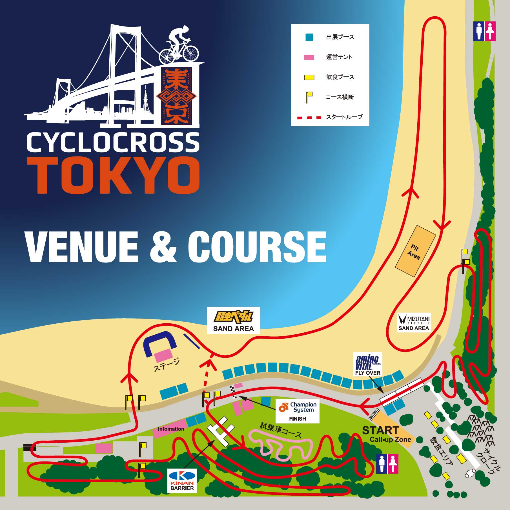
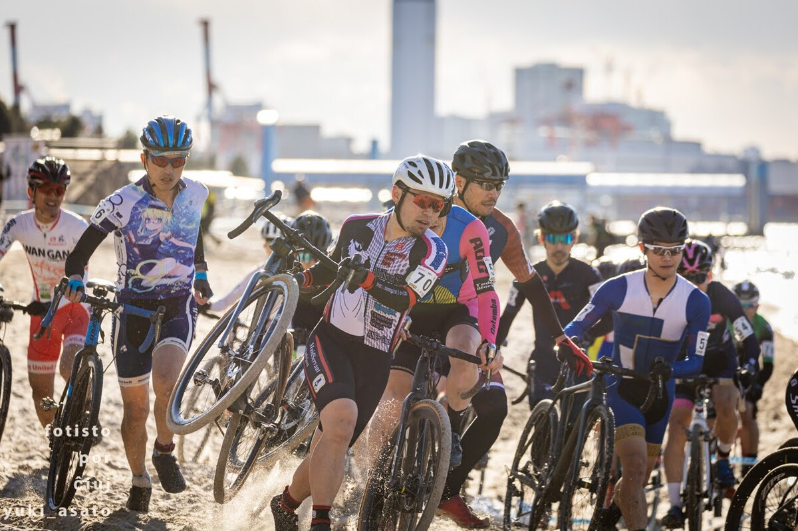

## リザルト

39/77位 (-2 Lap)

※変則日程のため、AJOCC的にはJCX 64/102位 (0pts)

### 機材

- メインバイク
  - GIANT TCX ADVANCED PRO
  - Farsports CX TU + A.Dugast Typhoon 33c (F: 1.30 Bar, R: 1.40 Bar)

※今年から[CYCPLYS AS2 PRO](https://amzn.to/3XXh90k)の空気圧設定を基準に計測しているため、0.1Bar未満は推定

### コース・タイヤセッティング

「ああ、復活前のコースね…」と言いたくなったが、現地で確認すると、**砂浜が記憶の2倍ほどの長さになっていた。**

トイレを遥かに超えて、北部駐車場のすぐ近くまでコースが伸びている。お台場海浜公園の砂は、人工砂浜の人為的なものでそこまで深くない分、かなり走りやすいのが幸いか。

考えるまでもなく砂浜の滞在時間が最も長く、タイヤセッティングの利を存分に活かすことができる。

林間部分のコースが荒れているという情報もあったが、個人的にはパンクを気にするようなレベルではなく、思い切ってフロント1.30Bar、リア1.40Barにセッティングした。

試走でも特に危ういリム内は感じず、快適に砂を走ることもできたのでそのままレースに臨んだ。珍しくME3と合同の試走時間だったので、上手くなった気がしたが、本番ではそこまでメリットにならないだろうなと考えていた。

問題は、潮の満ち引き。11時半以降は潮が引くという予報だが、この日は潮位が過去のレースに比べて高い日だったので、波打ち際が有利になるかどうかは五分五分だった。**試走時間ではレース時間のライン固めを予想することは困難なので、序盤は最適ラインを探る**こととなる。

コーステープギリギリの海と反対側にも固いラインができているので、波打ち際が固くなるか、それともコーステープ側の方が速いか、切り替えるならどこか…など、ME2までのレースを見ながら考えていた。

## レース展開

80人オーバーのエントリーでゼッケン70番なので、スタート直後の位置取りは期待せずに、スタートループの砂でポジションを上げる作戦。

鵠沼海岸でほとんど乗れない砂浜を乗車とランの練習をしていたし、昔から砂コースは得意なこともあって、根拠が少しだけある自信をのぞかせていたが、脚力は落ちているので、リザルトはトントンだろうという予想。

人数ほどの混乱はなく、波打ち際のライン取り合いをしながらコーステープ付近に目をやると、予想通りいいペースで走っている人がチラホラ。

ただ、上ラインは柔らかくなるポイントが何カ所かあるので、固さが安定している下（海）のラインよりそこで減速する。かといって、下ラインが速いというわけでもなく、予想よりもタイヤが沈むので、皆がランに続々と切り替えていく。

結局1周目は下ラインでランニングして、折り返し後にオーバーテイクを狙うことに。ここだ！というポイントで思い切りラインを外していったところ、派手に砂溜まりにぶつかって転倒…作戦失敗。以後おとなしく1周目を通過する。

2周目の砂は、海側を走りつつ上に切り替えるタイミングを轍で見極める。まだラインが出来上がっておらず、重めの路面なので脚のある人にガンガン抜かれてしまうが、轍のトレースだけはこだわった。上の人が飛び乗る辺りを探そう～と思っているうちに終盤まで来てしまい、慌てて上ラインに切り替えた。

チラっと後ろを見て乗車で上に移動できそうなところを記憶。

3周目、先頭がいい轍を作ってくれたのか、正解ラインが浮き彫りに。波打ち際の柔らかいところは最初から避けて「ちょい内～真ん中～上」の移動ラインを見つけて、砂区間のほとんど（ミズタニコーナーまで）を乗車できるラインを見つける。

<blockquote class="twitter-tweet">
シクロクロス東京の砂エリア正解ライン評 「ずっと上が固い！上で粘れ！」←嘘 「潮が引いたから下が正解！」←嘘 「MJは真ん中から下行ってたぞ」←最速ではない 「下→真ん中→上」←せいかい
&mdash; ゲン (@gen_sobunya) <a href="https://twitter.com/gen_sobunya/status/1888147731618869426?ref_src=twsrc%5Etfw">February 8, 2025</a></blockquote>

以後は淡々と自分のやれること（砂でプッシュ、林間はやや抜いてブロック）をやっていく。

中盤以降に、逆光と砂ぼこりでよく見えない根っこに引っかかってしまいチェーンを落としてしまったが、砂ですぐにリカバリできた。

残り周回や経過時間を気にする余裕がほぼなかったが、ラスト3周を迎えたタイミングで、実況から先頭が後ろに迫ってきていることを把握。そろそろ最後ということで見えている人を食いにいき、3人ほどキャッチしてポジションアップしてゴール。

レース後に倒れこむほどの辛さだったのだが、翌日の脚の疲労はそれほどでもなく、追い込み不足が反省点か。練習の内容は存分に活かせて、今季の順位%では最高の結果だが、余裕が出てしまうともっとできたのではないかと考えてしまう。

エントリー人数でほぼAJOCCポイントは諦めていて、取手でそこそこのリザルトを取っても降格は確定的なので、来年のME2シーズンで表彰台を早期に狙うべくベース練習でも始めようと思う。

## Photo

Photo by [yuki asato](https://x.com/yuki_asato)
