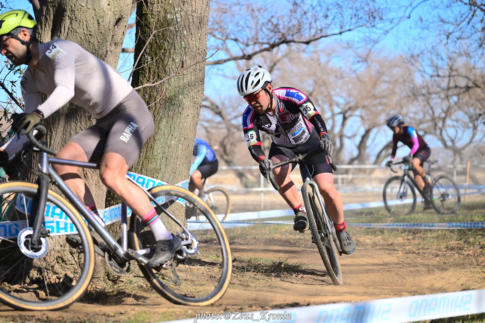
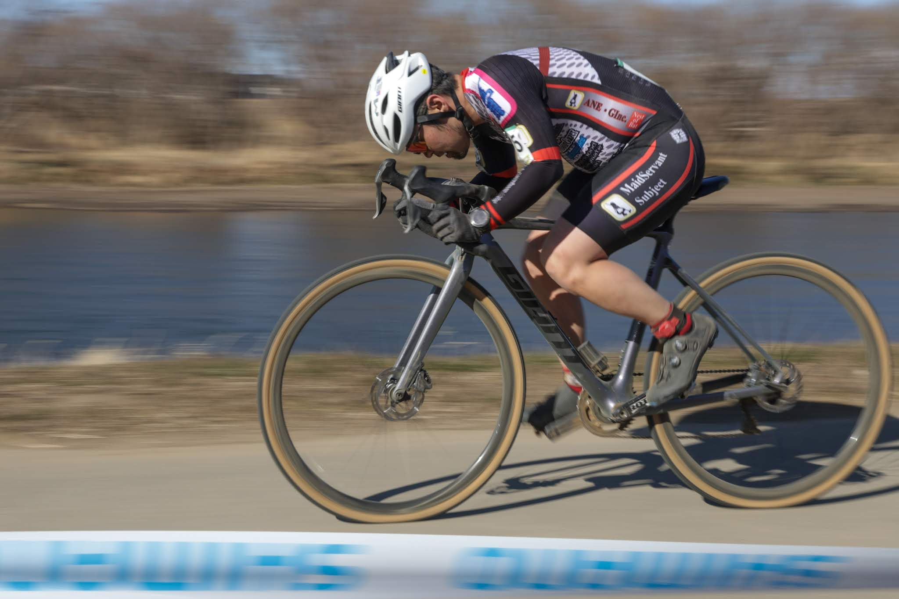

## リザルト

26/41位 (+5:13)

### 機材

- メインバイク
  - GIANT TCX ADVANCED PRO
  - Farsports CX TU + A.Dugast Typhoon 33c (F: 1.60 Bar, R: 1.70 Bar)

※今年から[CYCPLYS AS2 PRO](https://amzn.to/3XXh90k)の空気圧設定を基準に計測しているため、0.1Bar未満は推定

## コース

いつもの取手ステージ。今年は雨が降らず、乾いたコンディション。

「いつもの」といいつつも、テクニカルセクションでコーナーが追加されたり、キャンバーが1カ所とても狭い1本道ラインしか存在しないコースレイアウトになったりと、昨年から若干のマイナーチェンジがされていた。

それでいて、無意味な減速を強いるコーナーは減り、よりスピーディーな印象に。そしてバックストレートの強風は健在。今年は寒さも相まって、風の影響がより強く感じられた。

## レース

例年、クリテリウムのような展開となる取手ステージ。テクニカルセクションで休みつつも離されないようにし、バックストレートでの風の影響を受けないようにするのが鍵。一人旅になった後のペースダウンは必至だ。

AJOCCポイント的には降格は確定的なので、前半ハイペースで刻み続け、40分レースに備えるという名目でのトレーニングレースという意気込み。真面目にリザルトを狙ってもほぼ同じ戦略になるが、気持ちの持ち方が違う。

前半はとにかく気合で立ち上がりを踏み倒す。Gosseの出演した回の[Side by Side Radio](https://sidebysideradio.libsyn.com/)を聞きながらレース会場に向かっていたので、『1-2周目はフルガス、3-4周目で組み立てを考える、後は頑張る』といううろ覚えの英語トークを思い出しながらバックストレートでも必死のペダリング。

あっという間の数周回を、時には声掛けしてローテしながら進んでいく。

10人程度の大きなパックのまま、序盤の混乱を終える。なんとなく分裂しても、バックストレートの折り返しや、狭いキャンバーで再集合してしまい、決定打を誰かが繰り出さねば停滞するという状況。

単純なフィットネスの弱い自分はこのパックの後方に位置。この人数での1列棒状でキャンバー入りは避けたいと考えて、車間を開けて進入を心がけていたら、何周かしたところで前方のライダーがラインを外して詰まるトラブルが発生。

その隙を突いて、前方へ出ることに成功。そのまま、上手く抜けた数人でのパックに移行。均衡が崩れ、脚のあるライダーは前を狙い、ポジションを維持したいライダーは後ろから逃げたい恰好に。

最終的にEMU喜多さん、LEPUS奥田さん、そして自分の3人でバチバチすることになる…当然自分が一番弱い。バックストレートは粘るものの、その後の踏み倒しができず、徐々に遅れていく。

ウィンディの川崎さんに追いすがられ、なんども詰められては広げ返すという繰り返しの末、なんとかリードを保ったまま26位でフィニッシュ。800kcalも1時間で消費したハードなレースだった。取手はいつもこうだ。

## まとめ・シーズン振り返り

AJOCCポイントは降格が確定的だが、シーズン終盤2レースはほぼ1時間をしっかり戦え、感触のいい走りができた。

もともと、子供が生まれるので**どんなに早くとも年明けからの参戦と考えていた**シーズンだった。早いシーズンインを許可してくれた家族に感謝するとともに、来年早々に息子を抱えて表彰台に登るチャンスが巡ってきたと前向きにとらえている。

| 日付       | レース         | 順位 | 順位% | AjoccPt  |
| ---------- | -------------- | ---- | ----- | -------- |
| 2025/02/23 | 茨城6 ME1      | 26   | 63%   | 25pt/ME1 |
| 2025/02/09 | CXT2025#2 ME1  | 64   | 62%   | 0pt/ME1  |
| 2025/01/12 | 湘南#3中井 ME1 | 18   | 78%   | 22pt/ME1 |
| 2025/01/05 | CXCHIBA#14 ME1 | 56   | 91%   | 1pt/ME1  |
| 2024/11/10 | MHCX#11 ME1    | 72   | 82%   | 0pt/ME1  |
| 2024/10/13 | 湘南#1開成 ME1 | 20   | 71%   | 20pt/ME1 |

数値上も、ほとんど戦えていなかった時期を経て、大きめのレースでも60％台のリザルトに収まることができた。

来年に向けては、ベースを積みなおすかバニーホップを習得するか。どちらも毎年のように言っているが、今年こそ頑張りたい（10年連続N回目）

冷静に地理を見ると、茨城北部のレースに参加するよりも山梨寄りの信州クロスが行きやすいことも多いので、湘南をメインに近場にフォーカスして家族連れで表彰台を狙いたい。

## Photo

- hiroyo (cover photo)
- [nanashi](https://x.com/Zeus_Kronin)
