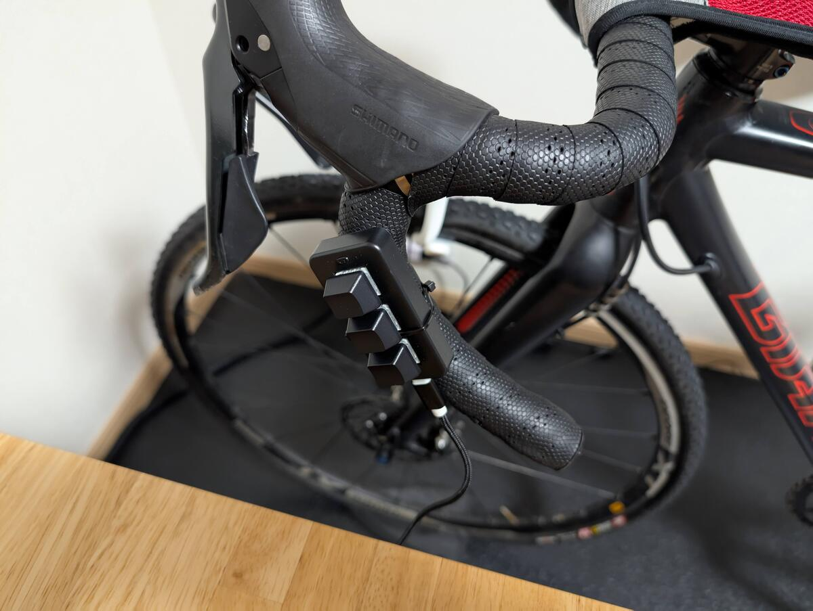

## はじめに

バーチャルシフティングは、Zwiftが近年発表したコンセプトの中でも、最も面白いと感じたものの1つ。

よく語られるメリットとしては、Zwift Rideのような**バーチャルシフティングを前提としたローラー専用フレームの登場**・**変速段数に縛られないスマートトレーナーの実現**・**変速ショックやチェーンラインの騒音の軽減**などが挙げられている。

個人的に、最も大きなメリットは騒音の軽減で、自分の家では、**バーチャルシフティングのおかげで、生後数か月の赤ちゃんが隣の部屋で寝ていても、Zwiftでトレーニングを行える**ようになった。

バーチャルシフティングを活用すると、**変速時の音が一切なくなることはもちろん、チェーンラインに起因した駆動音も低減される**。

チェーンラインが常にまっすぐな状態を維持できるようになり、**他のローラーに比べて静かなダイレクトドライブ型スマートトレーナーが、更に静かになる**というわけだ。最も大きい音がクリートのつけ外しに取って代わられたが、ローラー用のシューズを用意することで、この問題も解決している。

## バーチャルシフティングの原理と、Zwift上での制限

<LinkCard url="https://zwiftinsider.com/virtual-shifting/" />

バーチャルシフティングの原理は単純で、**仮想ギアに合わせてトレーナーの負荷を増減させるだけだ**。

ケイデンスを維持していると仮定した場合、負荷の増減した分だけライダーが発生させているパワーもう増減…つまりバーチャル空間内では加速・減速して、あたかもシフトアップ・ダウンしているように見せかける。

コグは単なるシングルギアに、チェーン落ち対策兼チェーンライン調整機能を持った樹脂とのセットであり、コグ自体に通信機能はない。

原理上は、どんなスマートトレーナーでもバーチャルシフティングの原理は利用できるはず。スマートトレーナーは、バーチャルサイクリングの**仮想勾配に対応させて、負荷を変動させる機能は必ず備えている**ので、バーチャルシフティングは全てのスマートトレーナーで実装できるはずなのだ。

ただし、Zwiftでバーチャルシフティングを利用するには、**スマートトレーナーのファームウェアがバーチャルシフティングに対応している必要がある**。WahooではKickr Core, Kikcr Gen6, Kickr Move, EliteはDireto XR, その他にJetBkack VICTORY, Van Rysel D100と、数えるほどしか対応トレーナーが存在していない。

今後、[Zwift Readyプログラム](https://support.zwift.com/ja/zwift-ready-r1x1sNas0)により拡大を図るらしいが、正直ちょっと寂しいラインナップだ。

※以下、『バーチャルシフティング』はZwiftの仮想シフトを指し、トレーナー負荷を調整して疑似変速することを『仮想シフト』と呼ぶ。

### 個人的な理想環境

我が家で最も稼働していない、ローラーに適したバイクはTCX SS…つまり変速の無いシングルスピード車だ。これまでは街乗りに使っていた。

できれば、TCXSSをローラー専用にして、ライドを楽しむ自転車はなるべくフリーにしておきたい。

ワークアウトメニューをこなすだけならERGを使うことで変速は不要だし、子持ちにはとにかく時間がないので貴重なリアルライドはパッと準備できることを大事にしたい。

だが、我が家のスマートトレーナーは、Saris H3であり、Zwiftでのバーチャルシフティングに対応していない。これは困った。

## QZ Appでバーチャルシフティングを体験しよう

QZ Appは、スマートトレーナーやインドアバイクと連携して動作する多機能アプリケーション。

元々の目的は、Zwiftに対応していない**ジムにあるようなインドアバイクを使って、Zwiftを楽しめるように通信の仲介をする**存在。

インドアバイクのケイデンスやパワーをQZ Appが広い、ZwiftにBluetooth経由で再送信してゲームをしたり、Zwiftの負荷データ（勾配）をインドアバイクに送信して負荷を動的に変更するというのが本来の役割。

QZ Appは、この仲介という役割を利用して、スマートトレーナーの負荷をコントロールできるため、Zwiftからの負荷変動だけでなく、（ベータ機能だが）手動で負荷を変動させて仮想シフトを実現できる。

なお、**お値段はたったの620円買い切り**。Zwift Readyプログラムに認証されたトレーナーとシフターのセットを買うより、かなり安価に仮想シフトを実現できる。

まずは簡単にセットアップを説明。

### セットアップ手順

1. **QZ Appのインストールと初期設定**

- App StoreまたはGoogle Play Storeからアプリをダウンロードする
- ベータ版にオプトインして再インストールする

2. **バーチャルシフティングの有効化**

- QZ Appを起動し、スマートトレーナーを接続する(トレーナーが起動したら自動で行われる)
- アプリ内の設定(Tile Option>Gaer)をONにして、QZ Appのトップ画面に仮想ギアと操作タイルを表示させる
- （オプション）Advanced Settingから音量キーでシフティングできる機能をONにする
- （オプション）Zwift ClickやPlayをQZ Appを起動している端末とペアリングする

3. **Zwiftとの接続方法**

- Bluetoothを有効にし、QZ Appを起動している端末とペアリングする（端末の名称を英字のみ5文字以内にする必要あり）
- 同一Wifiネットワークに接続している場合、"WAHOO KICKR 00"をネットワーク経由で接続する

※Wahoo Direct ConnectプロトコルをQZ Appがサポートして、Wahooデバイスのエミュレーションをしている状態となる

### シフティング方法

QZ Appでは、複数のシフティング方法を提供している

- **アプリ内のタッチスクリーンコントロール**：画面上のボタンをタップしてギアを変更する
- **スマートフォンの音量ボタンを使用**：音量上下ボタンでシフトアップ/ダウンする
- **スマートフォン接続したキーボードによる操作**: VolUp, VolDownキーを使用してシフトアップ/ダウンする(原理は2番目と同じ)
- **Zwift Click/Playの活用**：Zwift Click/Playを持っている人は、これらを使ってシフトアップ/ダウン操作に利用できる

### 他のアプリとの互換性

QZ Appは、トレーナー側の負荷を操作しているため、Zwift以外のサイクリングアプリでも使用可能となることが最大の特徴。

**Zwift ClickやPlayを他のバーチャルサイクリングアプリで利用したいケース**でも、QZアプリを活用できる。

ただ、パワーやケイデンスを再送信して負荷を調整するだけのアプリなので、個々のプラットフォームで完全な動作を確認しているわけではない点に注意。

## 実際にQZアプリの仮想シフトを使ってみた

シフト操作のたびにラップトップのキーボードを叩くのは現実的でないので、[サンワダイレクトのプログラマブルキーボード](https://amzn.to/4hpPSMh)を購入してハンドルに括り付けてみた。

<Amzn asin="B0CQN6BGMF" />

青軸の特徴的なクリック音を響かせながら、仮想シフトをすると、確かにシフトアップ/ダウンしたかの様に脚に感じるトルクが変化する。

物理的な変速と違い、必要トルクが一瞬で変化するわけではないので、脚に衝撃は来ないし音もしない。ヌルっと負荷が変わってケイデンスを落とすか、パワーを上げるかの選択を迫られる。

一方で、物理シフトと違って**タイムラグは大きく、仮想ギアの反映に1秒から2秒くらい**待たされる。

「ペースが上がった！」と思ってシフティングしても、バーチャル世界へのスピード反映は数秒遅くなるので、焦って数段シフトしてしまうと、とんでもなく重いギアを踏むことになる。**おそらくレースでは使い物にならない**だろう。アタックに迅速に反応するという使い方は難しい。

ワークアウトで数秒後に負荷を変えるような、予測のつく場面なら事前に操作することで、タイムラグの課題は解決できる。そもそもほとんどのワークアウト（タバタ以外）はERGでやるものなので、シングルスピード車でも全く問題が無い。

そして、**タイムラグと引き換えに、圧倒的な静音性を手に入れられた**。

冒頭のインプレの通り、隣の部屋で赤ちゃんが寝ていても、Zwiftでトレーニングやライドを行える。

## 番外編：native virtual shift 対応のTrainingPeaks Virtualを試してみた

理論上はどのバーチャルサイクリングでも仮想シフトはできるはずと考えていたところで、**TrainingPeaks Virtual(旧indieVeloを買収)は、キーボードを使ったバーチャルシフティングに対応**していることがわかった。

現在、ベータサービス中で無料のため、TCXSSローラーバイク化にあたって、プラットフォーム乗り換えが第1選択肢となっていた。

シフター代わりの3キーボードを好きなキー操作に割り当てできるので、Training Peaks Virtual（以下TPV）でシフティング操作にあたる"+","-"キーを割り当て、余ったキーはスクリーンショットにしてみた。

Zwiftでのペースパートナーにあたる、24365ペーサーとのライドで仮想シフトをお試ししてみた。

TPVの画面は、Indirveloのチームが元Zwiftメンバーということもあって、ほぼZwiftに近い。

設定項目が多い点は、Zwiftの弱点を補強しているともいえるが、メニュー画面が正直ごちゃごちゃしているなという感想。

肝心の**仮想シフト機能は、24段変速で驚くほど問題なく機能した**。QZアプリも使わないので、キーボードをPCに繋ぐだけのシンプル構成。

変速による負荷の上がり方は調整なしのQZより自然な印象。ギア1枚が仮想シフト1段階と考えておおむね違和感がない。それなりに作りこんでいる機能のようだ。ただ、タイムラグはZwift＋QZと同様に、1秒から2秒くらいかかる。

<blockquote class="twitter-tweet" data-media-max-width="560">
TrainingPeaks Virtual (indieVelo) ならZwift Cog/shift がなくてもバーチャルシフティングできると分かったので、しばらくこれでいく <a href="https://t.co/lycZkL9bB8">pic.twitter.com/lycZkL9bB8</a>
&mdash; ゲン (@gen_sobunya) <a href="https://twitter.com/gen_sobunya/status/1862781260223127701?ref_src=twsrc%5Etfw">November 30, 2024</a></blockquote> 

TPV仮想シフト設定の画面では、『ネイティブ』『レガシー』という項目があり、Saris H3は後者のレガシー設定で動作させる必要があるのだが、おそらくネイティブ設定が使えるトレーナーは、Zwiftでもバーチャルシフティングに対応するトレーナーなのだろうと想像がつく。ネイティブ対応しているトレーナーであれば、タイムラグの問題は起こらないのかもしれない。

### TrainingPeaks Virtualの課題

仮想シフトの実験としては、自分の乗り方（ベース走とワークアウト）では問題なく対応できそうだったのだが、それとは別に困った問題が起きた。

ベータゆえに**起動や走行中にハングアップ**することがあったり、TrainingPeaksの名を冠しながら、**ワークアウトの種類が少なく、質も悪い**こと。何よりも、TPVのログが**Garmin Connectに転送できず**、Fitファイルをアップロードしても**Garminの各種ステータスに反映されない**ことだ。

調べてみると、Garmin Connectの連携は、[特定のバーチャルサイクリングアプリに限定](https://support.garmin.com/en-US/?faq=apva7Th82K6Mm0zY4shzD6)されていた。Tacx Training™ app, Zwift, ROUVY, TrainerRoad以外はトレーニングステータスや有酸素効果が出ないようだ。

特に後者2つは深刻で、Garmin依存している自分にとっては、**疲労度や負荷管理ができなくなってしまうのは大問題**。ワークアウトはカスタムワークアウトで代替できなくはないが、ちゃんと出し切れる設定のワークアウトメニューを使いたいし、何よりそこに自分のリソースを割きたくないというのが本音。

これらの問題から、**Zwiftでなんとか（安く）仮想シフトをできるようにする**という方針に切り替わってQZアプリに行きついたという顛末。

## まとめ

QZ Appを使用した仮想シフトは、**高価な専用ハードウェアを追加で必要とせず**、多くのサイクリストにとってアクセスしやすいソリューション。

一方で、**レースに使えるほどの即応性は無い**ので、Zwift RideやZwift Readyトレーナーを用いたバーチャルシフティングを代替できるわけではなさそう。

QZはカスタマイズ性が高く、様々なデバイスやアプリに対応できる仕組みなので、設定を追い込めばより良い体験ができるようになるであろうことは潜在的なメリット。ただ、短期間に試している間、再インストールを迫られる不具合が1度発生したので、なるべくネイティブに実装されたZwiftのバーチャルシフティングを使いたいというのが本音。

Zwiftのサブスクリプション料金はどんどん高くなっているが、他のバーチャルサイクリングアプリを試してみて、習慣付けのためのイベントやログインボーナス、トレーニングメニューの充実など、料金に見合う価値は提供しようとしているのだな、と感じられた。

価格が安く、高機能でZwift ReadyなJetBlack VICTORYが日本で発売されれば、個人的には万事解決なのだが…どこか代理店にまた手を挙げてくれませんか。

<LinkCard url="https://www.jetblackcycling.com/indoor-cycle-trainers-and-accessories/victory-smart-trainer/" />
