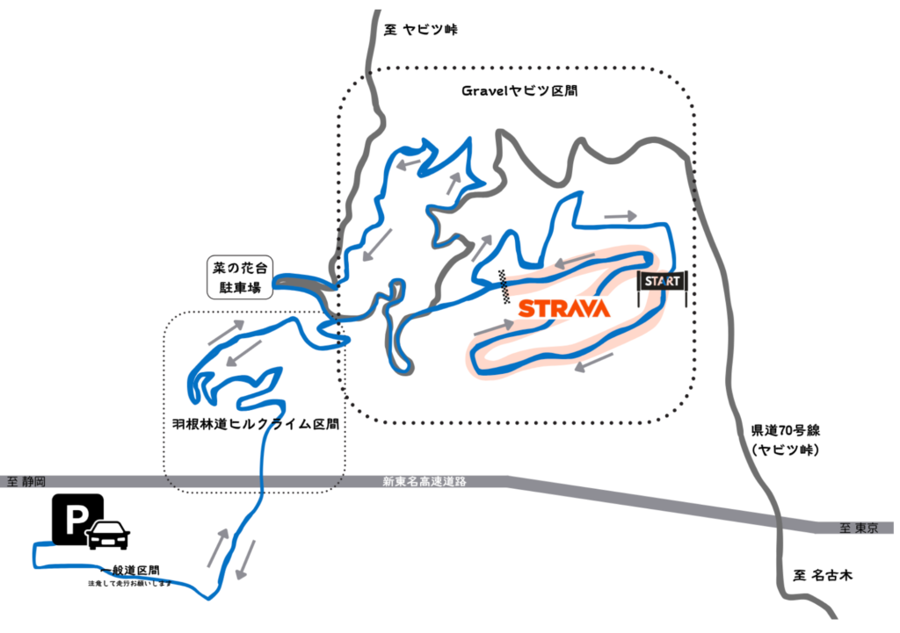
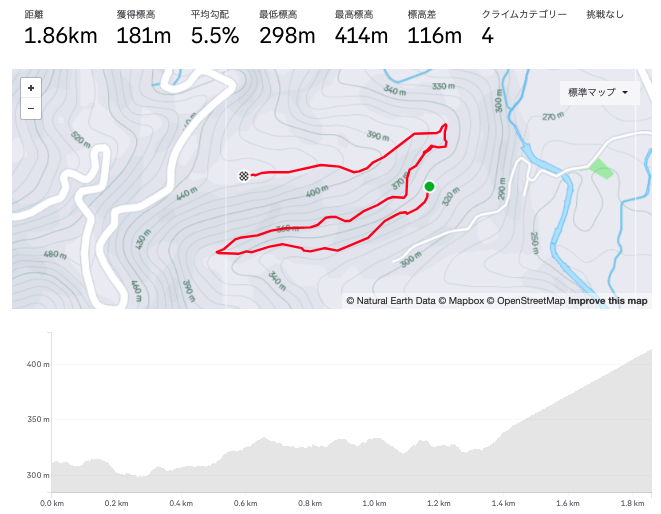
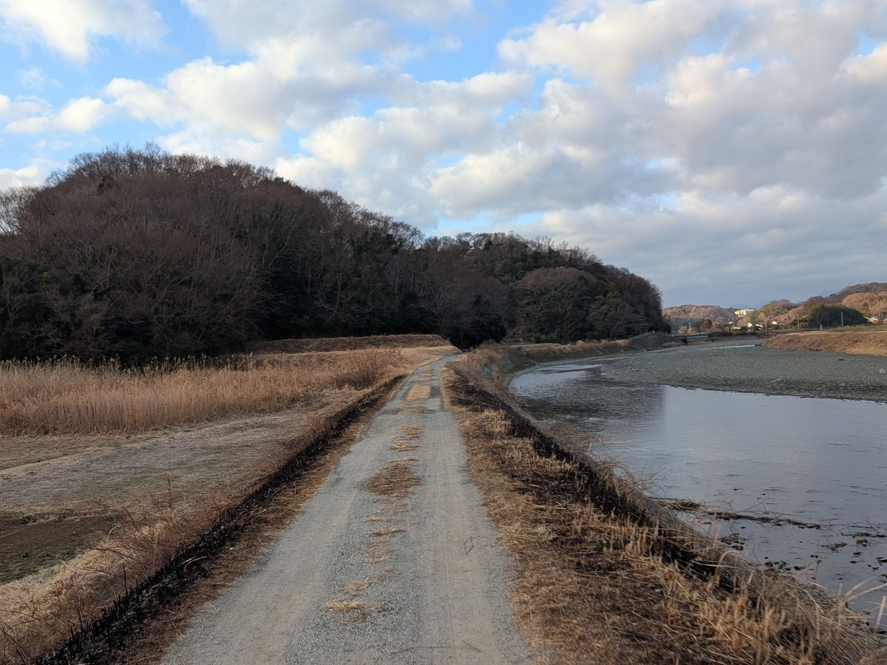
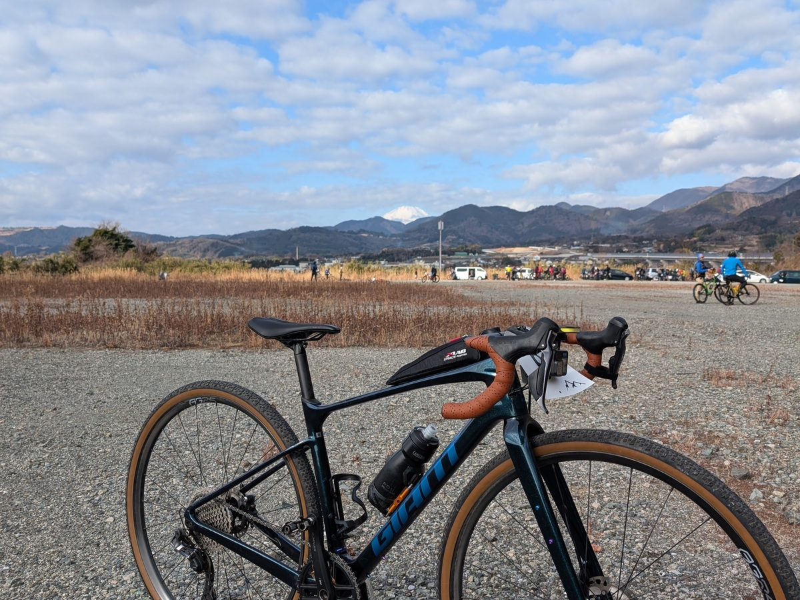
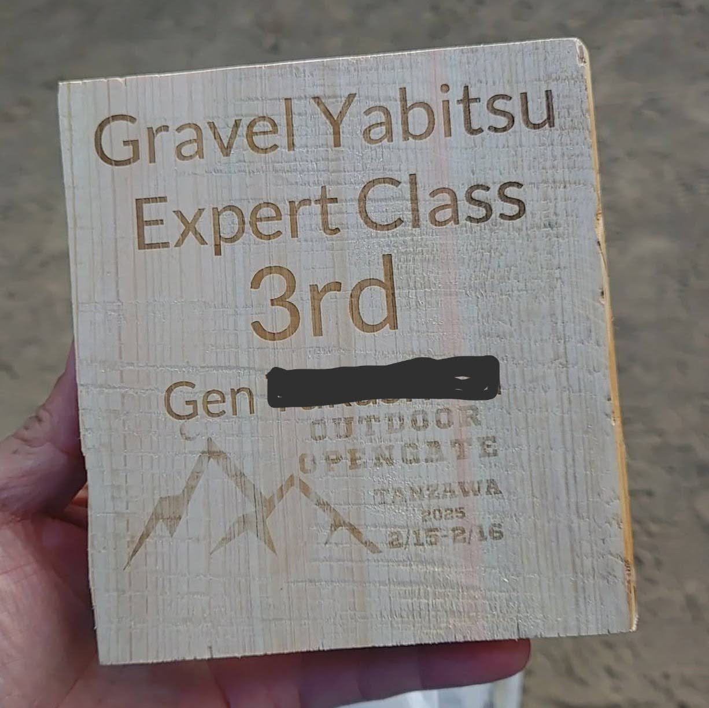
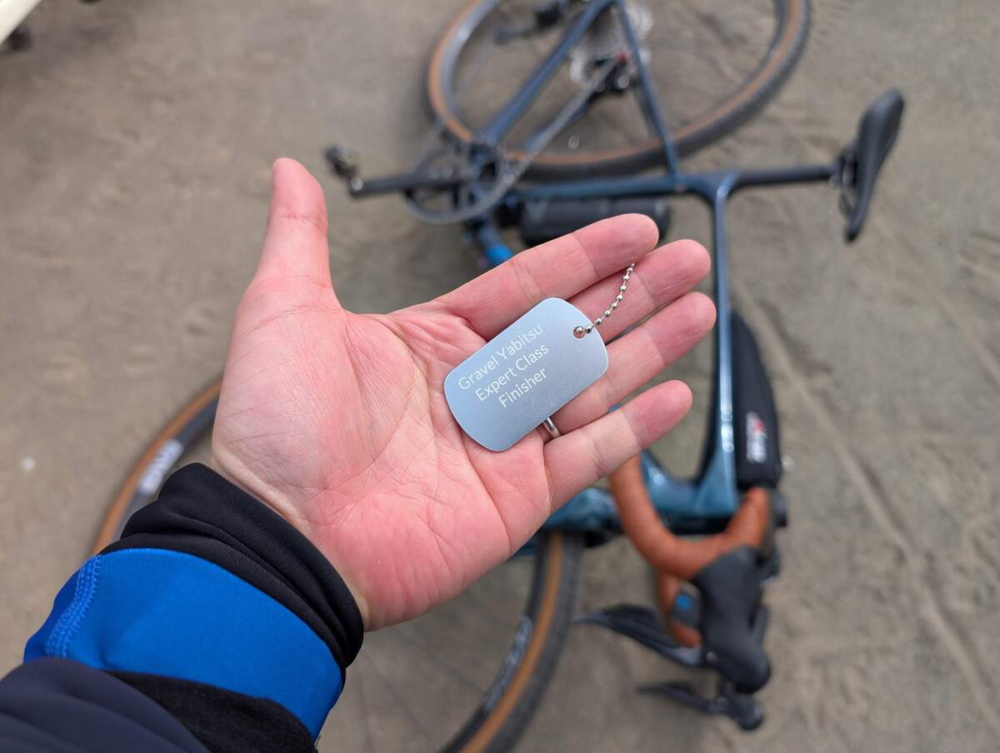

グラベルライドにおいて、永遠の課題はフィールド探しだ。

地元で走りやすいコースを探すだけでも、地図とにらめっこしたり、地形図を見たり、地元の人に聞いたり、いろいろと手間がかかる。

特に、管理者のいる林道などは、勝手に走るわけにはいかないので、事前に許可を取る必要がある。個人ではなかなか難しい。

## 丹沢オープンゲート2025

そんな状況の中、丹沢エリアでオフロードライドができるルートを提供してくれる団体が[鶴嘴](https://tsuruhashi-tanzawa.com/)だ。自転車をメインに、丹沢エリアをアウトドアスポーツフィールドとして楽しめる環境づくりを行っているありがたい団体だ。

関東南部サイクリストで知らぬ人はいないであろう、ヤビツ峠を擁する丹沢エリアだが、山は険しく、夏はヤマビルが有名。神奈川県の主要水源を担っているということもあって、ほとんどの林道は厳重に管理されている。県南部からのアクセスとしては、登山コースへのアプローチにもなっている戸川林道が唯一といってもいいオープンなオフロードだろう。

<LinkCard url="https://blog.gensobunya.net/post/2023/06/togawa_rindou/" />

**鶴嘴によって、こうしたオープンな林道以外にも、自治体や地権者との交渉が可能となり**、2024年の夏には初めて丹沢オープンゲートとしてのイベントがキックオフされた。

季節柄、野生動物やヒルとお友達になることができたイベントだったようだが、コースそのものはそこそこ楽しかったというのがSNS上の反応だった記憶がある。

そして今年2025年、満を持してヤビツの名を冠したイベントが開催された。

### "ヒルクライムチャレンジ" Expertクラス

コースは、マップを見ての通り羽根林道（通常は進入不可の舗装路）からヤビツ峠コース内にアクセスし、少し下ってグラベル区間にアクセスする形式。

20kmにして **獲得標高860m, 最大勾配は25%** となっている。「普段は入れない場所率」というオリジナルの定義は90%となっている。

計測用Stravaセグメントでは、最後の登り区間で最大勾配25%（らしい）の登りが続く。この区間は、乗車困難な箇所も存在するらしく、登り区間が勝負の分かれ目になると誰もが思うだろう。

ちなみに、中級者クラスはグラベル計測区間が短縮ループになっており、**計測区間だけで100mほど獲得標高が少なくなっており**、菜の花台より上に上がるグラベルも使わずに舗装路で駐車場に戻ることとなる。

## イベントレビュー

自宅から集合場所まで30kmほど、電車のアクセスも可能だが乗り換えと所要時間がかかるため、自走で向かうことにした。途中の花水川・金目川沿いのグラベルを走って行けることもあって、ウォームアップがてらフラットダートを楽しむ。

実は、**丹沢山系ではなく、金目川より南の丘陵地帯は良質なグラベルルートに恵まれている**。標高も低く、神奈川県の山岳エリアと比較すると険しくないので、グラベル初心者にもおすすめだ。

イベントに話を戻すと、事前案内では受付と集合という2つの用語があるにもかかわらず、前者がどこで行われるのか全く書かれていないため、事前に問い合わせて駐車場でゼッケンの受取と受付があることを把握。普段イベントを開催し慣れていないのか、不勉強なのか、イベント案内の改善が必要だと感じた。

家を出る時間は0度近かったが、最高気温は13度とかなり暖かい日で、天気も快晴。グラベル日和だ。

<blockquote class="instagram-media" data-instgrm-captioned data-instgrm-permalink="https://www.instagram.com/reel/DGH4Cney4R8/?utm_source=ig_embed&amp;utm_campaign=loading" data-instgrm-version="14" style=" background:#FFF; border:0; border-radius:3px; box-shadow:0 0 1px 0 rgba(0,0,0,0.5),0 1px 10px 0 rgba(0,0,0,0.15); margin: 1px; max-width:540px; min-width:326px; padding:0; width:99.375%; width:-webkit-calc(100% - 2px); width:calc(100% - 2px);">
 <a href="https://www.instagram.com/reel/DGH4Cney4R8/?utm_source=ig_embed&amp;utm_campaign=loading" style=" background:#FFFFFF; line-height:0; padding:0 0; text-align:center; text-decoration:none; width:100%;" target="_blank"> 
 

 
 

 

 
<svg width="50px" height="50px" viewBox="0 0 60 60" version="1.1" xmlns="https://www.w3.org/2000/svg" xmlns:xlink="https://www.w3.org/1999/xlink"><g stroke="none" stroke-width="1" fill="none" fill-rule="evenodd"><g transform="translate(-511.000000, -20.000000)" fill="#000000"><g><path d="M556.869,30.41 C554.814,30.41 553.148,32.076 553.148,34.131 C553.148,36.186 554.814,37.852 556.869,37.852 C558.924,37.852 560.59,36.186 560.59,34.131 C560.59,32.076 558.924,30.41 556.869,30.41 M541,60.657 C535.114,60.657 530.342,55.887 530.342,50 C530.342,44.114 535.114,39.342 541,39.342 C546.887,39.342 551.658,44.114 551.658,50 C551.658,55.887 546.887,60.657 541,60.657 M541,33.886 C532.1,33.886 524.886,41.1 524.886,50 C524.886,58.899 532.1,66.113 541,66.113 C549.9,66.113 557.115,58.899 557.115,50 C557.115,41.1 549.9,33.886 541,33.886 M565.378,62.101 C565.244,65.022 564.756,66.606 564.346,67.663 C563.803,69.06 563.154,70.057 562.106,71.106 C561.058,72.155 560.06,72.803 558.662,73.347 C557.607,73.757 556.021,74.244 553.102,74.378 C549.944,74.521 548.997,74.552 541,74.552 C533.003,74.552 532.056,74.521 528.898,74.378 C525.979,74.244 524.393,73.757 523.338,73.347 C521.94,72.803 520.942,72.155 519.894,71.106 C518.846,70.057 518.197,69.06 517.654,67.663 C517.244,66.606 516.755,65.022 516.623,62.101 C516.479,58.943 516.448,57.996 516.448,50 C516.448,42.003 516.479,41.056 516.623,37.899 C516.755,34.978 517.244,33.391 517.654,32.338 C518.197,30.938 518.846,29.942 519.894,28.894 C520.942,27.846 521.94,27.196 523.338,26.654 C524.393,26.244 525.979,25.756 528.898,25.623 C532.057,25.479 533.004,25.448 541,25.448 C548.997,25.448 549.943,25.479 553.102,25.623 C556.021,25.756 557.607,26.244 558.662,26.654 C560.06,27.196 561.058,27.846 562.106,28.894 C563.154,29.942 563.803,30.938 564.346,32.338 C564.756,33.391 565.244,34.978 565.378,37.899 C565.522,41.056 565.552,42.003 565.552,50 C565.552,57.996 565.522,58.943 565.378,62.101 M570.82,37.631 C570.674,34.438 570.167,32.258 569.425,30.349 C568.659,28.377 567.633,26.702 565.965,25.035 C564.297,23.368 562.623,22.342 560.652,21.575 C558.743,20.834 556.562,20.326 553.369,20.18 C550.169,20.033 549.148,20 541,20 C532.853,20 531.831,20.033 528.631,20.18 C525.438,20.326 523.257,20.834 521.349,21.575 C519.376,22.342 517.703,23.368 516.035,25.035 C514.368,26.702 513.342,28.377 512.574,30.349 C511.834,32.258 511.326,34.438 511.181,37.631 C511.035,40.831 511,41.851 511,50 C511,58.147 511.035,59.17 511.181,62.369 C511.326,65.562 511.834,67.743 512.574,69.651 C513.342,71.625 514.368,73.296 516.035,74.965 C517.703,76.634 519.376,77.658 521.349,78.425 C523.257,79.167 525.438,79.673 528.631,79.82 C531.831,79.965 532.853,80.001 541,80.001 C549.148,80.001 550.169,79.965 553.369,79.82 C556.562,79.673 558.743,79.167 560.652,78.425 C562.623,77.658 564.297,76.634 565.965,74.965 C567.633,73.296 568.659,71.625 569.425,69.651 C570.167,67.743 570.674,65.562 570.82,62.369 C570.966,59.17 571,58.147 571,50 C571,41.851 570.966,40.831 570.82,37.631"></path></g></g></g></svg>

 
この投稿をInstagramで見る

 

 

 

 

 

 

 

 

 

 
 

 

</a>
<a href="https://www.instagram.com/reel/DGH4Cney4R8/?utm_source=ig_embed&amp;utm_campaign=loading" style=" color:#c9c8cd; font-family:Arial,sans-serif; font-size:14px; font-style:normal; font-weight:normal; line-height:17px; text-decoration:none;" target="_blank">Gen(@gen_sobunya)がシェアした投稿</a>

</blockquote>

肝心のイベントコースは、**羽根林道からのアクセスが、舗装路であるものの、普段は入れない方向からのアクセス**ということで、新鮮な感じ。ただ、この舗装路は地形上ショートカットしている分、かなりの勾配で、普段のヤビツヒルクライムよりもきつい。舗装路なので何とかなるが、脚のあるライダーでないと既に辛いだろう。

本番のグラベルが始まると、最初はゆるめの下り、**草で路面が見えないのはちょっと怖い**。ただ、事前の案内ほどガレている下りでもなく、段差も少ないので、脅される程の難易度ではないというのが正直な感想。野辺山グラベルチャレンジ1日目のほうがよっぽど危険な下りだった。

計測セグメントが始まる前で一旦休憩。グラベルライドは一休みして、あーでもないこーでもないと話すところが楽しい。タイヤの幅だったり空気圧だったりコース上の危ないポイントだったり、こうした話題に花が咲くのはシクロクロスに似ている。ちなみに、本日はベースライドのつもりなので、計測区間でアタックするつもりは全くなかった。この時点では。

自分の気持ちいいペースで計測区間まで下っていると、いつの間にかアタック準備しているライダーたちが目に入る距離。

気が付けば計測スタートの場所を通り過ぎて、スピードも乗っているし前の人をパスすれば競うライダーまでクリアだし、しばらくは細かいアップダウンだし…ということで、**ついついアタックしてしまった**。

後ろから一気に追いついていき、ミスしたりコーナーが遅い人をパスしつつ最後の登りに突入。最後の登りは、確かに25%の勾配がある、数字だけなら乗っていける。ただ、**路面がひどい柔らかさだ**。まともに乗れず押し上げ、押し上げ…しかも長い。

グラベルシューズの[RX8](https://amzn.to/4k1L15Z)を履いているので、シクロクロスの時のように軽快なランニングもできず、押し早歩きを続けていたらようやく終わったという感じ。一瞬トップに立ったが最終的には4番手で計測ゴールを通過。個人的な探索ライドではこの乗車率でも笑い話になるが、イベントとしては辛いものがある。

<Amzn asin="B0BJJQ2V9H" />

計測区間後のグラベルも、ほぼ登りの上に乗車できない路面が多発しており、全体としてみれば歩いている時間の方が長かったのでは？というライドに。ヤビツ峠ブランドはいらないので、次回は乗車率を上げて難易度を下げて、楽しいライドにしてほしいというのが感想だ。

結局、1人はゲストライダーでランキングに参加していないので、エキスパートクラスの計測区間では3位ということで、地元の杉材を使った盾と副賞を頂いた。その場でレーザー刻印しているようで、名前入りだ。

また、ゼッケンと引き換えに全員がもらえる完走タグはドッグタグに、こちらもレーザー刻印と中々手が込んだ仕様だった。飾りやすいし、使いやすいので、こうしたものは嬉しい。

## まとめ

子供の世話があったので、早々に会場を後にしたが、イベントの雰囲気は悪くなかった。ただ、**グラベルライドとしては、もう少し乗車率を上げて、楽しいライドにしてほしい**というのが感想だ。

メイン会場の戸川公園では、MAVICが当日発表新作ホイール（ALLROAD SL CARBON）を展示していたり、みんな大好きmyxが出店していたり、フードワゴンも目移りするほどの数が出店していたりと、イベントとしては充実していた。それだけにコース設定でリピーターを失いそうな点は惜しい。

聞くところによると、中級のコースは悪くなかった（エキスパートの序盤、簡単な下り＋緩い登りで設計されていた）ようなので、難易度を上げずに距離を稼ぐ工夫があるとよさそうだ。

どうしてもエクストリームな設定にしてしまいがちな上級者向けオフロードイベントだが、乗車率が低かったり、ご褒美代わりのオフロード下りがなかったりすると、どうしても満足度が低くなってしまう。

神奈川県西部は、都心から近いにもかかわらずフィールドとしての魅力が高いエリアだけに、今後の改善に期待して次回があれば参加していきたいと思う。
