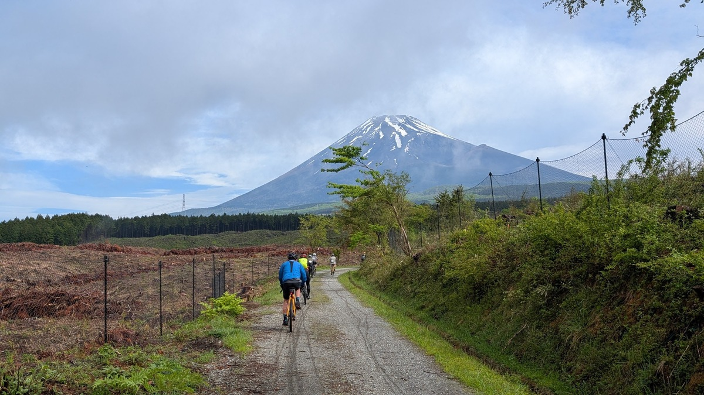
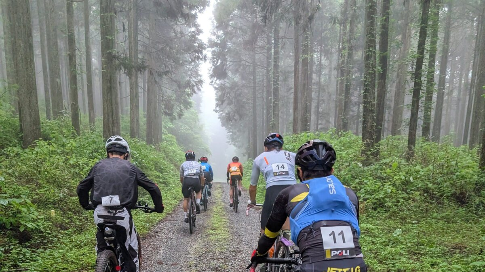
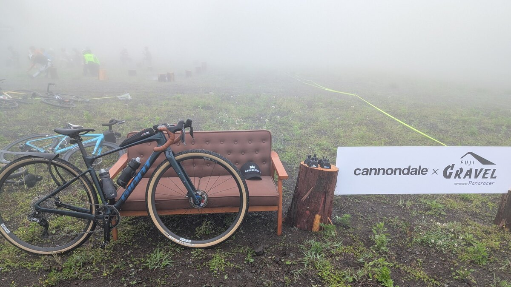
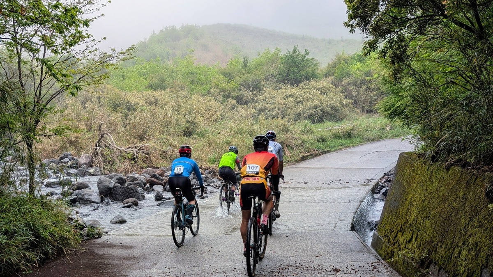

## 富士山周辺エリアのグラベル事情

富士山周辺のグラベルと言えば、もっとも有名なのは北富士演習場グラベルだろう。アクセス手段の豊富な富士五湖エリアと隣接しており、かつ入管こそあるものの申請すれば簡単に利用でき、それでいて景色と路面は素晴らしく、周辺林道とも接続しているという全ての要素を兼ね備えている。

そのほかにも、富士樹海トレイルなど、オフロードライダーにはいくつか思い浮かぶ候補が**富士山北斜面エリア**には存在する。

しかし、都心住民にとって比較的近いとはいえ、まだまだ一般的なコースでは無いし、入場もフリーという訳ではない。

グラベル愛好家は増えていると感じているものの、依然として関東近郊でのイベントが少ないことに加え、堂々と通行できる林道がそこまで多くないことを踏まえると、イベントでのクローズドコースを走る体験は非常に貴重だ。

この富士グラベルはエントリー枠が150人。関東近郊のサイクリストからすると非常に狭いと言って差し支えないだろう。事実、エントリーは開始後24時間持たずに満員御礼となった。

エントリー開始を待ち構えていて本当に良かったという他ない。

## 富士グラベルのコース

企画を聞いたタイミングでは、北富士演習場を使うのかと予測していたが、**富士グラベルは南側斜面のエリアにある富士山こどもの国を拠点**として開催されるとの告知だった。

イベントとなると、コースの良さという要素に加えて駐車場の豊富さやコースが人的キャパシティを備えているか、周辺自治体との関係という観点も重要になるが…とにかく富士グラベルは参加者からはコースの想像がつきにくい状態だ。

そんな中、運営からはコース下見の様子が発信された。写真だけでなく、ガイドライダーの動画付き。

<LinkCard url="https://fujigravel.com/blogs/news/3-20-recon" />

<iframe width="560" height="315" src="https://www.youtube.com/embed/qWTUWGXH3Ik?si=z8JhLJuz_aL2f58i" title="YouTube video player" frameborder="0" allow="accelerometer; autoplay; clipboard-write; encrypted-media; gyroscope; picture-in-picture; web-share" referrerpolicy="strict-origin-when-cross-origin" allowfullscreen></iframe>

これによって心配は雲散霧消、なんならこのスノーライドに混ぜてくれと言いたくなるようなエピックなコースであることが明らかとなった。

[ヤビツグラベル](/post/2025/02/tanzawa-opengate-2025/)で心に傷を負ったライダーも、これなら安心だ。

## 嵐の第1回

Grinduro Japan然り、グラベルクラシックやくらい然り、何故か国内のグラベルイベント第1回は荒天に見舞われている。

富士グラベルもこの呪い？を避けることはできず、開催前日は警報級の大雨が降る予報。

貴重なイベント参加がつぶれないか戦々恐々としている中、Grinduro Japanはその伝説の第1回を高速道路の安全面からパスして後悔していたこともあり、**開催するなら必ず行く**という決意をしていた。

どんな路面でも走れるよう、家の奥の雨具を引っ張り出し、雨ライド嫌いで買っていなかった泥除け（[Win Wing2](https://amzn.to/4kwCBCT)）もついに購入。準備は可能な限り整えていた。

運営の段取りは初開催とは思えないほど丁寧で、開催前の木曜日に参加者全員へメールが発信され、**金曜に1回と土曜に2回**の判断タイミングを設けることが知らされた。

第一判断タイミングから、開催に向けた運営陣の決意が読み取れたが、予報は依然大雨。身構えながら最終判断である土曜夕方の連絡を待っていたところ、コース状況や設営状況から無事開催が決定されたという通知が届き、胸をなでおろした。

予報よりは優しかったものの、かなりの大雨の中準備していただいたスタッフには感謝を禁じ得ない。（実際、某サイクルショップのハイエースがスタックする事件も起きたらしい）

### バイクセッティング

この日に向けて調整したものは大きく2つ。

1つはタイヤ。これまではテスト用に頂いていた[GRAVELKING X1](https://amzn.to/4kdFetM)をずっと使い続けていたが、トレッドゴムが劣化してきたことと、登りグラベルの対応重要性を感じて計量モデルである[GRAVELKING X1 R](https://amzn.to/3Fad5od)に履き替えた。

同時に、フロントを40cから45cにボリュームアップ。高速ダウンヒルやガレた路面にも対応できるようにしつつ、リアは登りのためにサイズを据え置いた。

<Amzn asin="B0CWKRQV2J" />

耐パンクベルトを一部省略しつつ、ケーシングも別物にになったことで**無印40cの重量のまま、45cにボリュームアップ**できる。

重量だけでなく、転がり抵抗も公称9％改善されているので、別物といってもいい走りを体感できるはず。細かいインプレッションについては別の記事で。

2つ目は泥除け。

先述の通り雨ライドが嫌いなので、これまでの自転車人生で何度か買っても大して使わず捨てていることが多かったが、今回は間違いなくウェット路面が長時間続くので観念して購入。

グラベルコミュニティ内で定評があり、パッとみた構造でも安定していそうなASSAVERSの[Win Wing2](https://amzn.to/4kwCBCT)を購入した。

<Amzn asin="B0CNY85W19" />

泥除けはタイヤに近づければ近づけるほど効果を発揮するが、マウント方法が面倒だと場所を追い込みが大変だ。また、**装着性とマウントの安定性を両立**しなければならない。これは不整地を走るグラベルロードでは特に重要な要素。

[Win Wing2](https://amzn.to/4kwCBCT)はこれらの要素をうまく解決しているとの評判で、自分で触ってみてもマウント部が良く考えられており、作業性は非常に優秀だと感じた。写真のようにクリアランスを攻めても、45kmの富士グラベルでタイヤに巻き込まれた回数は0。泥除けの決定版であると確信できた。

## 霧・富士山・霧

当日、雨予報ではなかったものの、御殿場から会場の裾野にかけては濃霧。

高速道路の100m先は乳白色で消えている。高速を降りても変わらない。車の少ないエリアとはいえ、なかなかのストレス…

この分だと今日は富士山を拝むのは厳しいかと思っていた矢先に、富士サファリパーク前のコンビニで休憩中に霧が晴れて御神体を拝むことができた。

ルンルンで会場へ車を走らせていると、会場前でまた霧が…

会場は霧雨と霧に覆われたどんよりとした天気。予報だと22度まで上がるはずの気温もまだまだ肌寒い。

知り合いに挨拶しつつ準備をし、パックに分かれて走り出す。番号も関係なく、前にいる順番でスタートするのがゆるいグラベルイベントらしい。先頭パックの先導は試走動画もアップロードしていた3UPの三上店長だ。

のんびり雑談しながら「動画の最初の富士山のところが見たかったんですよね～」などと喋っていると、なんとその最初のグラベルへ入った途端に雲が切れて、富士山が姿を現した。

先頭集団は、この瞬間に間違いなく参加費の元はもう取ったと感じただろう。これ以降富士山を拝むことは叶わなかったが、0回と1回は大違いなのでこれはこれでよし！

普段は閉鎖（施錠）している林道を通っていくコースということで、先頭グループはゲートを開錠しながらの進行。

霧に包まれて視界が少ないこともあり、CXの上位カテゴリ選手ばかりのパックであるが、会話が弾むイージーなペースで進んでいく。

そして、最も重要な点として、**激坂や、サイドカットを心配するガレたグラベル**がルート上に全く無くて驚く。常に快適に走行できる。

こんなグラベルが日本にあったのか…まさに顧客の想像していたグラベルライドがそこに提供されている。

前日までの雨と、濃霧で濡れてはいるものの、砂利がよく水を透すためか路面は快適に走行できる。砂ぼこりは立たないし、適度に濡れてグリップしやすいくらいだ。

購入した[Win Wing2](https://amzn.to/4kwCBCT)が役立つ場面はむしろ舗装路。水のたまったアスファルトを駆け抜けるときの水飛沫がお尻にあたる感覚は全く無い。同じ[Win Wing2](https://amzn.to/4kwCBCT)のユーザーを観察しても、自分はもちろん後方への飛沫もそれなりに抑えられているようだった。

今回の後悔はアイウェアに[レインホッパー](https://amzn.to/4jcELGJ)を施工し忘れたこと。

霧雨と霧で絶えず水滴がついてしまうこの環境では、アイウェアはほとんど役に立たず、ほぼ全員が外していた。

レインホッパーがあれば付いた水滴が即座にはじかれて快適な視界を得られるはずだったのに…結局買ってからテストで使ったきりになってしまっている。

1stエイドでは、スポンサーであるパナレーサーの提供したグラベルソファと熊鈴が。

濡れていたので結局我々のグループは囲んで集合写真を撮る形に。日本だと防水カバーを付けた方がいいかもな…などと話していた。

### エイドステーショングルメ

ライドイベントの醍醐味と言えばエイドステーションの補給。

今回は、地元富士市の名物らしい漬けナポリタンが提供された。ここ16km地点のエイドステーションはショートコースでも通る最重要エイドとなる。

用意されて小分けになった食べ物を頂くのが、ほとんどのイベントでの基本だが、ここではライダー到着後に**下茹でしておいた麺を茹で、炒めなおし**て提供してくれている！

大型のプロパンガスの大火力で炒めていることもあり、アツアツの状態で提供されるのは最高にうれしい。

調理時間分、待ちが発生するが味は格別。イタリア料理というよりもナポリタン風つけ汁のつけ麺という味で非常にGood。

距離も短いし、朝ご飯を抑えめにしておいた甲斐があったというものだ。

そしてミドルコースのみの2ndエイドでは団子と緑茶・ほうじ茶が提供された。ちなみにお茶は飲み放題という太っ腹ぶり。

人数が多くなってくると、1stも2ndもこのような形では配れないであろうことを考えると、第1回大会に参加できた役得とも言える。

### 開催フォーマットの功罪

ミドルコースとショートコースの分岐後、ミドルコースは様々な事情から12人単位のパックを再編成して走ることが必須。フリー走行ではないので、パンクやトラブルの時は、全員で待つ必要がある。

おそらく今回はそこまで大きな問題にならなかっただろうが、イベントのスケールが大きくなった際にこの手法が維持できるかは疑問。ゴール後の立ち話によると、何回か開催して実績を積んでいくしかないようだ。

自分の走行パックは幸いにもグラベルライドに造詣の深い三上店長に牽いていただいたので、Insta360のイケてるマウント方法の他にオフロードでのダウンヒル講座も聞くことができて、お値段以上のイベントとなった。

## 次回・ロングコースへの期待

1000m UPのコースだったものの、路面や勾配の良さもあって、70％が未舗装路にもかかわらず45kmのグラベルライドはあっという間だった。

8時に会場を出発して11:45頃の帰着なので、先頭パックは体力的にもう1周できる人がほとんどだろう。

体がまだまだ元気なので、100kmとは言わないが**70kmくらいのロングコースは欲しい**。次回以降に期待したい。

いい景色・いい路面・いいアクセスと三拍子揃った最高のイベントなので、是非是非回数を重ねて関東の定番グラベルイベントとして定着してもらいたい。
