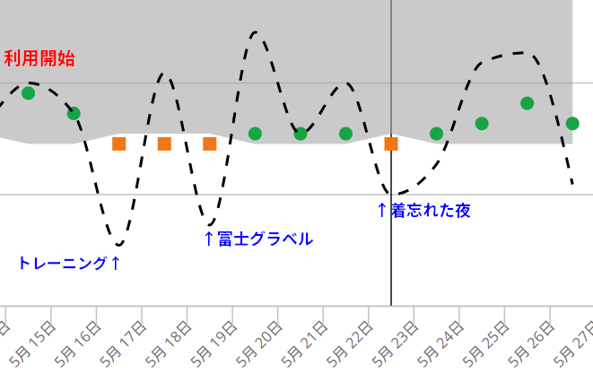

睡眠に関する投資はとても効果が高いと考えている。

毎日使うものだし、レースやトレーニング・日常生活での疲労を効率的に解消することで、起きている時間の質を高めることができ、人生において使えるリソースが多くなるというのが自分の考えだ。

それに、筋肉はトレーニングで成長するのではなく、回復によって成長する。トレーニングはあくまで計算された破壊なのだ。

これまでは、[エアウィーブのオーバーマット](https://amzn.to/4dwdDkK)や[テンピュールの枕](https://amzn.to/3SoAiWD)など、いわゆる寝具にお金をかけてきた。

大きな括りでは換気エアコンなんかも眠りに貢献してくれているだろう。

## 価格破壊リカバリーウェアの登場

元々、一般医療機器認定のリカバリーウェアは2021年には存在していたのだが、**定価ベースで3万円オーバー**もするので、確かめようとする気すら起きない価格だった。

※一般医療機器認定、低リスク（クラス1）であれば承認不要で届出のみ必要。ただし製造に関して許可は必要。詳しくは後述

それが、今年に入ってワークマンで1900円のリカバリーウェアが発売されたとのニュースを見て、少し試してみる気になった。

ただ、ワークマンの話題の製品で出遅れとなると、在庫があるか怪しいし、そもそもワークマンウェアのサイズは自分に合わないことが多いことも不安要素。着潰す寝巻として扱う前提とはいえ、体に合わないのは嫌だ。

ちょっと調べてみると、アルペングループのブランドであるTIGORAから、低価格スリープウェアである[TIGORA SLEEP](https://store.alpen-group.jp/disp/CSfSpecialPage.jsp?dispNo=006048)が発売していることを見つけた。

<LinkCard url="https://store.alpen-group.jp/disp/CSfSpecialPage.jsp?dispNo=006048" />

価格もこなれているし、ゴールデンウィークでセールになっていたので、季節の変わり目にこれ幸いと購入してみた。

期待値としては薄くて着心地のいい寝巻で、ついでに**プラシーボ効果でいいから何かメリットがあれば…**というのが正直な気持ちだった

## 主観的な効果と定量的（っぽい）効果

初めて着用した晩、朝起きると体が汗ばんでいることに気が付いた。妻の分も同時に購入して、同じ日から利用を始めたのだが、妻も同じ感想を抱いたとのこと。

『着て寝るだけでベストコンディション』と謳うが、製品としての効能は『血行促進・疲労軽減・筋肉の疲れハリコリの軽減』である。確かに血行が良くなって汗をよくかいたのかなとその時は思っていた。特別暖かくはないが、汗をかくという面白い状態だ。

主観的にはなんらかの効果がありそうだと思ったが、これが**睡眠の質に影響があるかと言われると、よくわからないし、疲労の軽減については体感するのが難しい**というのが正直な気持ちだった。

ただ、自分には『睡眠の質』を測る手段がある。そう[GARMIN Forerunner 965](https://amzn.to/43zKGQE)だ

<Amzn asin="B0BWF4MQ8X" />

ひとまず、疲労に反応しやすいHRVのグラフを確認してみた。

黒点線が日ごとのHRV数値を示している。HRVを見ている人は分かるが、トレーニングや強めのライドをした日は容易に低下する数値だ。

着用期間中をGarmin Connectから抜き出したが、図の通り1日だけ訳あって[TIGORA SLEEP](https://store.alpen-group.jp/disp/CSfSpecialPage.jsp?dispNo=006048)の着用を忘れた夜がある。

**着なかった日の晩だけ、日中に運動をしていないのにHRVが低下している**ことがわかる。

友人の一人は、着用後から有意にHRVが上昇したとの報告を出していた。

<blockquote class="twitter-tweet">
うむ、Day2も効果を感じる <a href="https://t.co/vCpQYF7Sdg">https://t.co/vCpQYF7Sdg</a> <a href="https://t.co/EBEqx0LaNO">pic.twitter.com/EBEqx0LaNO</a>
&mdash; Masanori (@miwamoto0203) <a href="https://twitter.com/miwamoto0203/status/1927133321135374715?ref_src=twsrc%5Etfw">May 26, 2025</a></blockquote>

これを以て、**「実際に効果がある！」というつもりは毛頭ない**が、体に何らかの**ポジティブな効果がありそう**な指標の動きはしている。

## そもそも医療機器認定とは

それっぽい結果は見せてくれたものの、そもそも医療機器認定において何らかの性能根拠が求められるのだろうか？という疑問が残る。

パッケージの登録一般名は、『家庭用遠赤外線血行促進用衣』だ。あとは監督省庁の文書を読めばたどりつけるのだろうが、こういう時はDeep Reserchがうってつけだ。

<LinkCard url="https://www.perplexity.ai/search/jia-ting-yong-yuan-chi-wai-xia-n9gy6rLBSFewcPo5DjOITw" />

<LinkCard url="https://chatgpt.com/share/6836f1d5-a2d4-8010-b27a-1ba5cbcfdc88" />

> 家庭用遠赤外線血行促進用衣は一般医療機器（クラスⅠ）に分類される。一般医療機器は「デバイスに不具合が生じた場合に人体に及ぼすリスクが極めて低い」医療機器として定義されており、他のクラスの医療機器と比較して最も規制要件が緩やかである。しかし、医療機器としての適切な管理は依然として求められる。
> ー中略ー
> 厚生労働省は令和4年10月14日に、一般社団法人日本医療機器工業会が作成した「家庭用遠赤外線血行促進用衣自主基準」について、その内容が適当であると判断し、製造販売届出の際に参考とするよう通知している

一部を引用すると、少なくともテストプロトコルのようなものは存在しており、山本化学工業で製造された製品では一**定の効果が認められた臨床実験もある**ようだ。（なお今回買ったものは下記のファーストメディカル社が製造）

ただ、製造販売業としての登録が必要なものの、製品としては無料の届け出のみで販売可能。承認や認証は不要となっていることが、ソースとなる厚労省PDFより読み取れる。

ちなみに、様々な販売会社がリカバリーウェア・スリープウェアを販売しているが、PMDAに登録されている製品のほとんどはファーストメディカル社が製造していることもわかった。

<LinkCard url="https://yakuji-navi.com/medical-devices/4455" />

そのほか、試験結果の文書化しておくことが前提という厚労省のQ&Aもあり、（メーカーの良心が常識的な範囲であるとすれば）一定の効果が確かめられた状態で市場に出回っているらしいことは理解できた。

業界自主基準に則っている製品であれば、何らかの効果は期待できそうだ。~~効能の体感できるかはまた別の話だが…~~

少なくとも[TIGORA SLEEP](https://store.alpen-group.jp/disp/CSfSpecialPage.jsp?dispNo=006048)は寝巻としては着心地が軽くて好み。「ポケットもあるので助かる」（妻談）ということで、我が家ではそれなりにいいものという評価が定着しそうだ。

<LinkCard url="https://store.alpen-group.jp/disp/CSfSpecialPage.jsp?dispNo=006048" />
