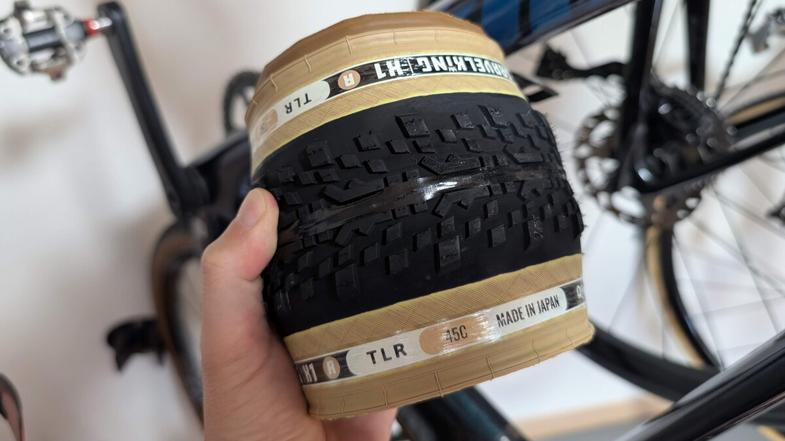

## 登りが多いなら軽いタイヤにすればいいじゃない

### GRAVELKING X1R

[GRAVELKING X1R](https://amzn.to/3TxGj3K)は、パナレーサーが新開発した**TuffTex-R**という最も軽量でしなやかなケーシングを採用したレース仕様のグラベルタイヤだ。従来のX1と比べて耐パンクベルトを一部省略しつつ、120TPIのケーシングとZSGグラベルコンパウンドの組み合わせで、GRAVELKINGシリーズ史上最低の転がり抵抗を実現している。

フロントに装着した**45cタイヤで無印X1の40c相当の重量**で済んでしまうのが最大の特徴。

軽量化によって登りパフォーマンスの向上を期待したり、重量を増やすことなくグリップを稼いだりといった効果が期待できる。一方で、耐パンク性能とのトレードオフが気になるところだった。

<Amzn asin="B0CWKRQV2J" />

## シェイクダウン

2025年に控えているグラベルライドや富士グラベルに向けて、近くの河川敷でシェイクダウン。

ノーマルのX1にあったタイヤの固さが取れて、変形を感じ取れる接地感がある。ビードとシーラントを慣らすために高めの空気圧にセットしたにもかかわらず、路面追従を感じるので、シクロクロスと余り感覚を変えずに使えそう…というのがファーストインプレッションだった。

ちょっとした段差やギャップを『ムニっと』いなしてくれるので、乗り心地もよく、接地感も高く安心してコントロールできそうなタイヤだ。

シクロクロスで使っている**ハンドメイドチューブラーでの安心感**はこうしたタイヤのしなやかさからくる接地感によるものが大きいのだが、このX1Rからも同じ印象を受けた。

ノブやコンパウンドが踏ん張るのではなく、タイヤが変形することによるグリップは人間にとってわかりやすい挙動を示してくれる（と個人的には思っている）。

## 1回目のライド：御荷鉾林道（ガレガレ）

結論から言うと、2回パンクした。

ノーマルタイプのX1と同じ空気圧で挑んだのだが、あえなく路上でのカット系パンクと、その後のTPUチューブのリム打ちパンクというダブルパンチを喰らう羽目になった。

### パンク原因を観察

興味深いのは、パンク箇所がサイドウォールではなく、タイヤの肩部分（ショルダー）だったことだ。通常のグラベルタイヤであれば、この部分は十分な耐パンク層で保護されているため、よほど鋭利な異物でない限り貫通することは少ない。

しかし、X1Rは軽量化を追求するために**耐パンク層の厚みと範囲を最適化**している。具体的には、最も接地圧の高いセンター部分は十分な保護を維持しつつ、ショルダー部分の耐パンク層は省略されている。（装着前の写真を撮るべきだった…）

これにより大幅な軽量化を実現している一方で、従来のX1では問題にならなかった異物でも貫通してしまう可能性が高まる。

空気圧不足により、タイヤがより大きく変形し、ショルダー部分への負荷が増大したことで、本来なら弾き返せたであろう異物が貫通に至ったと推測される。まさに**軽量化と耐パンク性能のトレードオフ**が具現化した瞬間だった。

### 2回目のリム打ち

1回目のパンクは実はオンロードであり、運の要素も大きいパンクだったが、問題は2回目。TPUチューブで復旧後、同じ空気圧設定のまま走行を続けたところ、今度は典型的なリム打ちパンクを起こしてしまった。

X1Rの軽量ケーシングは、従来のX1よりもさらにしなやかで変形しやすい特性を持つ。これは乗り心地の向上と転がり抵抗の低減には大きく貢献するが、**耐パンク性はトレードオフ**になっている。

対照的に、ノーマルX1のタイヤはサイドの固さが目立っており、推奨値よりやや低圧で運用していた。

具体的にはSRAMの推奨計算機から10%程度下げた空気圧だったのだが、X1Rの設計思想には合わなかったようだ。**変形のしやすさ**というX1Rの美点は、**通常か高めの空気圧でも接地感を得られる**と解釈すべきだった。

### X1Rにおける軽量性のトレードオフ

復旧にはRIDENOWのTPUチューブを使用した。シーラントで汚れても水洗いで再利用でき、畳むと非常にコンパクトになるため、TLRタイヤのバックアップとしては理想的だ。

しかし、本質的な問題はそこではない。X1Rは決してパンクしやすいタイヤではなく、**適切な使用条件下では素晴らしい性能を発揮する**。重要なのは、軽量化によって変化した特性を理解し、それに合わせた使い方をすることだった。

この日の経験により、X1Rは従来のグラベルタイヤとは異なるアプローチが必要なタイヤであることを痛感した。まさにシクロクロスのレーシングタイヤのように、デリケートだが高性能というタイヤなのだ。

なお、TPUチューブと電動ポンプの組み合わせはパンク修理に最適だったことを付け加えておく。場所も取らず、シーラントで汚れても水洗いで完全に落ちるので再利用も簡単だ。金属バルブのモデルを選べば電動ポンプの発熱も気にならない。

<Amzn asin="B0DJGR25Y7" />

<Amzn asin="B0CNPDJQYT" />

## 2回目のライド：富士グラベル（顧客の求めていたグラベル）

御荷鉾での教訓を活かし、富士グラベルではSRAMの推奨空気圧で臨んだ。結果は大正解。

45kmのミドルコースを通じて**一度もトラブルなし**。それどころか、X1Rの真価を存分に発揮してくれた。

### 登りでの軽さを実感

700x40cで460g程度という軽量性は、登りの多いコースで威力を発揮する。1000mアップのコースだったが、従来のX1と比べて軽やかに登れた。

**回転重量の軽減**効果は登坂だけでなく、加速時にも顕著に現れる。集団でのペース変化への対応が楽になり、長時間のライドでも疲労感が軽減された。

### しなやかさが生む安心感

適正空気圧で使用したX1Rは、まさに理想的なグラベルタイヤだった。

TuffTex-Rケーシングによる柔軟性が路面の凹凸を吸収し、特に細かい砂利での路面追従性が秀逸。タイヤが路面にしっかりと食いついている感覚を得られる。

霧雨で濡れた舗装路面でも、ZSGグラベルコンパウンドのグリップ性能は安心できるレベルだった。

### 転がり抵抗の改善を体感

GRAVELKINGシリーズで最低の転がり抵抗という謳い文句は伊達ではない。舗装路での巡航性能が明らかに向上しており、45cでも舗装路は快適だ。アプローチの長い日本のグラベルライドでは大きなアドバンテージとなる。

グラベル区間でも軽やかに転がり、エネルギーロスが少ないため長距離ライドでのスタミナ温存に大きく貢献する。

## まとめ：速度に特化したグラベルタイヤ

X1Rは、**明確なトレードオフのあるスピードに振ったX1の派生モデル**というのが自分の結論。

<PositiveBox>

- **圧倒的な軽さ**：登坂性能と加速性能の向上
- **しなやかな乗り心地**：路面追従性と快適性の両立
- **低い転がり抵抗**：長距離ライドでの疲労軽減
- **優秀なグリップ**：様々な路面コンディションに対応

</PositiveBox>

<NegativeBox>

- **空気圧設定がシビア**：しなやかゆえにリム打ちしやすい
- **耐パンク性能とのトレードオフ**：耐パンクベルトの少なさからくる貫通耐性の低さ

</NegativeBox>

### 推奨される使用シーン

速度の欲しいレース用途や、**路面が良好だとわかっているグラベルライドで疲労を軽減**するためには最適。転がり抵抗が良く、重量も軽く、乗り心地もよいと全てのピースがいい方向に作用する。

一方で、ガレた未知のコースや、パンクリスクを極力避けたいツーリング用途では、無印のX1や、より耐パンク性能を重視したX1+の方が安心できるだろう。パンクしたら速度はゼロという名言もある。

タイヤの進化により、死語となりかけていた表現だが「飛び道具」という扱いがしっくりくる。

<Amzn asin="B0CWKRQV2J" />
