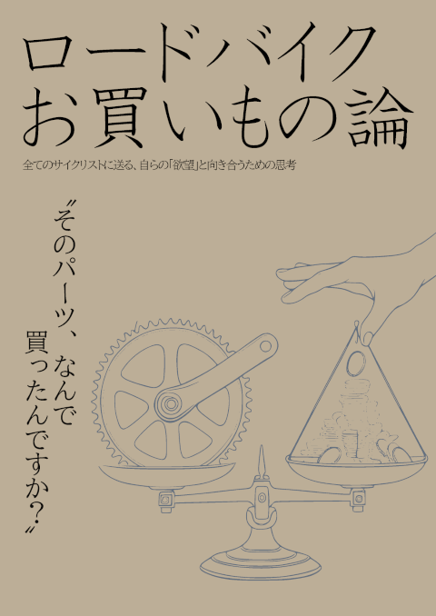
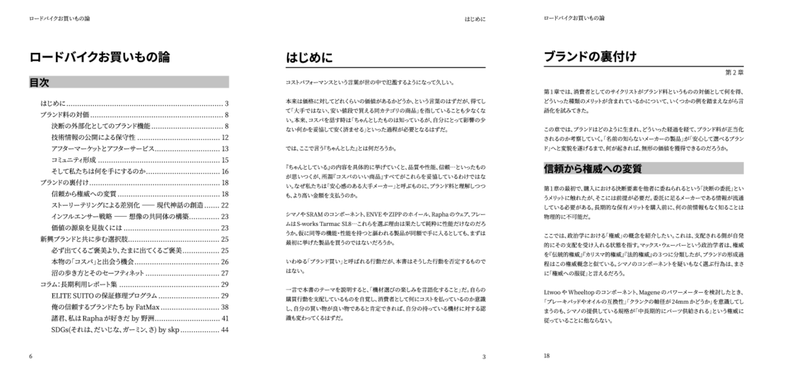

コストパフォーマンスの「パフォーマンス」、どれくらいの解像度で意識していますか？

名の通ったものと比べて、安ければコスパが良いと思っていませんか？

悪者にされがちなブランド料は何の対価なのか？性能と機能以外の価値とは何なのか？どんなに頭で理解していても、怪しいパーツを買ってしまうのはなぜ？

2年ぶりのコミケ参加では、ぼんやりと分かっているつもりの「ブランド価値」にフォーカス。

新興ブランドが勢いを増す中、実績のある大手メーカーや『ブランド料』を取っていると感じる製品が提供している価値とは何なのか、今一度言語化していく。

## C106新刊『ロードバイクお買い物論』

新刊は全60ページ、前半はブランド論に関するコラム、後半はブランドならではの長期利用サポートやエクスクルーシブイベントに関する体験談を掲載。

機能性能以外の価値とは具体的に何なのか、ブランドはどう育つのか、それでも玉石混交が欲しくなる心理とは、胡乱な蘊蓄と一緒に論じていきます！

体験談では『RCC体験談』『GARMIN製品DIY修理』『ELITEトレーナーの保証修理』（本ブログ記事リライト）『俺の信頼するブランドたちの小エピソード』というラインナップをお届けします。

### 寄稿者紹介

第4章にて体験談を寄稿いただいた皆様を紹介。

- 野洲 [@v_x_r_s](https://x.com/v_x_r_s)
- SKP [@sakimopuro](https://x.com/sakimopuro)
- [Ride Eat Sleep Repeat!](https://note.com/bikes)

## 頒布情報

コミックマーケット106 2日目(8/17)\
東6ホール コ-11b 幻想サイクル

- **C106新刊『ロードバイクお買い物論』** 頒布価格1000円 60p
- 既刊『限界車載ナレッジ』頒布価格1000円
- 既刊『週末洗車部』頒布価格500円

[スクミズマシンワークス](https://skmzlog.com/c106-carbon-frame-engineering/)の隣です。何の因果か、WINSPACE社の協力を得て作られた本を頒布するスペースの隣で、ブランド論をぶちかますことになってしまいました。

## 委託情報

いつも通り、メロンブックスで物理本を、Kindleで電子版を配信します。

<LinkCard url="https://www.melonbooks.co.jp/detail/detail.php?product_id=3163402" />
