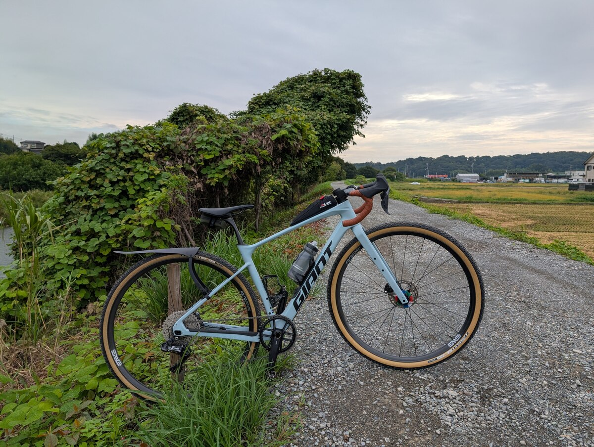
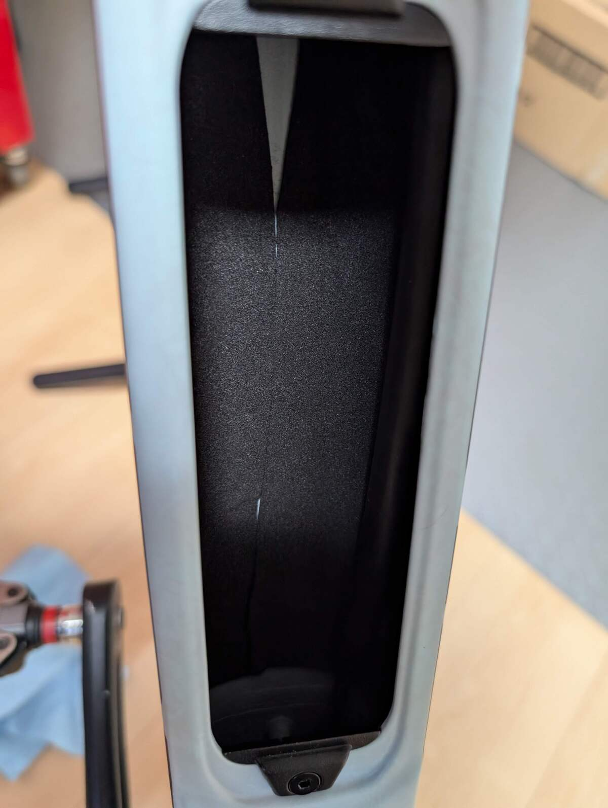
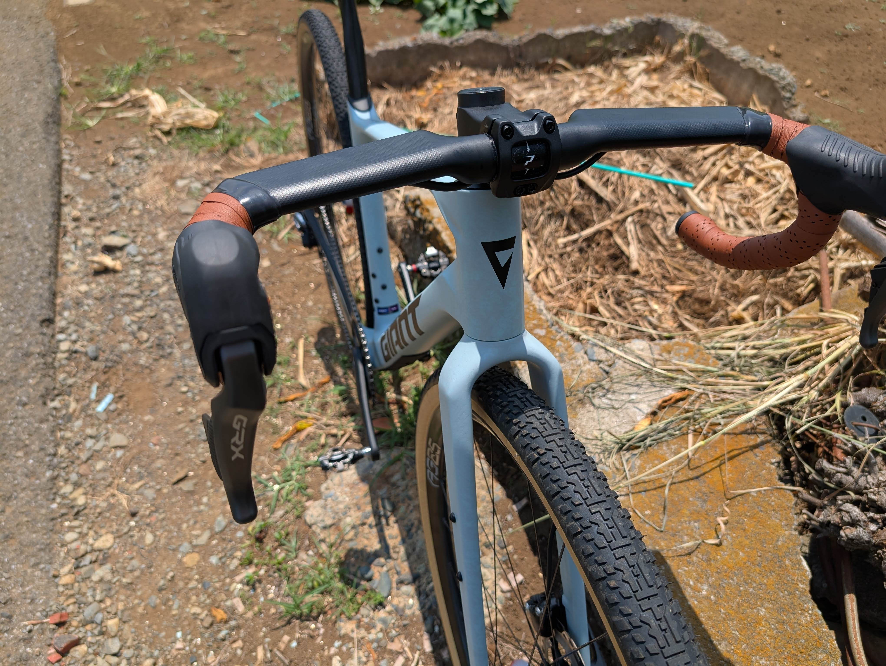
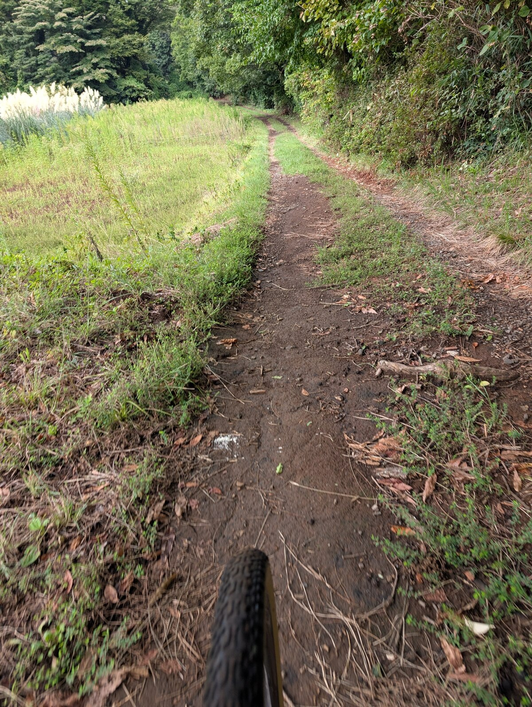

前作のREVOLT ADVANCEDは自分にとって初めてのグラベルロード。ニセコグラベルや富士グラベルといった大きなイベントに連れていき、走り飽きた神奈川県南部で新たなフィールドを開拓するよくできた相棒だった。

<LinkCard url="https://blog.gensobunya.net/post/2022/04/revolot_adv22_review/" />

ただ、ニセコグラベルの飛行機輪行や、度重なるタフなライドで大きな傷もついていたことも事実。

購入から3年以内であれば、GIANTのカーボンリプレイスメントプログラムを利用できるので、そのうちにということで思い切ってフレームを購入して組み換えることを決意した。

## 短いサイクルでのモデルチェンジ

通常**モデルチェンジに4年をかけるGIANTが、3年という短い期間で新作を出してきた**。グラベルシーンの進歩の速さがわかる数字だ。

このわずかな間に、主流となるタイヤ幅の拡大や、グラベルレースシーンの隆盛、UDHの普及など様々な変化がグラベル界では起きている。それに伴い、50cのクリアランス・エアロ性能などがグラベルロードの標準となりつつある。

アンバウンドグラベルの最長となる200マイルクラスでは、セルフサポートが必須となるなど、積載性も重要となっており、フレーム内ストレージもトレンドの1つだ。

新しい第4世代REVOLTは、これらのトレンドへしっかりと対応してきた。**レースモデルながら、ダウンチューブ下やフォーク横などのダボ穴が豊富**という特徴はそのままだ。タイヤ幅は、前後とも3mm拡大（ショートモード42mm -> 45mm, ロングモード50mm -> 53mm）している。

### 内蔵ストレージ

流行の**ストレージはダウンチューブに配置。もちろんストレージバッグも付属**している。

内部には緩衝材もついて、音鳴りを防いでくれるはずだった…が、なんと届いたフレームセットには緩衝材が貼られておらず。

ニセコグラベルで見た展示車には、[ダウンチューブ内に黒いウレタンシートが貼られていた](https://x.com/raichireishi/status/1837811720129335449)。海外のレビュー記事も緩衝材について言及されている。

再生産してもらうほどの瑕疵でもないので、GIANTジャパンで同等品を手配してもらい、（ショップにもって行く手間が惜しかったため）自分で貼り付けるという形で対応していただいた。

狭い作業野で大きなシートを貼り付ける手順なので、自分の不器用さと相まって綺麗にピッチリとはいかなかったが、分割して貼り付けることで実用上問題の無いレベルにはなった。

なお、緩衝材によってバッグとフレームの摩擦も強くなって固定力が増した半面、バッグをフレーム内に押し込む労力は増えた。ライド中のノイズに比べれば小さなストレスだが、こういったトレードオフもあるのだと学んだ。

### 半内装ケーブル

GIANTは、TT/Triバイクを除く全モデル完成車で完全内装の一体型ハンドル・完全内装ステムを採用せず、ステムの下部を経由してヘッドチューブに導入する仕組みを採用している。（OverDrive Aeroを採用しているロード上位モデルはうまく隠れるが、ステムではいったん外部の溝を通している）

REVOLTも例外ではなく、ヘッドチューブから内装されるルーティングだが、フォーク規格は通常のOverDrive（1-1/8インチ）で、ケーブル類を完全に隠すことはできない。一応社外ステムも利用できるが、誘導用ヘッドパーツを考えると実質専用ステムとなる。

ハンドル周りは上から見るとスッキリしているが、下部ではケーブルは少し見える仕上がりで少し中途半端だ。誘導用のヘッドパーツ分、実質スタックも高い。

## ライドインプレッション

アッセンブルについては、やや苦言を呈してしまったが、実ライドでは前モデルからの課題をしっかり潰していることが確認できた。

比較バイクは2022年モデルのREVOLT ADVANCEDで、専用となるステム以外すべてのパーツを移植した。ほぼ純粋にフレームのみの比較ができたはずだ。

前作ではアタックをかけたり、急加速するようなトルクをかけたときにBB周りの剛性不足が感じられた。当時のコメントは下記の通り。

> レースユースを想定しているだけあり、ペダリング効率はかなり良い………のだがシッティング限定となる。
> ダンシングでバイクが斜めになると、フォークやリアエンド部分が撓む感覚は大きい。この辺りは全てが剛体といった風情の TCR と最大の違いだった。淡々とシッティングで回す分には非常に気持ちよく進んでくれる ので、ダンシングしない乗り方がいいのだろう。

降車して、バイクを斜めにして、横からペダルを地面方向に踏み込むという原始的な剛性チェックをすると、第3世代のREVOLTはかなりグニャっと変形するが、第4世代ではその変形が小さくなっていた。（手持ちの第10世代TCRほどの剛性は無かった）

第4世代REVOLTは、実走での**BB周りの剛性感が明確に高くなっており**、ダンシングしても気持ちよく加速できる。第3世代の時はTCXでグラベルレースに参戦するサポートライダーも多かったが、第4世代がリリース後にTCXでの参戦はほとんど見なくなったことから、明確にグラベルレースをターゲットにして開発し、実を結んだのだろう。

明確にアピールこそしていないものの、フォークとフレームも軽量化されており、車重は数百グラム軽くなっている。

ストレージをダウンチューブに配置した以上、変形を小さくしないと開口部が歪んでしまうから剛性を高めなければならない事情が予想されるにせよ、高速域や加速時の挙動が良いのはプラスだ。**オンロードとオフロードを兼ねる万能バイクは存在しないというのが持論**だが、前作よりはその幻の理想に近づいている。

運動性能が上がった一方で、REVOLTの特徴であるハンドリングの良さや、D-fuseシートポストによる乗り心地の良さは健在。シートポストがSLRグレードにアップして、更にしなりやすくなったのか、サドルに座ってやや荒れたグラベルを下っても安定している。長時間のダウンヒルで立ちっぱなしだと疲労が溜まってしまうので、シッティングでも跳ね返りを感じないのは非常に助かる。寝ているヘッドのおかげで、オフロードダウンヒルの安定性も高い。その分、クイックなコーナリングは苦手だがそれはCXバイクであるTCXの領分だ。

### ポジション

唯一しっくりこなかったのがポジションだ。

内装用のヘッドパーツが増えた分、ヘッドスペーサー無しの状態でもハンドルが高くなっている。舗装路もある程度快適に走りたいし、距離の長いイベントでは空気抵抗も馬鹿にできないので、なるべく頭が低くなるセッティングにしているのだが、今回はハンドルが高すぎてブラケットポジションでパワーをかけづらい感覚があった。

第3世代から**乗り換える場合、ステムをワンサイズ伸ばすか、リーチの長いハンドルを使った方がよさそう**だ。

現状は42㎝幅のストレートハンドルを使っているが、次は上40cm/下42cm程度でドロップも少な目にして、ステムを20㎜伸ばす…？と考えるとEXSのグラベルハンドルが候補に挙がる。ただ、ハンドル内のケーブル内装に非対応なので、理想のハンドルが出るまで市場を注視するつもりだ。

## まとめ

2022-2024モデルのREVOLTで感じていた**課題を的確に潰しつつ、トレンドにも対応**した正統進化のグラベルレースとパッキングライドを両立したモデル。

軽量化しつつ剛性も高くなり、ロードバイクに似た運動能力も手に入れた。機敏なショートモードで、45㎜タイヤまで公式に使えるので、幅広い局面で活用できるバイクとなっている。

2026年もフレームセットはカラーを継続、そのほかも国内展開されているので、（在庫があれば）安心して買っていいと言えるバイクだろう。
