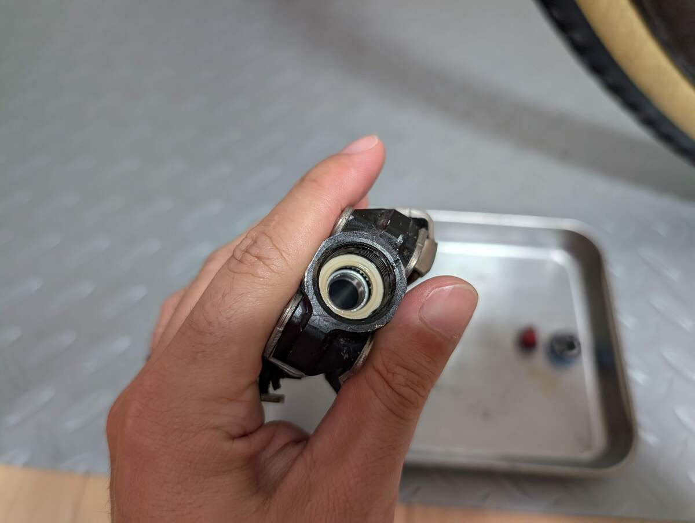

## 背景

グラベルロードに使っている[Favero Assioma PRO MX-1](https://amzn.to/4m0bikH)が非常に良かったので、両側化して本格運用することを決意した。

<Amzn asin="B0DZCHJG9M" />

パワーメーターとしての計測であれば、片足で十分事足りるのだが、Garmin Connectで見ているペダリングダイナミクスのデータを見ているうちに、両脚のデータを見たくなってしまった。

ここで言っている「良い」の意味は、SRMに比肩されるパワー精度と安定性もさることながら、拡張性や保守性が高いという点も欠かせない。

Assiomaの現行世代パワーメーター（MX, RS）は補修パーツ類が非常に豊富で、構成するすべてのパーツを購入できる。

<LinkCard url="https://cycling.favero.com/en/shop-category?tid=21" />

更に、RS, MXのロード↔MTBがボディ入れ替えで変換できる仕組みとなっており、ペダル型であることからCX以外では長く付き合うことができるだろうという読みだ。（CXはペダルに容赦なく高圧洗浄をかけるのでNG）

## 購入物

公式通販でも購入できるのだが、bikeINNの方が安く、到着見込みも早かったので今回はbikeINNで購入した。到着時の消費税を含めて55000円は下回るといった具合。

単純なアップグレードであれば、[PRO MX-UP](https://amzn.to/42dzbOD)を購入すればポン付け＋アプリでのペアリングだけで両脚化が可能だ。ただし、こちらはボディも含めて購入することになるので、**お値段は7万円前後する上に、何の機能もないAssiomaの右側SPDペダルが余ってしまう。**

工具箱の底で腐ることが目に見えているので、なるべくボディを使いまわす方法を探り、**補修部品の右スピンドルを既存のペダルに入れることで両側化できる**ということをFaveroのサポートに確認したうえで今回の方針を決定した。

## 作業

難しいことはなく、公式Youtubeチャンネルが提供している"Favero Assioma PRO MX: How to replace the pedal bodies"を参照してボディではなくスピンドルを交換するように読み替えるだけだ。

動画の内容をなぞっても価値の薄い情報になってしまうので、要点のみ記載していく。

<iframe width="560" height="315" src="https://www.youtube.com/embed/GnQVhhrnvGs?si=DvIOomS_j4XUwGT4" title="YouTube video player" frameborder="0" allow="accelerometer; autoplay; clipboard-write; encrypted-media; gyroscope; picture-in-picture; web-share" referrerpolicy="strict-origin-when-cross-origin" allowfullscreen></iframe>

ボディ交換と異なる点として、**ボディを使いまわす場合オイルやダストシールはボディに残っているので、わざわざ新品を追加する必要はない。**（もちろんシールが破損している場合は除く）

パーツ点数はたったの5点で済んでおり、トルク管理できる環境さえあればポン付けに近い感覚でメンテナンスを行える。

ひずみゲージのついているスピンドルと、ベアリング圧入されているボディはASSYとなっていて、内部はユーザー側で作業できない。その代わり、シマノペダルのように絶妙な玉当たりを調整する必要がないので、作業ハードルを大幅に下げてくれる。

唯一の注意点は、**トルク管理の必要なインナーキャップが逆ネジ**という点。（右側ペダルのみ）

ペダリングで緩まないために当然ではあるものの、[トルクグリップ](https://amzn.to/42gThri)のような反転できない簡易トルクレンチではトルク計測ができないので注意。

パワーメーターの組付けでトルク管理ができない場合、計測値も信用できなくなってしまう。そのような事態は避けたい。

最後の注意点は、余計な場所にグリスを残さないためにグリスアップツールをちゃんと使うということだ。これはMX-1やMX-2の本体に同梱されている。

本当に**ネジを緩めて、スピンドルにグリスを塗って入れ替えるだけ**なので、作業が5分で済んでしまった。もし両側をロードペダルに入れ替えるという場合でも、ほぼ同じ工程なので10分程度で両側を交換できてしまう計算だ。

先々でベアリング交換やライドスタイルの変更に遭っても簡単な作業で対応できるという点は非常に強い。これでRS-2も他人におすすめできる確信を得た。

<Amzn asin="B0FGJ5HFM9" />

## 最初からMX-2を買え

さて、勘のいいひとは気が付いたと思うが、スピンドルだけを買った場合では「両脚PM用の二股充電ケーブル」が付属してこない。

にもかかわらず冒頭の写真では二股ケーブルを使って充電しているわけだが、これは私が**この個体と別にロードバイク用の[PRO MX-2](https://amzn.to/3V4vDdK)を購入している**からだ。

<Amzn asin="B0DZCL7M9J" />

良い物と知ったからには、最初から一番いい物を買うのが出費も手間も少ない。

スパイダー型ならばともかく、ペダル側のパワーメーターであれば両側を買っておいたほうがリセール的にも良いだろう。最初から[MX-2](https://amzn.to/3V4vDdK)を買っておけばよかったというのが本記事の結論だ。

Assiomaは内外価格差がそこまで大きくなく、公式通販から買った品で不良が出た場合送料はユーザー持ちという話も聞いたので、国内流通で買うのがよいだろう。
