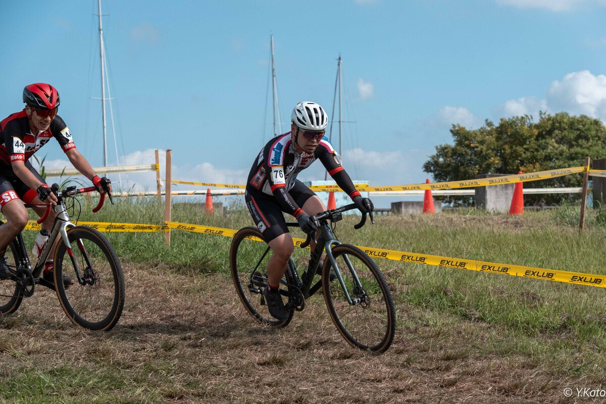

## リザルト

45/60位 (-1lap)

### 機材

- メインバイク
  - GIANT TCX ADVANCED PRO
  - Farsports CX TU + A.Dugast Typhoon 33c (F: 1.70 Bar, R: 1.70 Bar)

※空気圧は[CYCPLYS AS2 PRO](https://amzn.to/3XXh90k)による空気圧設定

<Amzn asin="B0CNPDJQYT" />

今シーズンから、ドライ時はチェパークのチェーンワックスを利用している。レース後に、フレームと一緒にチェーン周りを**マックオフナノテククリーナーで洗えば、駆動系も含めて綺麗に洗車が終わる**ので、時短になり助かっている。

<Amzn asin="B0C4NVS7TB" />

## コース

定番のりんりんポート周辺の陸上競技場と芝生広場を利用したコース。

グラウンド上のコーナーでの減速が少なくなり、その他の箇所もコース幅が広く高速で抜けられる設定のコーナーがほとんど。ライン取り次第でかなりボトムスピードを上げられるので、上手ければ上手いほどタイムが稼げる設定になっていた。

## レース

昨年生まれた子供の世話が最優先なので、地味に維持しつづけた最低限のフィットネスで戦うつもりだったが、レース2週間前に子供が発熱。自分も1週間前から体調を崩して1晩高熱で寝込んでしまい、直前の仕上げ期をノーライドで過ごしてしまった。

当日もHRVが最低クラス、ストレス値は常に高めで推移するなど、レースに臨む体調としては過去最悪だ。それでも、走らなければ現在位置もわからない。

ME2に降格して最後尾からのスタートなので、ME2のスキルレベルや抜きやすさをチェックしておきたかったのと、自分のアドバンテージがどれくらい残っているかの確認も兼ねている。

<iframe width="560" height="315" src="https://www.youtube.com/embed/0TbKSfDpQP4?si=pLg3rPDUTCv_mD60" title="YouTube video player" frameborder="0" allow="accelerometer; autoplay; clipboard-write; encrypted-media; gyroscope; picture-in-picture; web-share" referrerpolicy="strict-origin-when-cross-origin" allowfullscreen></iframe>

1周目は20人ほどオーバーテイクに成功し、元ME1の意地を見せたが練習不足と体調不良はごまかせず、2周目には早くも失速。

それでも、踏みなおせずに直線で垂れるにしても、コーナーワークや段差のクリアスピードでかなりタイムを取り返せるので、ごまかしながらレースを進められた。25分ほどたったところで本格的に脚が無くなってしまいストップするまで、パックの最後尾についたり千切られたりできていた。

体力さえ回復すれば上位に戻れる感触はあったので、開成・幕張の高速レースに向けて少しでも回復と積み上げに努めたい。上位に戻れる感触が、過去のパフォーマンスにより自意識でないことを祈るばかりだ。

余談になるが、ライフステージもカテゴリも何もかも変わった状態で出場する、半年ぶりのシクロクロスレースだった。侵入角、スピード、タイヤの潰れ具合、障害物の有無とか考えながら走ってると雑念がスーッと消えていき、「楽しい」という感情が出てきたのは本当に自分がシクロクロスを好きな証拠に思えて、少し嬉しかった。

## Photo

- [Y.Kato](https://x.com/kaytoyoshitaka)
