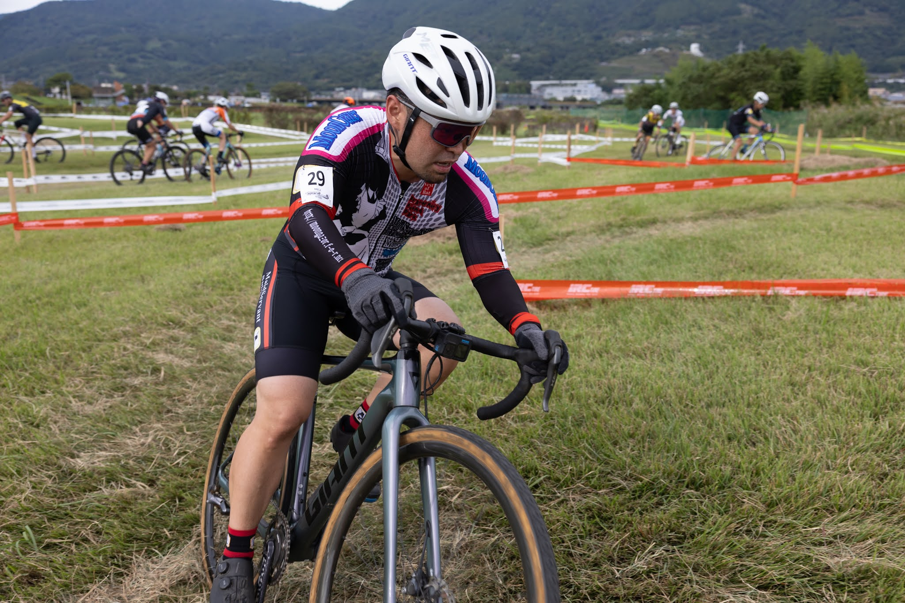

## リザルト

13/37位 (+2:53)

### 機材

- メインバイク
  - GIANT TCX ADVANCED PRO
  - Farsports CX TU + A.Dugast Typhoon 33c (F: 1.70 Bar, R: 1.70 Bar)

※空気圧は[CYCPLYS AS2 PRO](https://amzn.to/3XXh90k)による空気圧設定

<Amzn asin="B0CNPDJQYT" />

今シーズンから、ドライ時はチェパークのチェーンワックスを利用している。レース後に、フレームと一緒にチェーン周りを**マックオフナノテククリーナーで洗えば、駆動系も含めて綺麗に洗車が終わる**ので、時短になり助かっている。

<Amzn asin="B0C4NVS7TB" />

## コース

定番の河川敷公園の芝生とキャンバーエリアを使ったコース。

きつめのキャンバーに、階段越えや急下りがあったりする機材泣かせのコース…ではあるが、危ない箇所ほど気を付けるのかホイール周りを壊している人は滅多にいない。実はもう1つの代名詞である重い重い芝生が、ディレイラーやプーリーに絡まって破壊していることの方が多い。

湘南CXで最も気持ちよく曲がれない（苦言）ことで定評のあるコーナーエリアは、逆バンクのタイトコーナーだらけ。スキルが高ければアドバンテージはあるが、先頭にいないと意味がないというジレンマがある。

バックストレートの重い芝と風のエリアでどれだけ踏み倒し、テクニカルなセクションでボトムスピードを維持できるかどうかがタイムを稼ぐカギとなる。

## レース

先週は風邪の後遺症により、貧弱なフィジカルのままだったが今週は完全に回復。HRVや安静心拍も良好な状態でレース当日を迎えた。

近場ということもあり、朝は子供の面倒を見ながら、栄養補給や水分補給もタイムスケジュールをしっかり組んで淡々と補給。

<iframe width="560" height="315" src="https://www.youtube.com/embed/F-LEMCrVNMU?si=0ceiLtosqIeRqvI-" title="YouTube video player" frameborder="0" allow="accelerometer; autoplay; clipboard-write; encrypted-media; gyroscope; picture-in-picture; web-share" referrerpolicy="strict-origin-when-cross-origin" allowfullscreen></iframe>

スタートはミスして後方に埋もれてしまった。細いスタートエリアと、スタート直後の段差での混乱を見越していたが、それらにビビりすぎてしまったことが原因。

前へ出ようにも、みんな焦っているのか、キャンバーエリアではイージーミスが自分を含む周囲で連発。テクニカルセクションでは、遅い選手に詰まった車列が出来上がり、心拍が落ち着き始めてしまうありさま。スタートループ採用は非常にありがたかったが、コース特性までは変わってくれない…

バックストレートに出てから、各々のレースがスタートし、脚の合う人を見つけて後ろに入り、キャンバーやコーナー処理が上手い人は周囲にいないことを確認してからは、積極的に前に出て展開。とはいえ、体調がよくなっただけで、脚力や体力が向上したわけではない。インターバルをかけすぎると最後まで持たないことは自覚していたので、ペースを刻むことに専念する。

前6周の4周目後半から、前を捉えるレースから周囲と抜きつ抜かれつにレースが変化。コースサイドの観客カウントで15位前後にいることはわかっていたが、メカトラ・マスターズ選手も多くいまいち現在地がつかめない。

ラスト一周を前にして後ろについたパックを、シケインと急坂を使って前に出て自分の後ろから切り離したところだけは上手くいった。しかし、バックストレートでハイパワーを出す元気もなく数名に後ろからパスされてしまう。

なんとかダンシングで追いすがるが、一瞬後ろにつくのが精いっぱい。抜き返せずにフィニッシュ。

階段やシケインのでは、昔取ったME1の杵柄を使ってアドバンテージを取れるものの、根本的な脚力が落ちていることは否めないという感触だった。

## Photo

- [Y.Kato](https://x.com/kaytoyoshitaka)
