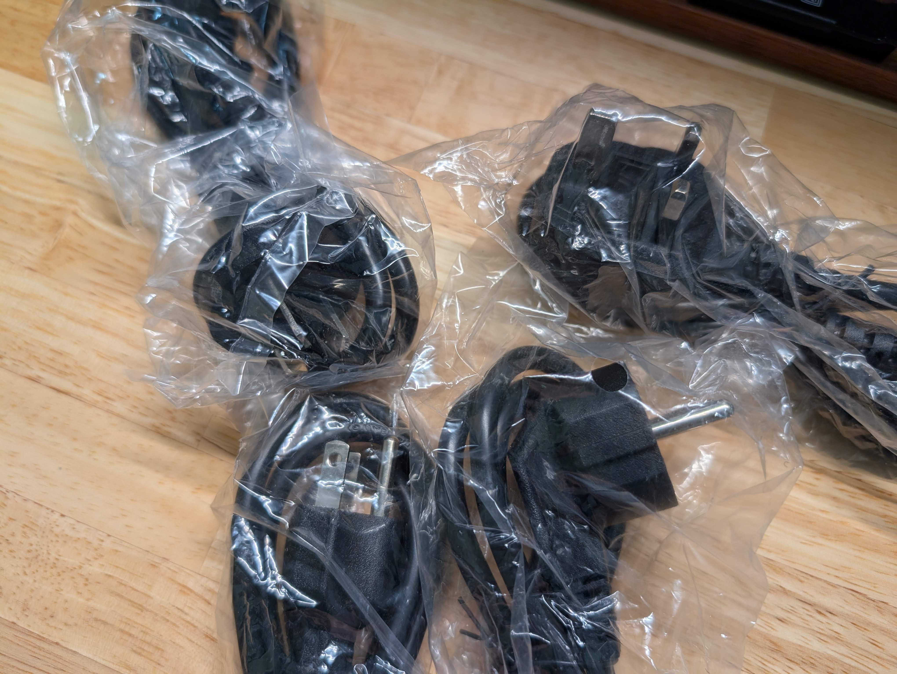
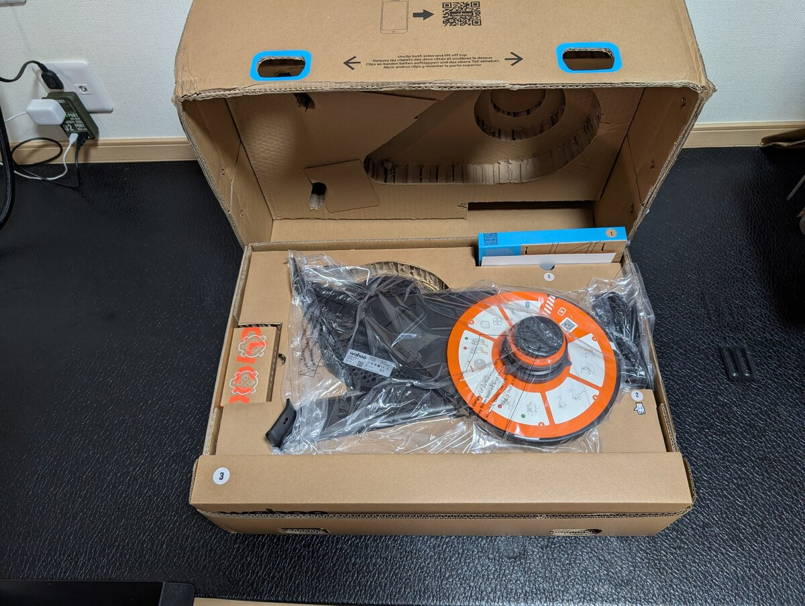
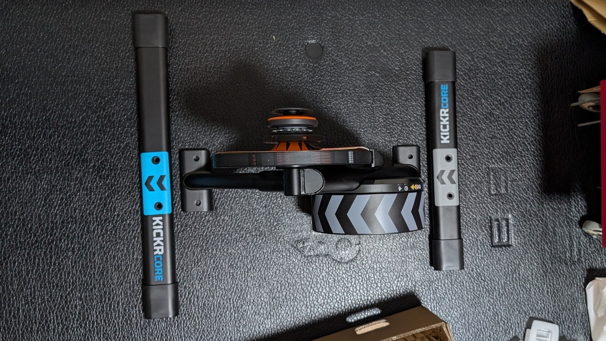
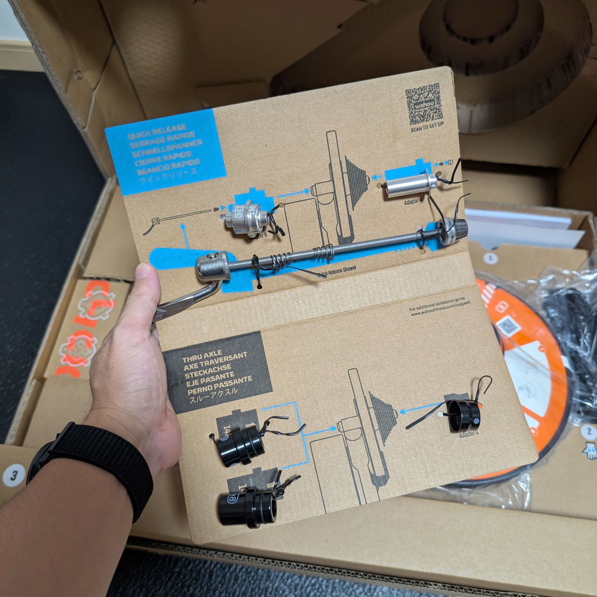
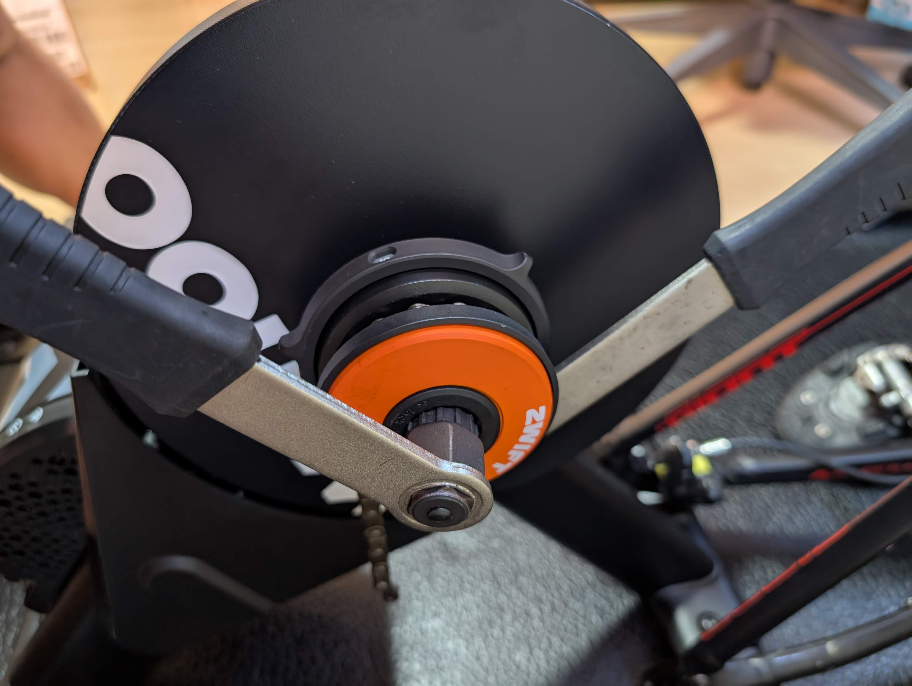

愛用していたSaris H3とシングルスピードCXを組み合わせて、QZを使いながらバーチャルシフティングを使いつつ、Zwiftでトレーニングをしていた。

Saris H3の拡張性の低さや、QZ経由で実現したバーチャルシフトの不安定さやレスポンスの悪さから、Zwift Clickをサポートするスマートトレーナーへの移行を決意。

## 主なスペックと注目ポイント

前作のKICKR COREから、平たくなったベースレッグ部分に加えて、Wifi接続・レースモード対応・Bluetoothブリッジ・オートキャリブレーションといったソフトウェア面に加え、付属するZwift Clickが第2世代になったことが主な変更点。

レッグ部分は、前後がわかりにくいという組み立てプロセスの改善らしいので、トレーナーとしてのアップデートは主にソフトウェア側だ。劇的な変化ではないが、前モデルから7年もの経過とともに必要なった要素を追加した、正常進化モデルといった趣だ。

Bluetoothブリッジは、Apple TVのようなBluetooth接続上限が厳しいデバイスと組み合わせるときに必須とのことだが、Apple TVが効果すぎるので自分が必要性を意識することはなさそう。

ちなみに、ACアダプターのプラグは日本人の家屋には馴染みが薄いアース付き3ピンプラグだ。Wahooのトレーナーは国内購入品でもこの規格らしい。確かに日本規格ではあるが、気を使った注文住宅でもなければキッチンの一部以外に3ピンプラグ対応のコンセントを装備している家は少ないだろう…

## 開梱・組み立て

さっそく箱から本体を取り出して、組み立てていく。

Saris H3のように組み立て済みで脚を広げるだけではなく、KICKR CORE2は自分で脚のねじ止めが必要だ。Zwift Cogは取り付け済み。

脚に進行方向がプリントされているので、前後の長さだけわかっていれば問題ない。組み立て手順はWahooアプリで丁寧にガイドされるので、間違える人は少ないだろう。

各種エンド規格に対応するためのキャップも、利用方向が書かれており、嵌めたとき表側に規格名が出てくるという気合の入りっぷり。

## 走行感・トレーナーとしての快適性

特筆すべきは、バーチャルシフティングとそれがもたらす静音性。**KICKR CORE2自体の稼働音もかなり小さい**上に、Zwift Cogと組み合わせで実現する **「まっすぐなチェーンライン」はギアとチェーンの接触音も最小限**に抑えてくれる。

伸びたチェーンだと若干音鳴りするが、新品のチェーンと組み合わせたところ、隣の部屋で家族が寝ていてもトレーニングに支障はなさそうだった。もちろん、ノーマルコグを使ってしまっては変速音が出て台無しになってしまうので、バーチャルシフティングの使用は必須だ。

インドアサイクリングでは、チェーンは汚れないものの、静かにトレーニングするためにチェーンオイルは必須。特に、徐々に油膜切れが進むと、騒音も少しづつ大きくなるので気づきにくい。

発進時の大トルクや耐久性を考慮して、電動ママチャリにも使っている[FINISH LINEのe-bike チェーンルブ](https://amzn.to/4qkCNJ8)をローラー用バイクには使っている。

<Amzn asin="B01NAWVKN7" />

トレーナーとしての負荷のかかり方は、H3と比べて遜色ない。

筐体自体の重量が減った他、フットプリントも狭いので**無酸素インターバルをやるときの安定感はやや心もとないが、トルクの変動は非常に滑らか。** スペック上も1800Wまでは対応しているので、自分の脚には十分余裕がある。

### Zwift Clickとバーチャルシフティング

Zwift ClickはQZのバーチャルシフティングと違い、**非常にレスポンス良く負荷を変動させてくれる**。ここは完全に期待通り。5Hzでデータを送信するレースモードと組み合わせれば、Zwiftレースでもなんの違和感もなく戦えるだろう。

新Zwift Clickは方向キーとABZYボタンを備えており、ゲーム内でアイテム利用・Uターン・ライン変更・ルート変更などが行えるので、ゲーム中の操作がほぼClickで完結する点も体験がいい。特に**Zボタン長押しのRide on Bomb**は利用頻度が高い。

**ERGモードでバーチャルシフトが使えなくなってしまう点**はかなり残念なので、Zwift側のアップデートに期待したい。パワーの変化が大きいメニューをこなすときに、ERGではトルク変動が大きすぎるか遅すぎるERG DEATHが起きてしまう。この現象を防ぐためにERGモードでもマニュアルシフトの有用性がある点は、Zwift側も把握していると思われるが、ERGとバーチャルギアによる負荷変動をどう処理するのか、悩みどころだろう。

ERGモードでのスタートも中々重いギアを踏み倒すことになるので、改善には期待したい。

なお、Zwift Cogはただのチェーンライン調整機能が付いたシングルギアだ。最もまっすぐなチェーンラインを実現するための機構だが、現代的なバイクに組み合わせる場合はもうちょっとアウター側に調整範囲が欲しかった。

## まとめ、だが…

2025年に必要とされる機能を十分に取り入れた、**ミドルグレードスマートトレーナーとして正常進化**している。

もともとドル価格に比べ高かったとはいえ、日本では円安の嵐が吹き荒れる中、7年経っても値上がり幅を抑えられている（通常なら1.5倍になっているところだ）。新興メーカーの価格とは比べようもないが、Zwiftの公式パートナーであるという点はZwiftユーザーには安心点だろう。

負荷のかかり方、静音性、接続性、Zwiftとの統合による体験、全て期待以上のものだった。しかし、これは**当たりの個体を引いた場合に限る**という但し書きが必要だ。

## アリエクセラー以下のサポート、お粗末なQC

Zwift ClickやWifi接続によって、個人的な利用環境を大きく改善してくれたことは間違いないのだが、**Wahooの公式サポートはお粗末すぎた。** ついでにいえばQC(Quality Control)も全く信用できないという結論に至った。

買うなら、日本の代理店であるインターテックを通すのが必須。自分のようにシングルスピードバイクをローラー専用にするという都合が無ければ、新規のトレーナー購入では[CYCPLUSのスマートバイクT7](https://www.cycplus.com/products/t7-smart-bike)が狙い目だと知人にはアドバイスするだろう。

今回、"KICKR CORE2日本最速購入"を目指して、**Wahoo公式通販**で購入した。国内発売が遅いこともあり、そもそもサポートチケットの管理等が本社経由になる製品なので、日本国内の価格で購入する意義をあまり見いだせなかったというのもある。

"Shipping 3-5 days"と記載されている中、1週間かかって届いた商品は不幸にもフライホイールを手で回すただけでわかる不良を抱えていた。

<blockquote class="twitter-tweet">
これくらいの不良は検品で弾いて欲しいんだがなぁ… <a href="https://t.co/bLzanGg2SI">pic.twitter.com/bLzanGg2SI</a>
&mdash; ゲン (@gen_sobunya) <a href="https://twitter.com/gen_sobunya/status/1968627349425111265?ref_src=twsrc%5Etfw">September 18, 2025</a></blockquote>

ポストにも書いたが、**出荷前に5秒検査すれば分かる不具合は弾いて欲しい**というのが本音。高速回転時に異音がするような不良ならまだ理解できたが、こんな製品を出荷するWahoo（とCOREシリーズを製造しているMagene）は信用ならないという評価になった。

ちなみに、**Redditには同様の症状を申告するスレッドが現在進行形で増えている**ので、特に対策はされていないようだ。

Wahooはこうした製品不良の際に、修理の提案ではなく新品交換をすると聞いていた。ましてや今回は初期不良なのだから、当然新品交換だろうと思い、淡々とサポートチケットを起票した。

チャットサポートの対応がよいと過去のツイートには多く書かれていたが、現在チャットサポートはチャットボットへの置き換え中で太平洋時間でも一切有人稼働してないので、サポートチケット以外の手段はない。

基本的に、自分は**不良品が出るのは仕方ないが、サクサク交換されるなら問題はない**というスタンスを持っている。QCは怪しいが、翌営業日にチケットを拾われて交換品が発送され、**新しい物が届くのはまた1週間後くらいかと**この時点での期待値を思い浮かべていた。折悪く、金曜日の起票となったので週末対応していないWahooサポートがチケットに返信したのは日本時間の火曜早朝だった。

何故か、記入済みだった送付先住所とシリアルナンバーの再確認をされたので、サポート返信の5分後には「その通りだ」という趣旨の返信と写真を添付した。子供に合わせて早起きさせられたのが役に立った（と思っていた）瞬間だ。

### サポートチケットの遅延

ここから、Wahooの黙殺対応が始まるのだが、長文だと感情が籠ってしまうので順序を踏んで事実だけ列挙していく。（表記は日本時間）

- 9/18: サポートチケット起票
- 9/19: サポートからシリアルと発送先住所の確認
  - 同日、2点を返信
- 9/24: 返信が無いので催促のチケット追記（対応キューに影響があるので、あまり頻繁に追記するなと書かれている）
- 9/25: [Wahoo Fitnessの公式Xアカウント](https://x.com/wahoofitness)にサポートが止まっているとメンション（過去にメンションで対応を催促して公式の返信も確認できているため）
- 9/27: チケットに催促追記
- 9/27: サポートチケットが放置されているという新規チケットを起票する
- 10/1: 当初のサポートチケットに催促追記
- 10/2: 再び、[Wahoo Fitnessの公式Xアカウント](https://x.com/wahoofitness)にメンションする。同日に[Wahoo Fitness JapanのXアカウント](https://x.com/JapanWahoo)にも現状をメンション
- 10/3: 両XアカウントからDMにてサポートチケット番号の確認が入る。催促用チケットがクローズされる（返信は無い）
- 10/3: 当初のチケットに、以後はインターテックで対応するという連絡が入る
- 10/8: 前回の案内が間違いであり、返品プロセスを開始するという連絡が入る。現在**届いている製品の電源ケーブルを切ったことを写真で撮ったら、5日ほどで交換品を発送**する
  - 提案1時間後に20日以上待たせてうるさいがトレーニングできる製品を使えなくしてから5日も経ってようやく発送という提案はふざけているのでもっと早く交換品を届ける案を出せと要求する
- 10/9: 返信が無いので、「先に交換品を発送し、後から破棄プロセスを行う」という要求をはっきりさせる。また、遅延により特典のZwiftサブスクリプションやWahooサブスクリプションが利用できていない点の補償も要求
- 10/10: 交換品の出荷指示を出したと連絡
  - 即時にお礼のメッセージを追記する
- 10/14: 交換品が発送される
- 10/17: 交換品が到着する。セッティング・動作確認の上で最初の品を破壊し、証拠写真をサポートに送付。勝手にチケットがResolvedになっているので遅延に対する補償はあるのか、できるのかと確認を追記

なお、本記事執筆時点で以後の返答は無い。

### 消える異音

先のサポートチケットのやり取りの間、インドアトレーニングが全くできないのは子育て優先の自分にとっては致命傷。騒音を覚悟しつつ、妻が出社しているタイミングでトレーニングを開始した。

何分かZwiftで走行していたところ、**何かが削れる音と共に、衝突音がどんどん小さくなって、ついには消えた。** 幸か不幸か、異音が無くなったのでZ2ライドくらいならこなせるようになったのは不幸中の幸いだった。（それ以上の強度は怖いので試していない）

なお、交換が済んだから分かったことだが、**異音が消えた故障個体は、トルクの変動があきらかに不自然**だった。

坂道やワークアウト設定によってハイパワーを要求する際、一度抵抗が上がった後に徐々に抜けていく感覚があり、ERGでのトルクすら安定しない。ましてや、バーチャルシフトの際は脚への抵抗がギクシャクしていて、「走れるが快適ではない」状態だった。

一度回転物に接触していたものがあったのだから、削れて異音が無くなっても何かしらの不具合があったのだろう。

## 今後の決意

何か、劇的な改善があったという情報が無い限り、今後のサイクリスト人生ではWahooとMageneはブラックリスト入りだ。代替品が無く、魅力的な商品があれば、最大限疑いの目をもって慎重に購入する可能性はあるが…
