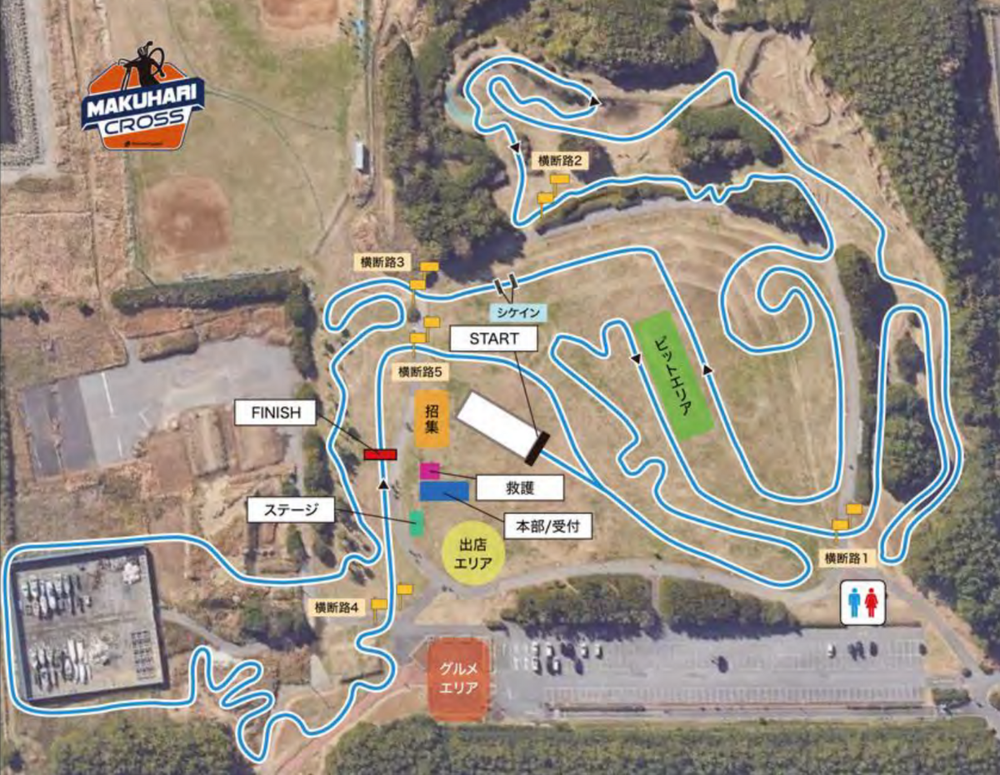
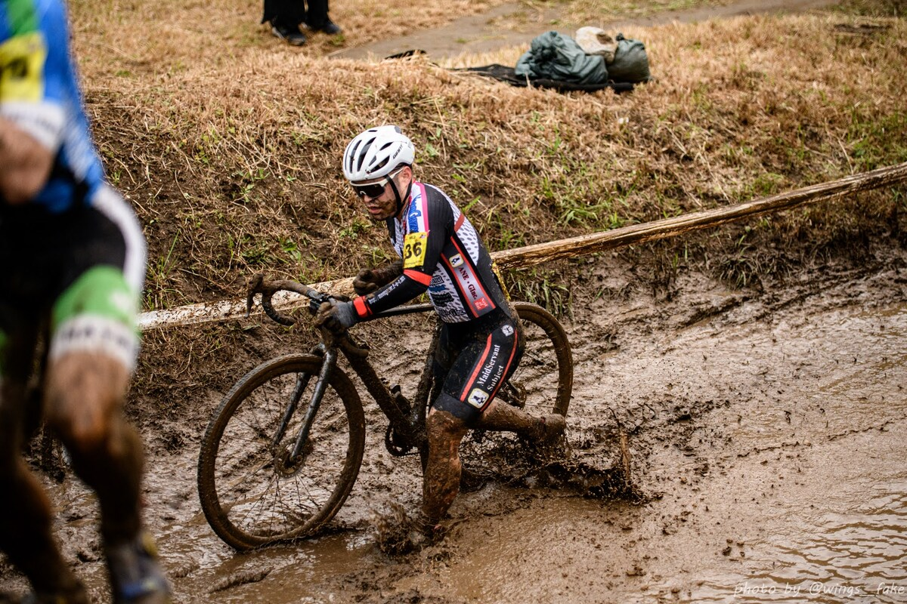
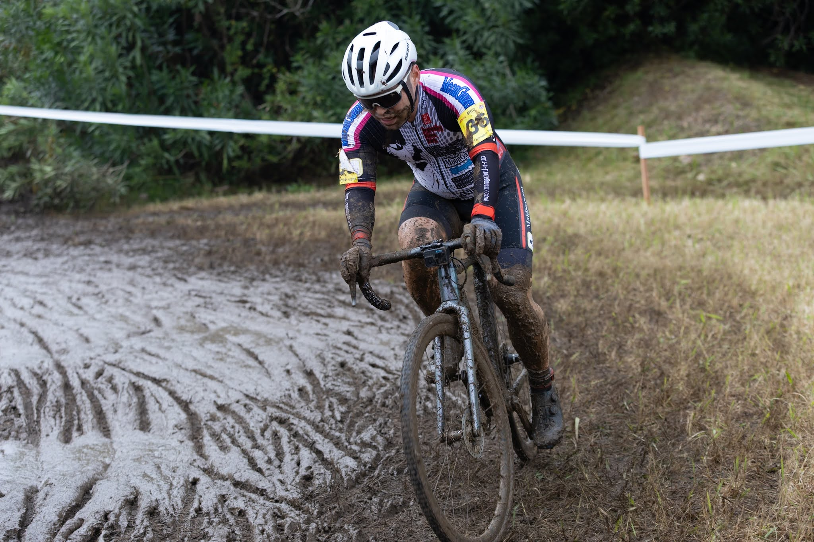

## リザルト

18/54位 (+4:40)

### 機材

- メインバイク
  - GIANT TCX ADVANCED PRO
  - Farsports CX TU + A.Dugast Typhoon 33c (F: 1.70 Bar, R: 1.70 Bar)

※空気圧は[CYCPLYS AS2 PRO](https://amzn.to/3XXh90k)による空気圧設定

<Amzn asin="B0CNPDJQYT" />

今シーズンから、ドライ時はチェパークの[チェーンワックス](https://amzn.to/4nKaGAR)を利用しているが、この日は雨予報だったので[マックオフのセラミックドライ](https://amzn.to/49Hv2Hq)を利用。

<Amzn asin="B07SYYN2J6" />

## コース

2週間前から当日は雨予報。この幕張、過去に大雨が降った大会では、MTBコースエリアの斜面がツルツルになり降車しても登れず滑り落ちるライダーが続出したこともあり、古参CXerに悪夢の再来かと恐れられていた。

設営側もその不安を汲み取ったのか、運営が困難になるのを懸念したのか、もしくはその両方だが**コースマップは例年と大きく変わる**ことになった。

晴れの幕張海浜公園は、重い芝と縦のダイナミックさが特徴のコースだが、**今年は縦の動きが大幅に減り、長いストレートがほとんど無いレイアウト**となった。多数のコーナーと斜めの動き、たまに出てくるテーブルトップや嫌らしい小キャンバーをどうクリアするかが問われるコースに。泥も相まって1周10分近くかかるロングコースとなった。

奇しくも関西では低速テクニカルコースで名高い美山コースがこちらも雨でドロドロの中開催されており、東西で低速マッドシクロクロスの日と相成った。

## レース

<iframe width="560" height="315" src="https://www.youtube.com/embed/wb4TJ0BOZOc?si=Ae-t20FwIxbl97Re" title="YouTube video player" frameborder="0" allow="accelerometer; autoplay; clipboard-write; encrypted-media; gyroscope; picture-in-picture; web-share" referrerpolicy="strict-origin-when-cross-origin" allowfullscreen></iframe>

参戦回数が少なくポイントをあまり持っていないので、54人中36番の後方スタート。

序盤の泥ではない芝生区間でどれだけポジションアップできるか問われるため、スタートはぐいぐい行くことに。雨が降り続けていた影響で、昼の試走時はシャバシャバの泥がコースの大半を覆っていた。

泥に対する空気圧セッティングは2通りで、定石通り低圧でグリップを稼いでスリップロスを減らすか、**泥の底の路面を捉えるためにあえて高めの空気圧とする民間信仰**の2択。この日は試走のコンディションと天気予報を見て後者を選択。

試走の終盤に雨はやんだが、雨雲レーダーでは再度振り出す予定だったのでシャバシャバの泥をかき分けて転がりを得る方が良いと判断。泥の無い芝生での進みもいいはずと考えた。もちろんコーナーはツルツル滑るが、重心を真ん中にして腰を捩じって無理やり自転車を曲げると意外にも鋭いターンができるのだ。

スタートは路面抵抗の目論見が当たったのか、泥区間に入るまでにポジションをいくらか上げることに成功する。

20位前後のポジションを手に入れるも、そのあとは予見できないスリップと格闘しながら前走者をパスしていく戦いが始まる。毎周回変わる最善ラインを見極め、転んだ前走者を避け（たら転び）、前後左右でメチャクチャになりながら進んでいく。テーブルトップの頂上でプルを入れたら、泥で滑った手がハンドルからすっぽ抜けたときは本当に焦った。

そして計算買いが1つ。一向に雨が降らないどころか、雲が薄くなり光も差してくる。こうなると泥がどんどん水分を失い、重くなる。重い泥では高めの空気圧は全く役に立たない。コーナーでふくらまざるを得なくなり、前を追うどころではなくなってしまった。

関西の美山と違って抜きやすいコースではあるが、中盤からペースが上げられなくなりそのままのポジションでフィニッシュ。ミスも多く反省点の多いレースとなった。

ただ、このレースでおそらくME2残留のラインは越えたので、（参加できれば）来年もME2で走れるだろう。

## Photo

- [hiroyo](https://x.com/hiroyo_oo)
- cover: [わいえほ](https://x.com/wings__fake)
