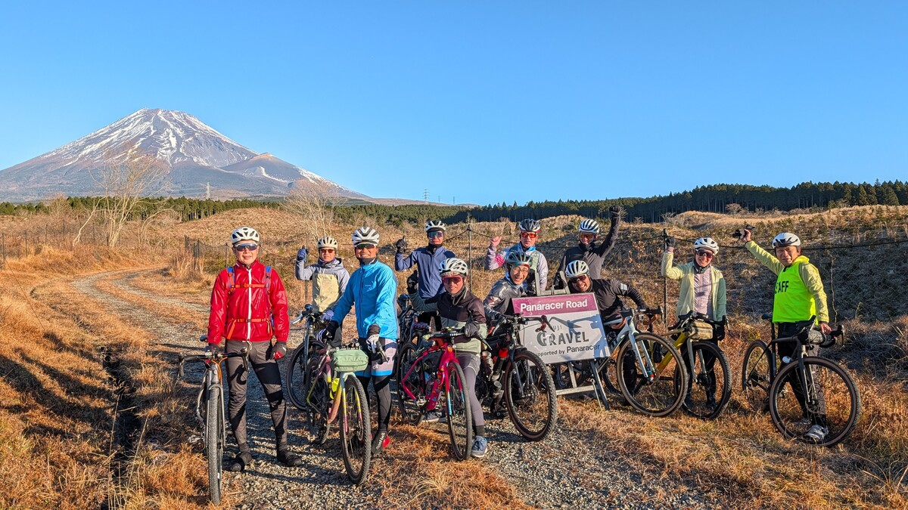
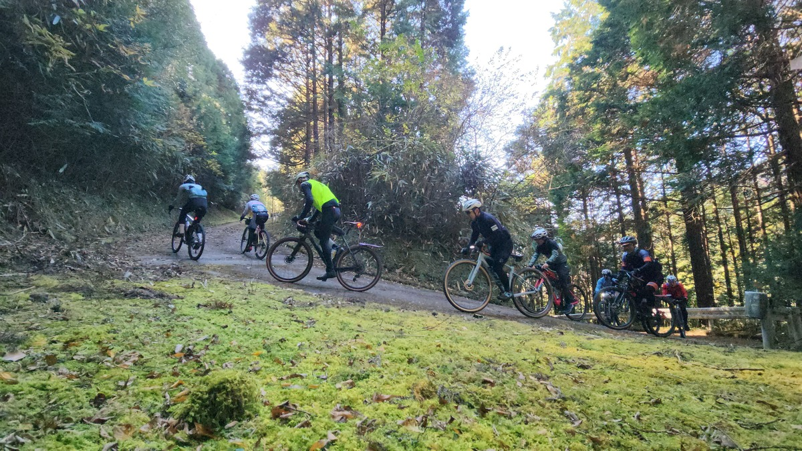
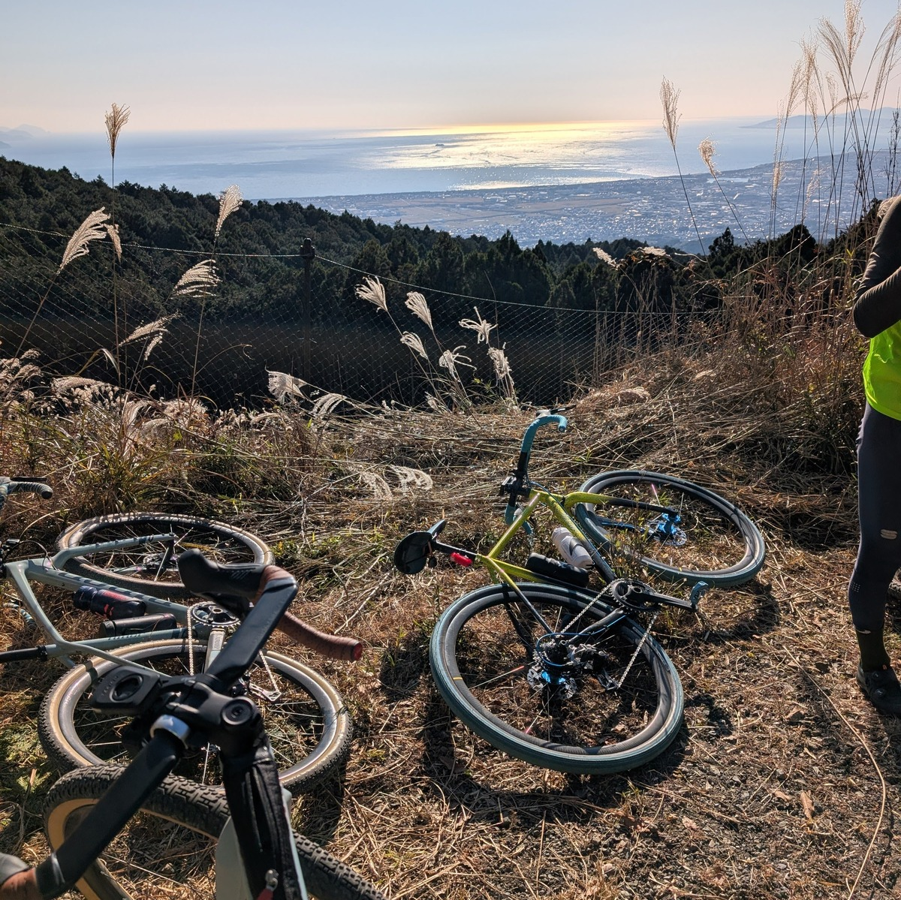
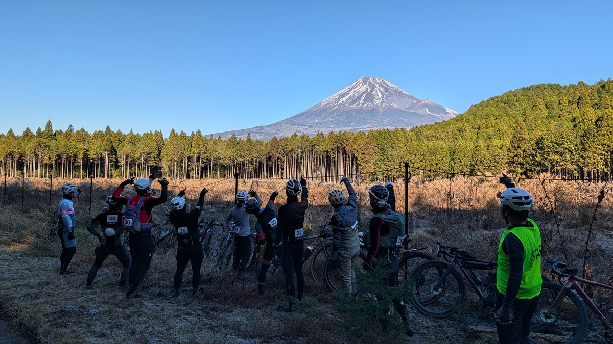
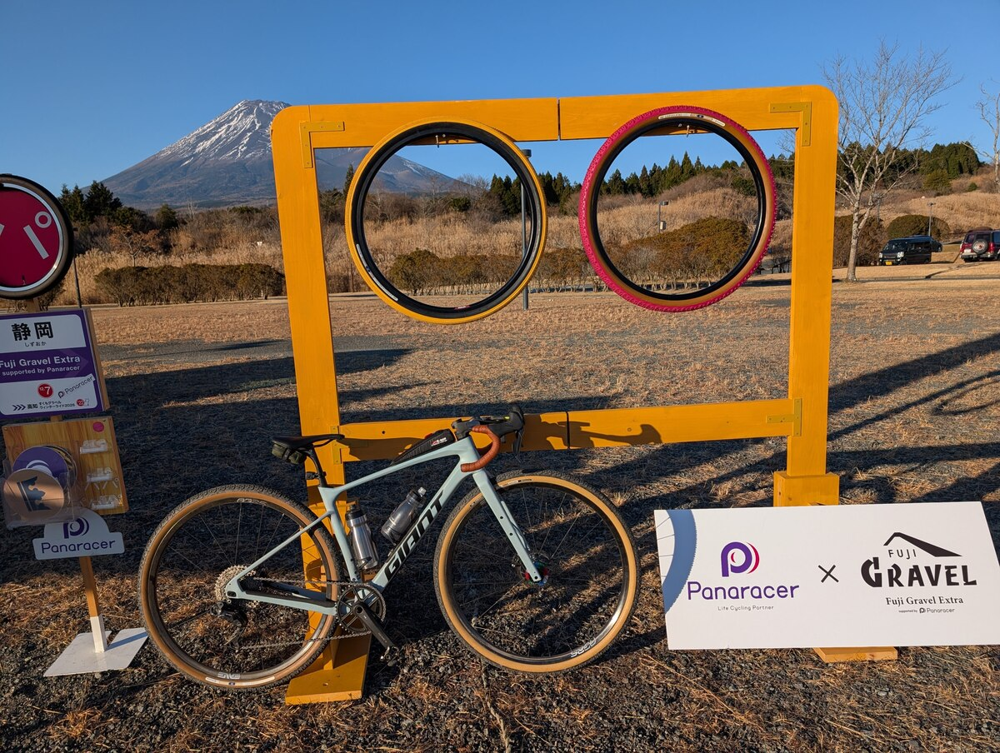

2025夏に爆誕した、関東で最もポテンシャルの高いグラベルイベントである「富士グラベル」。

第1回ということもあり、手探りで40kmほどのミドルコースで開催された。非常にいい路面で、富士山という無敵のアイコンも持っている中、唯一ちょっとした不満があった。

> 体がまだまだ元気なので、100kmとは言わないが70kmくらいのロングコースは欲しい。次回以降に期待したい。

<LinkCard url="https://blog.gensobunya.net/post/2025/05/2025-fuji-gravel/" />

この冬、**富士グラベルエクストラ**として、自分の要求を満たしたイベントとなったので、一も二も無くエントリー。

12月ということで、寒さが心配されるが、当日の裾野市予報気温は、最低3度から最高16度の予報。標高の分を差し引いて考えると、スタート時間の7:30では摂氏0度前後のスタートが予想された。

## 冬装備

今シーズン、氷点下はおろか1桁台の気温で外を走った記憶すら怪しいなか、手持ちの冬装備を総動員。

とはいえ、昼間は10度をゆうに越えるであろうから、調節しやすいものを選択した。[ドライナミックメッシュ](https://amzn.to/48VuZHb)以外は全く高級品を使っていないが、朝一の指周り以外はかなり快適なライドができたので、結果的には大正解だったセットを公開。

- Goldwin光電子ヘッドバンド
  - いざとなれば脱げる
- [INBIKE Sping/Autumnグローブ](https://s.click.aliexpress.com/e/_c4tSu1i9)
  - いざとなれば脱げる。0度付近では指がちぎれそうなほど痛かったが登り始めたら問題無くなった
- [INBIKE Winter bib](https://s.click.aliexpress.com/e/_c3XDOMGd)
  - 防風機能は限定的だが、逆にそれがちょうどよかった
- [MILLET ドライナミックメッシュノースリーブ](https://amzn.to/48VuZHb)
  - 汗冷えダメ絶対。1枚目に装備することで体表面の乾燥を維持
- GIANT Winter baselayer
  - 普通の暖かいベースレイヤー、2枚目
- Endura Windchillジャケット
  - 脇に開閉可能なベンチレーションがあり、調節しやすい。中には普通の半袖夏用ジャージを着こむ。

実際の現場は到着時点でマイナス2度、スタート時点でマイナス1度。

朝一走り出した時点では、日陰ということもあり指先が痛いほど寒かったため、もう一段階暖かい物を用意すべきだったかと後悔しかけたが、すぐに暖まり最終的には素手でヒルクライムする程度の気温になったので、比較的上手く調整で来たのではないかと思う。この中では、冬インナーの中に着た[MILLET ドライナミックメッシュ](https://amzn.to/48VuZHb)は汗冷えしないための必須装備で、特にいい仕事をしてくれた。

<Amzn asin="B0C71TLMSG" />

<LinkCard url="https://ja.aliexpress.com/item/1005007723940936.html" linkurl="https://s.click.aliexpress.com/e/_c3XDOMGd" />

<LinkCard url="https://ja.aliexpress.com/item/1005006147782176.html" linkurl="https://s.click.aliexpress.com/e/_c4tSu1i9" />

## 夏の答え合わせで富士山を望む

夏は霧で1度しか拝むことが叶わなかった富士山だが、本日は文字通り**雲一つ視界に無い**快晴！

夏には霧の中むなしく刺さっていた「絶景スポット」の看板も、今日は富士山と共に凛々しく立っているようにすら見える。

エイドも充実しており、毎度舌鼓を打ちながら会話できるペースで進んでいく。

ガイド付きグループライドというフォーマットで、事前のペーシングアンケートに沿った班編成が行われた。自分は、『良いペース』『標準』『まったり』という選択肢から『標準』を選択したところ第3班に配置された。周囲の方を見る限り、おそらくレースリザルトなどは調べたうえで編成しているように思えて、脚も揃っている。

序盤は共通コースなので、夏と同じく理想の路面に近いグラベル林道を楽しく走っていく。

## "エクストラ"コース

さて、ミドルコースでも50kmに満たなかった夏の富士グラベルと違い、今回は**68km 1870m Upというパンチのあるコース**設定。

夏のミドルコースで使っていた見覚えのあるエリアに別れを告げると、一行は駿河湾に近づくため一度降りて登り返していく。

このタイミングで、舗装路の長めの登坂で、トムボシスさん（もう"選手"ではない…）と一緒に走ることができた。フォトアタックの鋭さは元プロのそれで、とんでもないスピードで駆け上がっては撮影を繰り返していた。なんども綺麗なダンシングが見られてお得だ。

登り切ってバンジージャンプと吊り橋のスポットでもある[須津川渓谷](https://maps.app.goo.gl/Vx472p9Bse8HqrPF8)にやってくると、季節外れの美しい紅葉が迎えてくれた。

そしてここからは激坂とグラベル登坂とダウンヒルを繰り返すと、終盤は駿河湾を望むグラベルへ。

富士山がいかに偉大であろうと、何度も見てくると「さっきの方がいい景色だったな…」という気持ちも出てくるというもの。ニセコグラベルでもあったが、山だらけの中で出てくる海は格別だ。

更に、今回は終盤のフォトスポットにCannondaleのグラベルソファが設置されていた。

終盤は楽な勾配だが、地味な登りが続いており、徐々に日陰も濃くなって気温も下がり始め、なんとなくグループ内に停滞の空気が漂ってきたタイミングで、リフレッシュとなるフォトスポットであり、良い演出だった。

## 疲労困憊にならない良い塩梅のグラベルイベント

後半に登りが連続するというコースプロフィールは、イベントとしてはかなり厳しい感想が残ることを懸念していたが、68kmに7時間以上かけるという**スローペースと最後に最高のグラベルダウンヒルを配置する**ということもあって、気分良く完走できた。

なお、使ったタイヤはもちろんスポンサー様のパナレーサー。**グラベルキングX1通常モデルの45cを1.7bar**ほどで走った。こうしたファンライドイベントでは無理に軽量性に振らず、幅広のモデルで乗り心地とグリップという名前の安心をチョイスするのが王道。

毎度、東名高速道路の渋滞がひどいので、新東名が完全開通するまではじっくりイベントを育てて欲しい。

<Amzn asin="B0CWK9XGX8" />

気になった方は、公式アルバムが終了の挨拶記事から閲覧できるので、ぜひ見て欲しい。絶景！

<LinkCard url="https://fujigravel.com/blogs/news/2025-fuji-gravel-extra-photos-album" />

<iframe width="560" height="315" src="https://www.youtube.com/embed/PwutDQGgJgM?si=8ODdhMsmYsDc8eww" title="YouTube video player" frameborder="0" allow="accelerometer; autoplay; clipboard-write; encrypted-media; gyroscope; picture-in-picture; web-share" referrerpolicy="strict-origin-when-cross-origin" allowfullscreen></iframe>
