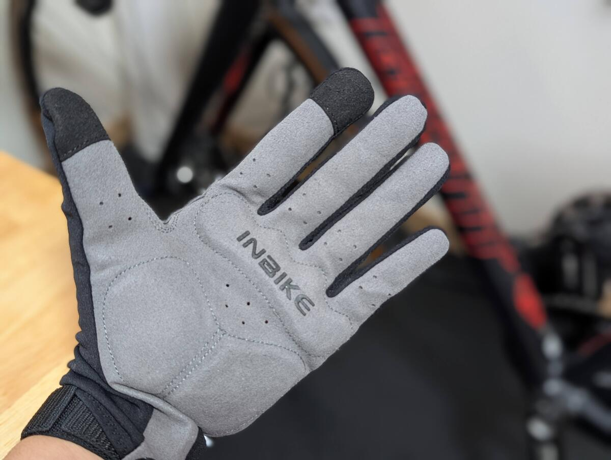
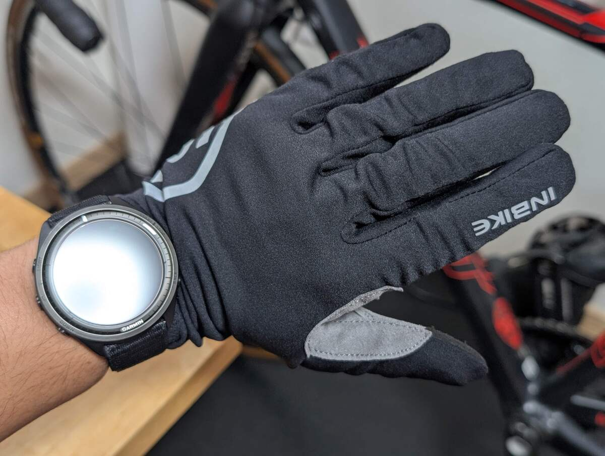

## 仕様

公称使用温度は10-15度。

手の甲側には薄手のライクラ、防風素材は無い。手のひら側は一般的なサイクルグローブと同じ滑り止め素材に、薄手のパッド入りだ。

手の甲の素材の伸びはよく、ビブタイツとの共通性を感じる。パッドの薄さも自分好みだ。

個人的なポイントは、手首部分が短く、スマートウォッチにかかりすぎない点だ。サイクルコンピューターを使わない人間にとっては重要なポイント。ウォッチフェイスを完全露出させても、生地の張りでサイドボタンが押される懸念はない。

指の先端は一応導電素材らしいが、上手くスマートフォンのタッチパネルを扱えるものではなかった。

<LinkCard url="https://ja.aliexpress.com/item/1005006147782176.html" linkurl="https://s.click.aliexpress.com/e/_c4tSu1i9" />

1000円台とかなりのお買い得プライスながら、2000円未満で[中ボア付きの防風モデル](https://s.click.aliexpress.com/e/_c3X51jkv)、[防水レイヤー付きのモデル](https://s.click.aliexpress.com/e/_c39fpBrP)、逆に汗抜けのいい[Breathableモデル](https://s.click.aliexpress.com/e/_c4tOGHOz)など、ロングフィンガーグローブだけでかなりのラインナップがある。

とはいえ、今回買ったモデル以上の防寒力がありそうなモデルは、どれもかなり分厚く見えた。指先の感覚を重視したい（なんなら素手の方が好み）という自分には合わないと感じたので、今回の中間的なモデルをチョイス。

## 想定気温を下回る実走レビュー

こちらもビブと同じく、富士グラベルエクストラで本格投入。

ビブタイツとの違いは、完全に想定気温を下回っている（マイナス2度から13度ほど）点。とはいえ、普段から真冬用の装備というものはもたず、[Defeetの冬用グローブ](https://amzn.to/3KsisSn)で通していた身なので、そこそこ行けるのではないかと思っていた。

<LinkCard url="https://blog.gensobunya.net/post/2025/12/fujigravel-extra2025/" />

実際はというと、読みを完全に外した。スタートからしばらくは完全に防寒力が足りず、指先が痛いほど。

体が温まってからは特に問題なく過ごしたものの、気温の方も一桁前半だった。後半の10度前後でヒルクライム（日当たり良好）している頃は、汗がたまってきているのが分かったので、素手で過ごした方が快適だった。

防風レイヤーが無い分、そこそこの強度と速度さえあれば手汗の出るペースと乾燥のペースがちょうど釣り合っていたが、どうにもスイートスポットが狭い印象を受けた。

### Defeet Wool系グローブとの比較

寒すぎないが0度までは対応してほしい…という要件でよく比較に上がるのがDefeetのウール入りグローブ（通称軍手）シリーズ。

<Amzn asin="B00O9TZTVI" />

今回のINBIKEのモデルと比べると、**適度な防風に汗抜けの良さ、操作感のある厚み**が実によくできていることが分かった。

このシリーズは、**サイズの個体差が大きい**というかなり致命的な欠点があるものの、自分に合うサイズの個体を見つければ氷点下で走り出しても指が痛むほど冷えるということは無く、暖かくなってきても適度に汗を拡散してくれるのでかなり広い局面で利用できる。

改めて調べると、公式の対応気温も4℃～16℃と、広めに取られている。

冬グローブはインナーウェアと同じで、相反する要素を求められる。その上、ブレーキを握る大事な役目を持つ"指"を守るため、自分のような『ヘビーデューティなグローブは嫌いだが、ある程度守る能力は欲しい』というワガママなサイクリストは、それなりにお金をかけた方がよさそうだ。

## まとめ：帯に短し襷に長し

暖かさを称するロングフィンガーグローブとしては、**冬場に普段使いするには能力不足**を感じた。それでいて、汗が溜まる感覚もあったので、自分のような手汗を嫌うライダーには、春秋にも正直向いていないのではと思える

春秋シーズンは積極的に汗を放出しつつ、やや冷たい風を受けても汗冷えしないことが第一なので、[Breathableモデル](https://s.click.aliexpress.com/e/_c4tOGHOz)を使った方がいいだろう。

どのモデルも安さはピカ一なのだが、薄手ロングフィンガーグローブはGIROで事足りていると思っているので、わざわざINBIKEのモデルを買うかは考えどころだ。

絶妙な長さでスマートウォッチとの相性が良い点や、着脱用のタブも小さ目ながらしっかりしている点はいい作りと言える。
