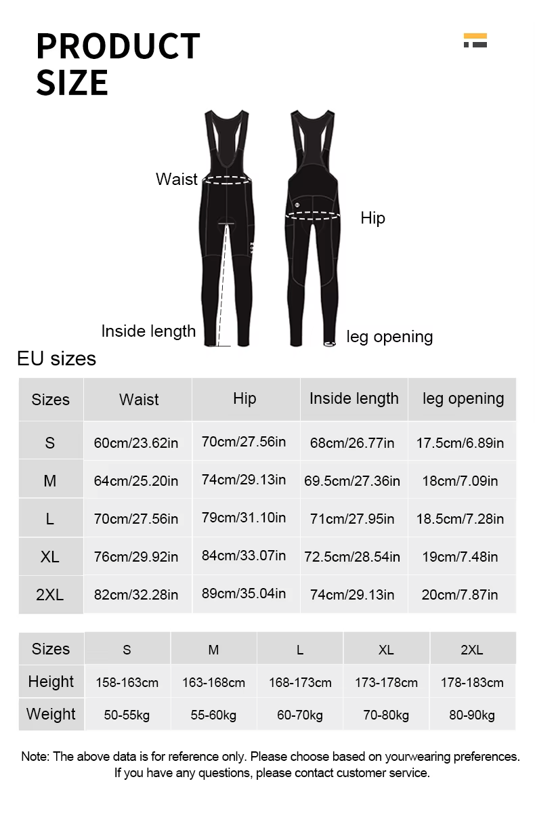
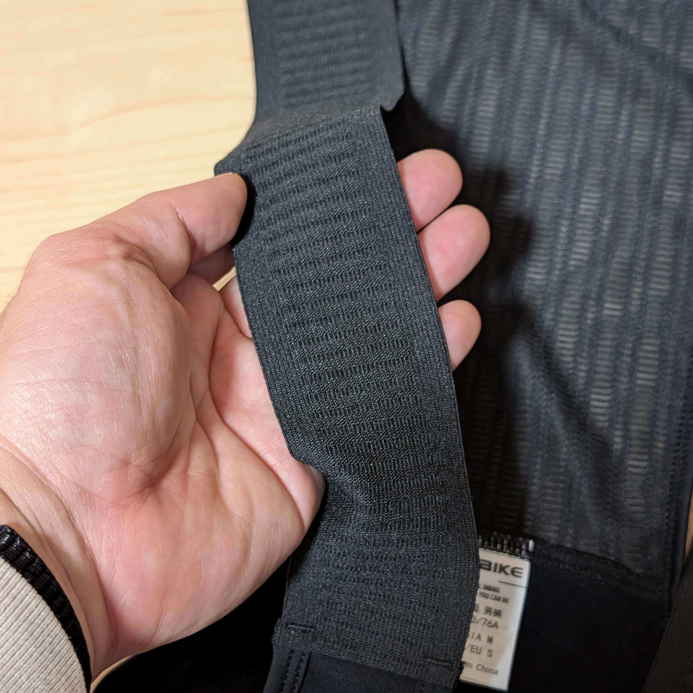
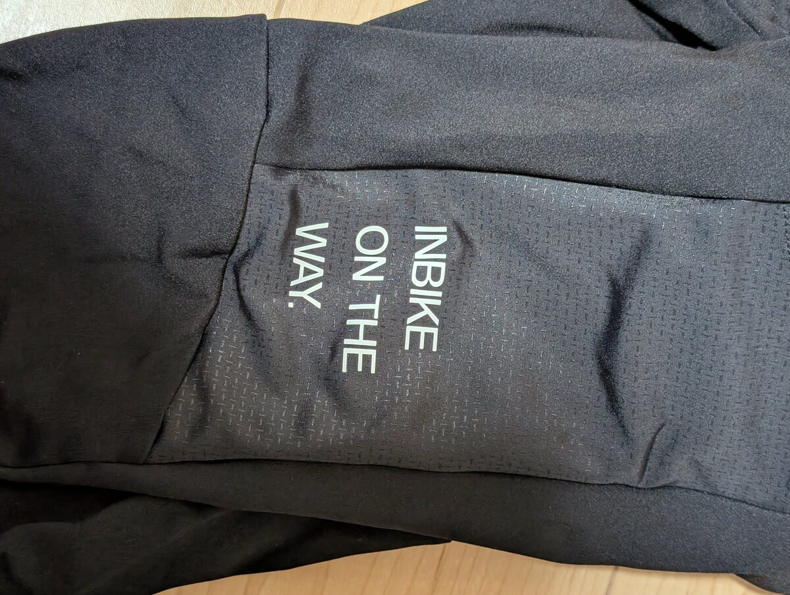

2022年の夏に、[LAMEDAの長袖ジャージ](https://s.click.aliexpress.com/e/_c2RFw0tR)と[シームレスビブパンツ](https://s.click.aliexpress.com/e/_c3Dq2mtr)でいい思いをしてから、低価格帯のいわゆる中華ジャージに対するイメージが変わった。

RaphaのプロチームラインやBioracerのような、どんな過酷な状況やユースケースでも快適さを保つ機能や性能こそないが、大抵の気候における日々のライドにはこのくらいで丁度よく、それでいて**ビブ生地のストレッチの良さは他のメーカーを凌いでいる**と言ってもいい。

色々と調べる中、LAMEDAブランドはINBIKEという更に価格帯の低いブランドの1ラインであるらしいことを知った（違ったらこっそり教えて欲しい）。チームウェア以外のウェアを買うときの選択はこれにしようと決め、ようやく2年越しに独身の日セールで買ったのが今年の冬物だ。

AliExpressで **よくわからないブランドを漁るときの第一必須要件は『直ちに命に関わらない』** ということを己に言い聞かせているのだが、ウェアは命に関わりづらいポイントなので気軽に試すことができる。氷点下になるような厳寒ライドでは、ウェアの性能が生命維持に直結するが、幸い温暖で日当たりもいい地域に住んでいるので、真冬でも朝で氷点下になるかどうかというライド環境なので、条件はバッチリだ。

今回購入したのは、カーゴポケット付きのフリースビブタイツ。自宅周辺のライドと、氷点下から10度オーバーまで変化した富士グラベルエクストラでの使用感をメモしていく。

## 公式スペック

<LinkCard url="https://ja.aliexpress.com/item/1005007723940936.html" linkurl="https://s.click.aliexpress.com/e/_c3XDOMGd" />

実際に購入したリンクがこちら。

様々なセラーから販売されているが、INBIKE, LAMEDA共に公式ストアがAliExpress内で展開されているので、トラブル時の対応を考慮して公式セラーから購入した。

正式名称は、Men's Fleece Backpacking Pantsと言うらしい。色はパープルとブラックの2種類で、今回はブラックをチョイス。

### サイズチャートに注意

INBIKEのサイズチャートは、EU SIZEといいつつも実態はかなり異なる。というより日本サイズと考えてもサイズ表記より小さめと考えてよい。

160cm程度の身長ではSサイズとなる他、股下長は68cmとかなり短め。EUサイズなら通常2XSかXSサイズとなるので、しっかり自分の体型と見比べる必要がある。後述するが、ストレッチ性は高いのでウエストやLeg Openingは調整の余地がある。

股下が短めになっているのは、**上にソックスを重ねるスタイルを想定している可能性**がある。モデルも皆このスタイルで履いているし、ビブタイツ選定の難しいところである脚の長さのフィット感を吸収できるということで便利な設計ではある。

## 質感

フリースはかなり薄手で裏起毛とは言えないレベルだが、その分ストレッチが効いている。腹回りもかなり上部までカバーしており、背中のベンチレーションやフラットな肩紐など、必要な要素はカバーされているように見える。この安さで肩紐がフラットなのはうれしい。

反射材付きメッセージのポケットが付いているが、**ポケットは左側だけ**についている。以前購入したカーゴビブはポケットの生地が固くて履き心地をスポイルしていたが、これはポケット部分もよく伸びる。

そこまで大きなポケットではないが、おそらく大きくしてしまうと伸縮して中のものが落ちてしまうのだろう。スマートフォンや補給食は問題なく入るので、必要な役割は果たしている。

履いてみると、160cmの自分にはSサイズがジャストフィット。太腿周りは60㎝近く、いつも脚を通すのに苦労するがこのビブタイツはすんなり履くことができた。ペダリング動作も全く妨げられないストレッチ性で、Bioracerのようなサポートこそないものの、動作は快適だ。

前面防風素材ではない点に注意。

## ライドフィーリング

10度前後での1時間ライドでは課題らしい課題は無し。

真価を問われる富士グラベルエクストラでは、マイナス2度から10度以上の環境で7時間半のグラベルライドを行った。

結論から言うと、**氷点下でも問題なくダウンヒルをこなし、昼間のクライムでも暑すぎることはなく**実にいい具合の保温と放熱を提供してくれた。

特に冬ビブは腹回りまでガードすることもあって、登りで熱を放出しきれないことで腹回りの汗がたまってしまうパターンもあるのだが、そうなると汗冷えの原因になる。動き続けるためのウェアとしては過剰な防寒になっていない点は優秀だ。

唯一気になったのは、ライド終盤に座骨がサドルに刺さる感覚があった点。製品情報をよく見ると、パッドの写真には"5-6時間のノンストップサイクリングに最適"と書かれている。ストップだらけではあるが、グラベルライドにはやや厳しかったかもしれない。表記を信じるならロードライドなら問題なさそう。

この情報を探している間に、数百円の差でプロフェッショナルパッド（パッド密度が50-80kg/m^2→55-120kg/m^2にグレードアップ）なるものを利用したモデルがあることを発見。大したアップチャージも無いので、こちらの方が安パイかもしれない。動きやすさが維持されるかは不明。

<LinkCard url="https://ja.aliexpress.com/item/1005009859854507.html" linkurl="https://s.click.aliexpress.com/e/_c33K6Jez" />

## まとめ

冬のゆるゆる平地ライドから、山岳地帯のグラベルライドまでこなすことができる割に、5000円以下で購入できる超優秀なコストパフォーマンス。

温暖な地域の冬サイクリングや寒さに強い人、高めの強度で冬に乗る習慣がある人におすすめ。不満があればもっと性能のいいウェアに乗り換える必要があるが、買って試すハードルの低い価格がうれしい。

<LinkCard url="https://ja.aliexpress.com/item/1005007723940936.html" linkurl="https://s.click.aliexpress.com/e/_c3XDOMGd" />
