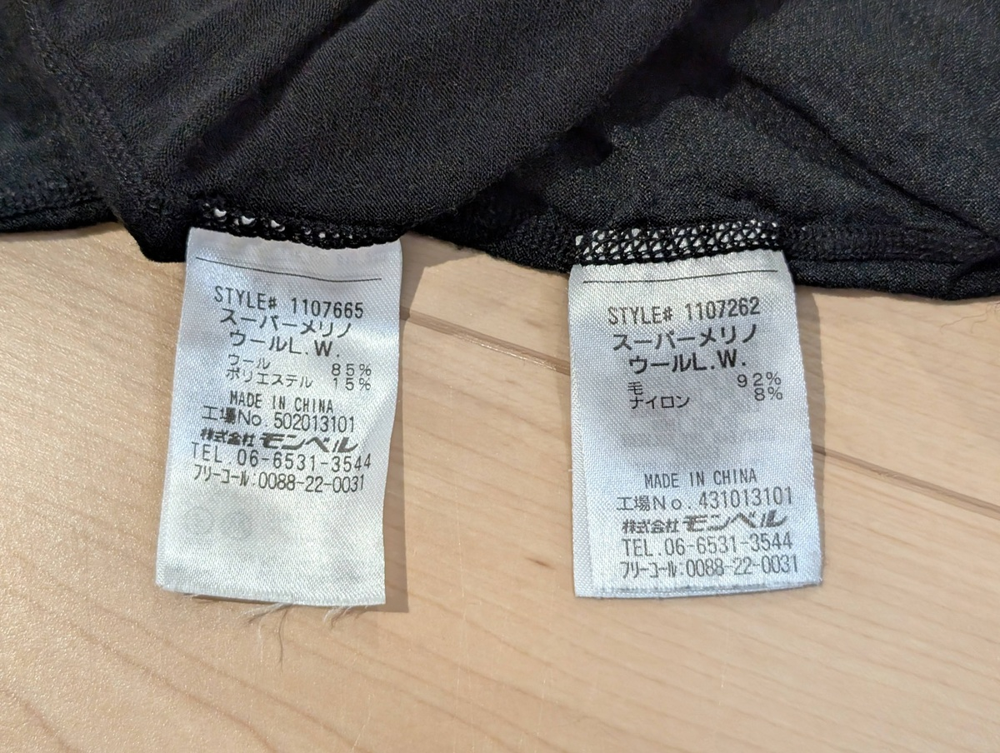
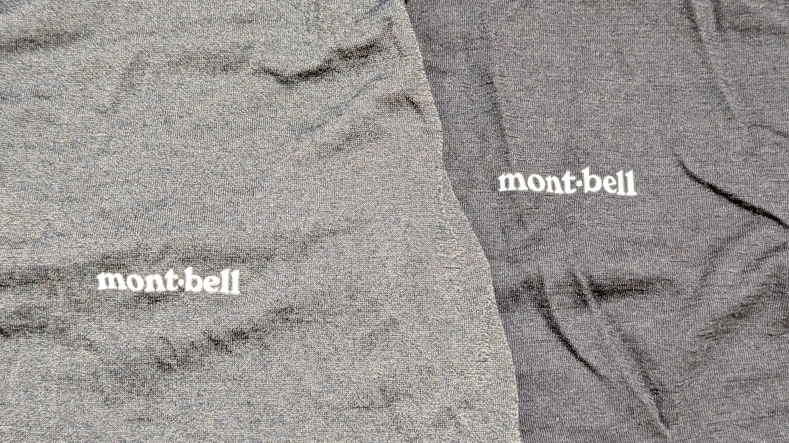
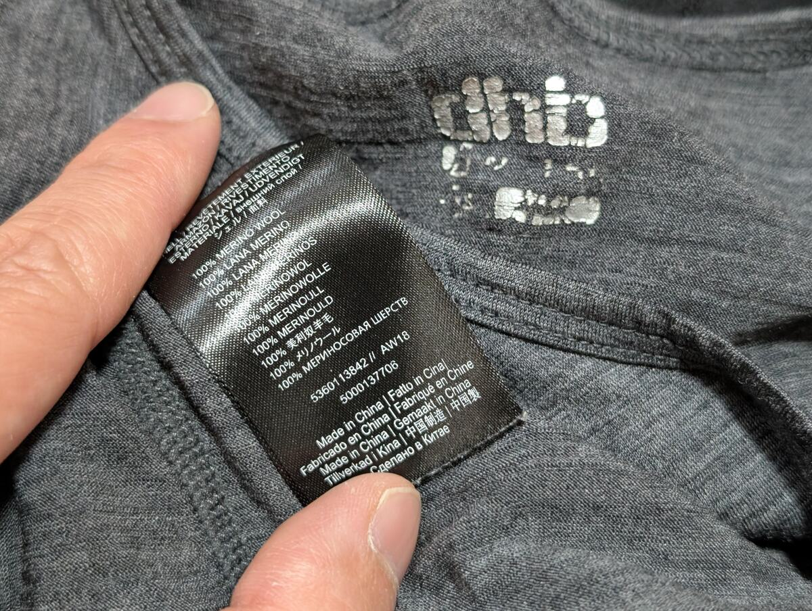

きっかけはモンベルの[スーパーメリノウールL.W. Tシャツ](https://webshop.montbell.jp/goods/disp.php?product_id=1107665)を買いなおした時だった。

<LinkCard url="https://webshop.montbell.jp/goods/disp.php?product_id=1107665" />

軽量のメリノウールインナーとしてはド定番の本品。過去に買ったはいいものの、チクチク感が苦手でサイクリングには使わずに、特に寒い日に日常使いするという扱いだった。

今年ついに交換を決意したわけだが、モンベルクラブの購入履歴を遡ると、**なんと2017年に購入した**一品だった。

あまり使っていないとはいえ、驚異的に長持ちしているが、この記事の本題はそこではない。新しく購入した同一名称のこの品、とても**肌触りのいいメリノインナーシャツに進化**していた。

同じ製品にも関わらずあまりにも別物。確かに遥か以前に購入したものだが、「単なる劣化でここまで変わるか…？」とタグを確認したところ、混毛率（混用率）が大きく変わっていた。

元々持っていた方はウール92%でナイロンをブレンド、**新しい方はウール85%でポリエステル15%と、混毛率もさることながら、混ぜる素材も変わって**いる。

生地の厚みは同じ程度なのだが、表面も見た目が大きく変わっており、新しいモデルは分かりやすく黒色が濃い。

写真では強調されてしまっているが、古いモデルはやや繊維の白っぽさが残り、見るからにチクチクとしている。メリノウールの刺激のある肌触りが苦手だったが、どうやら現代のメリノウール製品はこの点を克服している。

## 混毛率と混ぜる素材の特性

一般論として、メリノウールは**汗の拡散と乾燥をゆっくりにする**ことで、気化熱を軽減して暖かさを得るための素材だ。一方で、スポーツ用途としては適度に汗を逃がしてくれる速乾性も求められる。汗が溜まってしまうと、逆に汗冷えしてしまう他に不快感も大きいからだ。

自分はもう1枚メリノウールインナーを持っており、そちらはメリノウール100％の一品だ。dhb製のノースリーブインナーで、寒いシクロクロスレースではよく1枚目に追加で着ていた。ただ、メリノウール100％ということもあってか、汗がすぐに溜まってしまい、レース中はともかくレース後すぐに脱がないと風邪をひきそうなほどだった。『スーパーメリノL.W.』より明らかに薄いにも関わらずだ。

ナイロンもポリエステルも、吸湿速乾性が高いが、ポリエステルはより速乾性に優れ、ナイロンの方がより摩擦や伸縮性に優れるとされている。

複数メーカーのメリノウールインナーを調査したところ、冬用スポーツウェアとして使うときは、運動量によるが化繊と混用しているケースが多かった。

| ブランド  | 製品名                                                                                                      | メリノウール | その他繊維                                  | 用途                               |
| :-------- | :---------------------------------------------------------------------------------------------------------- | :----------- | :------------------------------------------ | :--------------------------------- |
| Smartwool | [クラシックオールシーズン](https://www.lostarrow.co.jp/store/g/gSW61030004004/)                             | 88%          | ナイロン12%                                 | 年間を通じて使える                 |
| Smartwool | [クラシックサーマル](https://www.lostarrow.co.jp/store/g/gSW61030004004/)                                   | 100%         | -                                           | 記載なし                           |
| mont-bell | [スーパーメリノL.W.](https://webshop.montbell.jp/goods/disp.php?product_id=1107661)                         | 85%          | ポリエステル15%                             | 登山／ハイキング／旅行             |
| mont-bell | [スーパーメリノM.W.](https://webshop.montbell.jp/goods/disp.php?product_id=1107654)                         | 85%          | ポリエステル15%                             | 登山／スノースポーツ／野外観察     |
| mont-bell | [スーパーメリノEXP.](https://webshop.montbell.jp/goods/disp.php?product_id=1107581)                         | 79%          | ポリエステル18%・ナイロン2%・ポリウレタン1% | 冬季登山／スノースポーツ／極地遠征 |
| Rapha     | [メリノ ベースレイヤー - ロングスリーブ](https://www.rapha.cc/jp/ja/product/BMK01XXBBK)                     | 74%          | ナイロン16%、エラステイン10%                | 変動気温対応                       |
| Rapha     | [メンズ メリノ ライトウェイト ベースレイヤー - スリーブレス](https://www.rapha.cc/jp/ja/product/BFN01XXDNY) | 53%          | リサイクルポリエステル47%                   | 変動気温対応                       |
| Castelli  | [Bandito Wool](https://www.castelli-cycling.com/JP/ja/p/4522532_010)                                        | 48%          | リサイクルポリエステル47%・エラスタン5%     | 冬のカフェライドやロングライド     |

特に、Raphaベースレイヤーの混毛率はわかりやすく、薄手で活動量の大きさを想定しているスリーブレスのインナーはメリノウールの割合が低く設定されている。

サイクリングブランドのベースレイヤーは、登山系メーカーに比較して分かりやすく割合が低い傾向も見える。

## 肌触りはメーカー努力？

冒頭の疑問に戻り、『古いスーパーメリノのチクチク感は混毛率の影響なのか？』を検証しに、アウトレットに出かけて可能な範囲で肌触りを触り比べてみた。

店舗で触れる範囲の製品（カステリ以外）を触り比べてみたところ、**どの商品も滑らかで引っかかりを感じず、混毛率との関連性は分からなかった。**

dhbのベースレイヤーがメリノ100％にもかかわらず着心地はいいように、肌触りは縫製や繊維そのものの質と関係がありそうだ。

そもそも、メリノウール自体が「ウールのチクチク感が無い」という点を売りにしていたので、当然と言えば当然の帰結なのかもしれない。ただ、過去（10年以上前）のメリノウール製品は結局肌に刺激があったので、技術の進歩によって解決したようだ。

## 汗抜け改善

前述した通り、メリノウール製品は**汗を吸い上げて中に保持し、ゆっくりと蒸発させる**ことで気化熱が奪われることを防ぎ、暖かい着心地を実現している。防臭なんかもこのメカニズムの副産物だ（繊維内では肌表面より細菌が働きにくい）。

だが、激しいスポーツでは汗の保持・拡散能力が間に合わず、汗が溜まってしまうこともある。肌に汗が直接触れていると、熱が移動しやすくあっという間に冷えてしまうというわけだ。

ここは、もう1枚下にポリエステル製の、汗を移動させることに特化したレイヤーを挟むと解決できる。ミレーの[ドライナミックメッシュ](https://amzn.to/3YcTn0S)や、ファイントラックの[ドライレイヤー](https://amzn.to/45pdbC3)が代表的な存在。

肌が常にドライな状態で保てるようになるだけでなく、1枚分の空気層もできるので、メリノウールに限らない冬インナー1枚のレイヤリングに比べて圧倒的に暖かさが増す。

冬のシクロクロス観戦や、コミケ待機列のような屋外で長時間過ごす際の個人的必需品となっている。

## まとめ

最新のメリノウールインナーは肌触りと性能を両立しており、過去の「なんだかんだいってチクチクする」という印象から大きく異なったものとなっていた。

ベースレイヤーの進歩により汗抜けも改善できることがわかっているので、サイクリング・プライベート問わず冬のセットに組み込んでおくことにした。

<LinkCard url="https://webshop.montbell.jp/goods/disp.php?product_id=1130653" />

<Amzn asin="B0C71TLMSG" />
