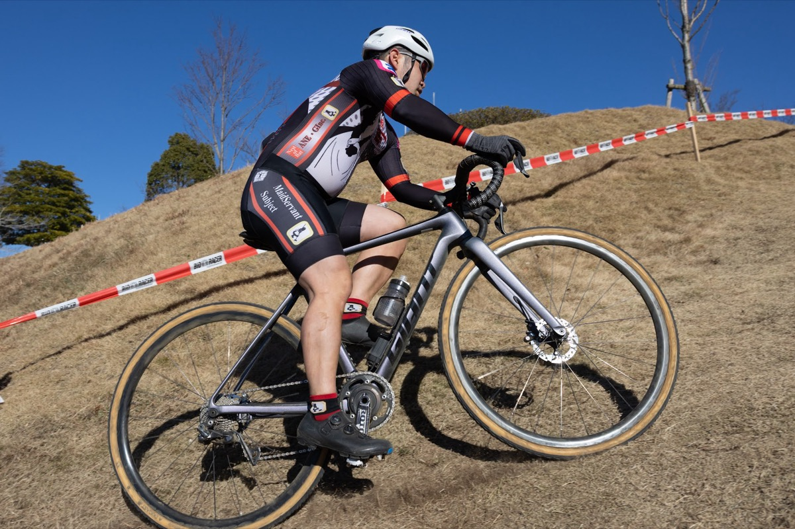

## リザルト

25/31位 (+4:52)

### 機材

- メインバイク
  - GIANT TCX ADVANCED PRO
  - Farsports CX TU + A.Dugast Typhoon 33c (F: 1.60 Bar, R: 1.65 Bar)

※今年から[CYCPLYS AS2 PRO](https://amzn.to/3XXh90k)の空気圧設定を基準に計測しているため、0.1Bar未満は推定

## コース・タイヤセッティング

今年は装いを変えてきた中井中央公園のコース。

長い階段は鳴りを潜め、代わりに林間のセクションが増え、記憶よりも削れたグラウンド側の山が牙を剥くレイアウト。そしてカラっとドライの土グラウンドのスラロームは健在。

## レース展開

ME2に降格し、ライフステージも変化したことから、中盤でレース中レースを楽しむことと、40分間の出し切りを目標に設定。

弱くなっていくフィジカルで出し切るために、補給も取り入れてみようとシクロクロスではじめてのボトル装着をお試し。

<blockquote class="twitter-tweet">
今日の実験（グラベルケージとスモールボトル） 中井で落ちなきゃ大抵どこでも落ちないはず〜と思ったけど、確かに落ちないがこのケージは横ずれする <a href="https://t.co/bA1VmQthyW">pic.twitter.com/bA1VmQthyW</a>
&mdash; ゲン (@gen_sobunya) <a href="https://twitter.com/gen_sobunya/status/2010555666084291040?ref_src=twsrc%5Etfw">January 12, 2026</a></blockquote>

たまたま手元で余らせていた[グラベルケージ](https://amzn.to/49EdDxT)をチョイスしてみたが、あまりよくなかった。何人かアドバイスをもらったので、[Eliteカンニバル](https://amzn.to/4sEtLYy)や、[Adeptをはじめとした汎用パターン](https://amzn.to/4pVcW9z)を試してみる予定。

<Amzn asin="B07M5W8Q5R" />

<Amzn asin="B0CSF262Z2" />

レースの方は、スタートでやや出遅れたが自分の周辺は上手く飛び出せない人が多く結果オーライ。最初の砂利コーナーをアウト側でスルリと抜けられたので、そのまま10位周辺パックで進行。ヨピさんがグラウンドエリアで前に出てグイグイリードしていくが、苦手意識からかやや膨れて1秒ほど遅れてコントロールラインに戻ってくる。（レポートを書く段階で、下げたつもりの空気圧が去年と同じことに気が付いた、凡ミス）

その後は階段などでパックに追いつくも、またグラウンドに出たところで差が出来てしまう。数秒差を追い続けるが、今度は下りで根っこを思い切り踏んでしまい、手に強烈な衝撃を受ける。なんとかブレーキをかけてコースアウトこそ免れたが、落ちたボトルを拾って走り出すと、左右共にシフトボタンが反応しない。それに、レバーも思い切り曲がっている。

走りながら叩いても直らないし、変速なしに走れるコースでもないのでそのまま下ったところをピットイン。数分かけてピットスタッフに直してもらい、ジャンクションボタンを長押ししたら左だけはシフトが復活した。

自分は左右レバー両方ともシフトダウン・シフトアップができるように設定しており、片側復活さえすればまた走り出せる。10年間出番のなかった冗長化が今回は幸いした。

その後はほぼ最後尾から数個ポジションを上げながらフィニッシュ。休んだ分、後半パワー的には中々追い込めていたので、目標はまぁまぁ達成。ポイントも総計では残留に問題ないだろうラインを確保。

これにて今シーズンはレース仕舞いなので、レバーはそのままオーバーホールに預けようと思う。

## Photo

- [hiroyo](https://x.com/hiroyo_oo)
