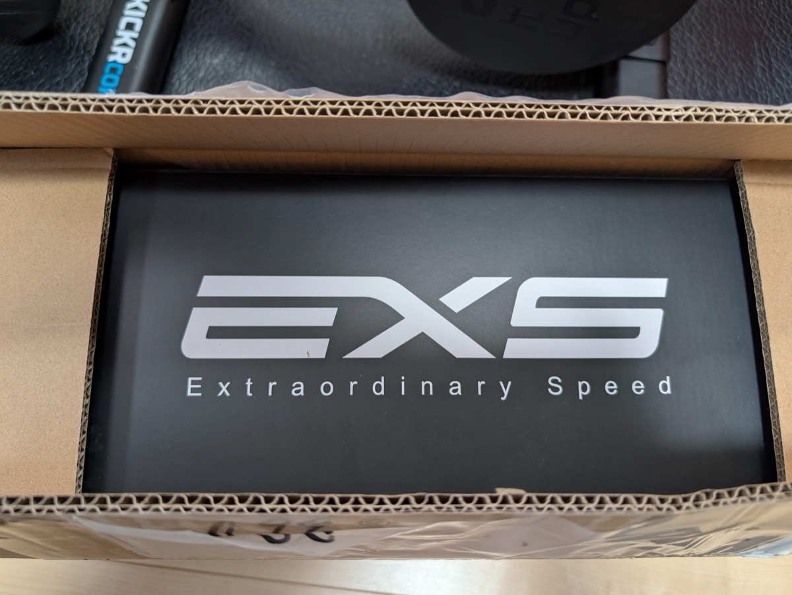
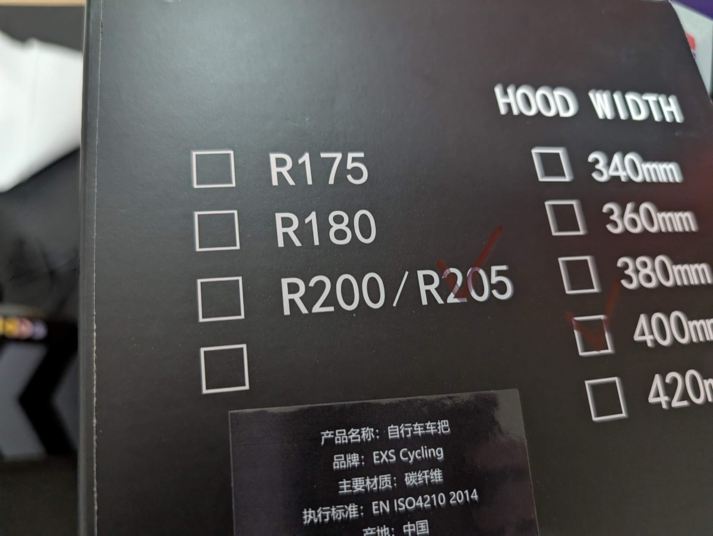
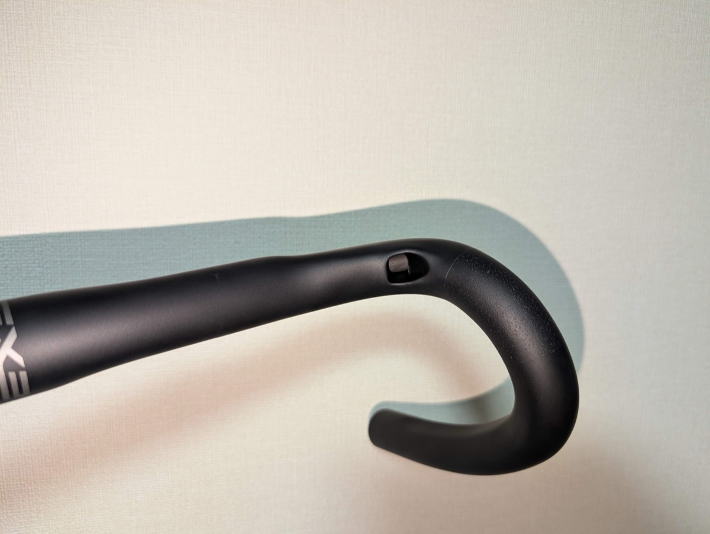
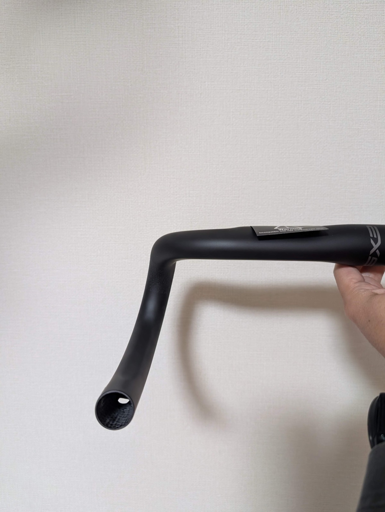
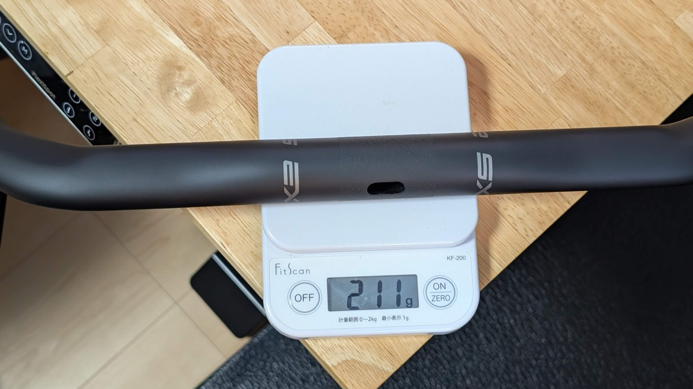
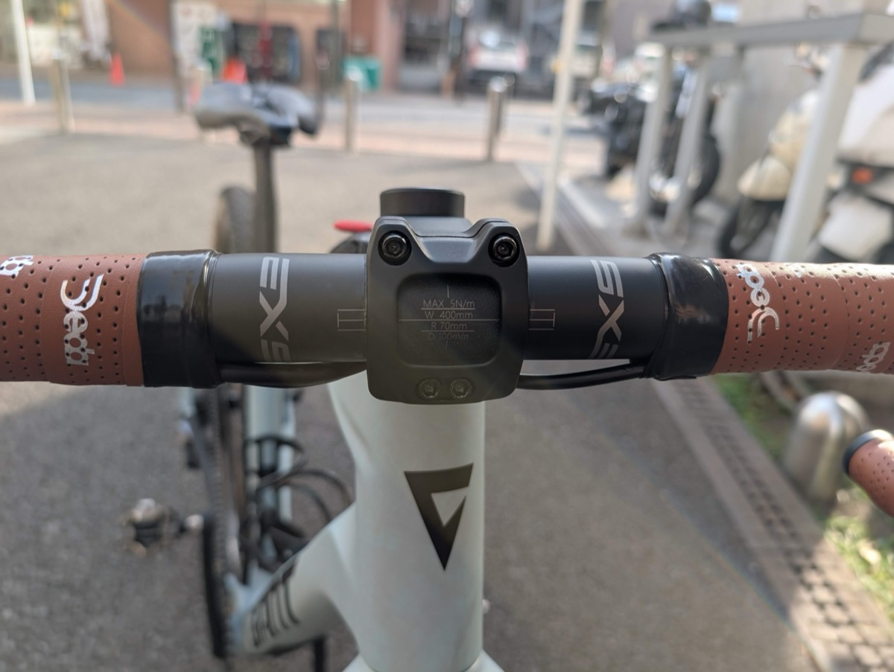
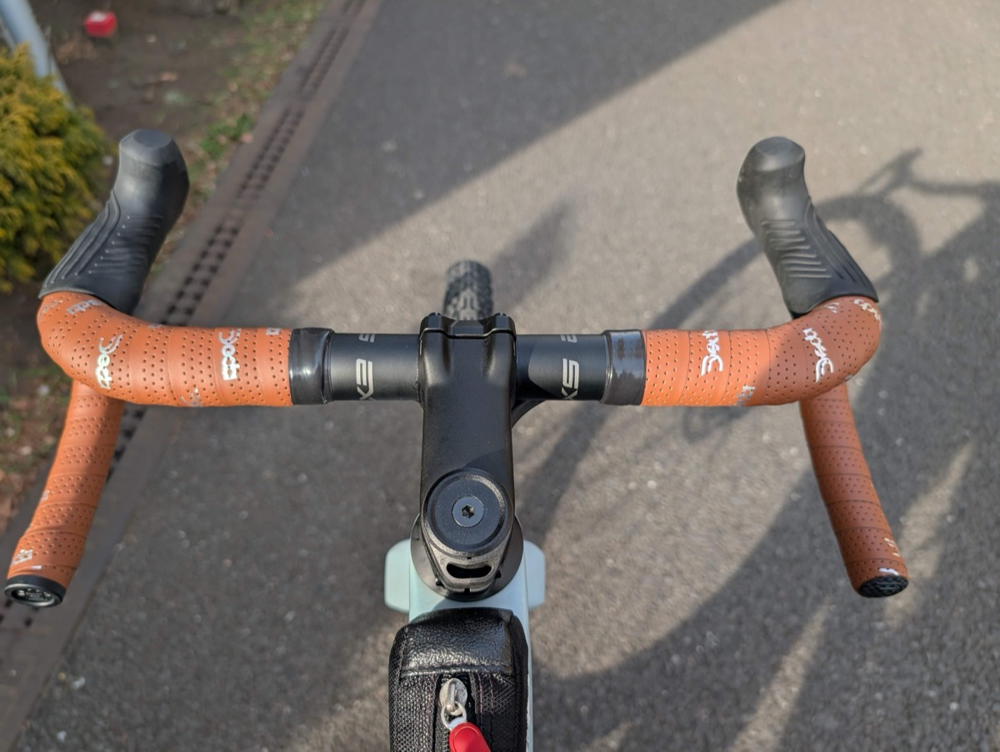
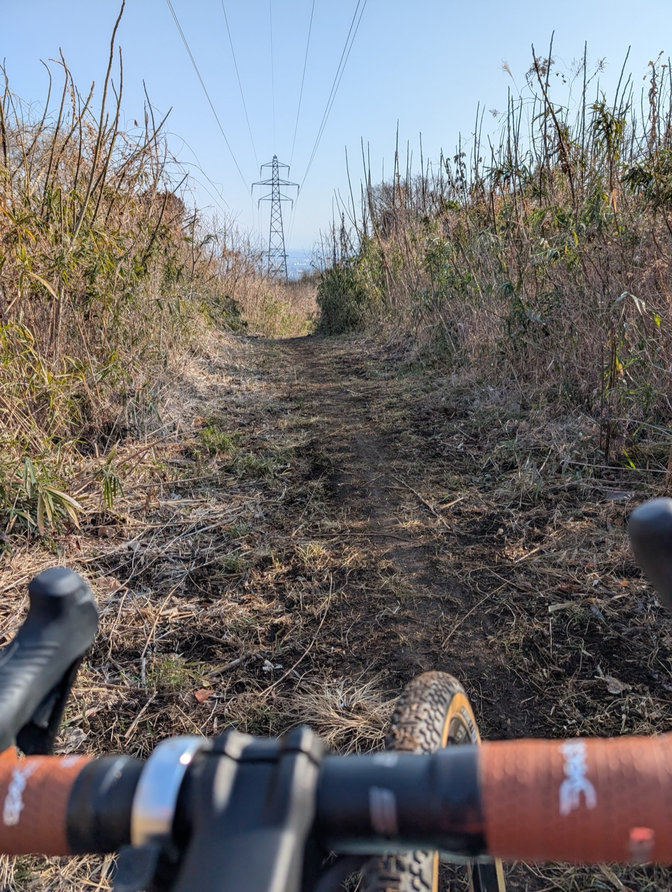

グラベルバイクのハンドルバーは奥が深い。個々人のスタイルの差が大きく、まだ"万人にとっての最適解"が定まっていない。

自分の場合は、乗り方こそレーシンググラベルに近いが、フィールドは河川敷のフラットダートからトレイルのシングルトラックまで幅広いフィールドを想定した使い分けが必要となる。もちろん、アプローチの舗装路は快適に巡航できることが好ましい。

<blockquote class="twitter-tweet">
舗装路やフラットダートでそれなりに高速巡航しつつガレ場は下ハンドルでコントロールするフレアやブラケット幅を求めて沼 390-420のフレアでドロップ110くらいの一体型ハンドルとかあれば試したい <a href="https://t.co/jFkzkssef7">pic.twitter.com/jFkzkssef7</a>
&mdash; ゲン (@gen_sobunya) <a href="https://twitter.com/gen_sobunya/status/1985647860709540015?ref_src=twsrc%5Etfw">November 4, 2025</a></blockquote>

TCRを売却して、現行REVOLTで走り回るようになってから、幅広エアロハンドルに持っていた違和感。

**エアロは重要だが、トレイルの下りで前に突っ込みすぎても困る。そして、せっかくなら一体型ハンドルで格好良く決めたい**。下ハンドルになると、遠くなった分前傾が強くなるのは平地スプリントには良いが、トレイルダウンヒルのための下ハンドルではない。

上記ポストの写真に写っているのは幅420mmのエアロストレートハンドル。幅広による安定感はある。そして、TCRで学んだナローフレアハンドル前提のエアロフォーム。この2つを良いところ取りしたい。

できれば一体型を！という思いはあったが、**先に述べた通り、グラベルバイクのハンドルバーには最大公約数的な解がない**。つまり、市場でもグラベル一体型ハンドルかつ、サードパーティとして使える製品はあまり無い。

一度立ち止まって冷静になり「ステム長やポジションも作り直しだし、別体のほうが後から調整できるじゃないか」と、考え直すことにした。

そこで思い出したのは、[EXS CyclingのR200ハンドルバー](https://exs-cycling.com/products/r200-road-handlebar?VariantsId=10075)だ。友人のインプレも気になっていたので、現時点での所感も聞きつつ、**理想に近いショートドロップ・ショートリーチのフレアハンドル**として購入を決意。

<iframe width="560" height="315" src="https://www.youtube.com/embed/e2rOmdLiZc8?si=ZuTbWL-NPUAFnkLu" title="YouTube video player" frameborder="0" allow="accelerometer; autoplay; clipboard-write; encrypted-media; gyroscope; picture-in-picture; web-share" referrerpolicy="strict-origin-when-cross-origin" allowfullscreen></iframe>

<LinkCard url="https://exs-cycling.com/products/r200-road-handlebar?VariantsId=10075" />

リーチ70mm, ドロップは100mmと、非常にコンパクトな設計が特徴。上ハンドル+40mmのフレアもグラベル用途に都合が良かった。

## EXS Cycling とは

以前は[非フル内装フレームをフル内装化するカーボンフォーク](https://exs-cycling.com/products/fk-00-integrated-fork?VariantsId=10072)でサイクリングギークに名を知られ、今では一体型エアロハンドルの[Aerover](https://exs-cycling.com/products/aerover-integrated-handlebar)で絶賛躍進中の新興中華ブランドだ。

最近は専用規格互換の軽量シートポストなんかも発売している。日本では[BOOTLIGHT BIKES](https://bootlightbikes.com/)が代理店を務めている。

<LinkCard url="https://bootlightbikes.com/" />

## ポジション・換装計画

換装後の感覚では、上ハンドルは狭く遠くエアロポジションを取りやすく、下ハンドルはフレアで肘を横に開きやすく、それでいて下ハンドルでも前傾が強くならない範囲を狙う。

上ハンドルは舗装路とフラットでの利用が殆どとはいえ、ダートでも走る以上はあまり狭くするのも、安定感から考えもの。上ハンドル420mm→400mmの変更を予定して、レバーを内向きにしてエアロポジションを取りやすくする計画。

下ハンドルは420mmで十分と考えていた。広くてもいいが、**あまりフレアが大きいと、今度はハンドルが遠くなってしまう**ので、せいぜい440mmか？という予定でいて、これもR200は上400mm-下400mmと計画内。

REVOLTはショートステム設計で、現在70mmを使っている。リーチも幅も小さくなると、これを伸ばさねばならない。

**ハンドルリーチは現在のPrime Primaveraから-7mm, 幅は20mm小さくなる**ことを考えると、+10mmか、+20mmの延長が妥当。後から**組み替える可能性を考慮すると、ブレーキホースを切る余裕が欲しい**ので、長いステムから試すべきという物理的な理由から、90mmステムへ変更した。

### 対抗馬たち

実は、EXS Aeroverに28.6mmヘッドのTCR…つまりREVOLTと同じ規格のヘッドパーツも用意されており、一体型エアロハンドルとして採用しようか悩んだ瞬間もあった。Farsportsの[F1s Handlebar](https://www.farsports.com/products/f1-handlebar-98)も同じ理由で候補にあり、どちらもリーチ・ドロップが微妙に大きく、しかもステム長設定が一発勝負となるので、購入に踏み込めなかった。

最新型のAddict Gravelに搭載されている一体型ハンドルは、R200と同じくショートリーチ・ショートドロップで、自分の要件と合致していたが、専用設計でアダプタ類が無いので断念。将来的にCADEXブランドでいい感じの一体型ハンドルが発売されることを祈りたい。

## Di2バーエンドジャンクションとの相性、内装型R205との出会い

組み上げにおける最後の懸念点として、有線世代のDi2のバーエンドジャンクション([EW-RS910](https://amzn.to/4bbqc5r)のケーブル内装方法を確認するため、公式の問い合わせフォームから確認したところ、問題なくバーエンドにe-Tube用の穴が開いていることが確認できた。

<Amzn asin="B01MXTE6GL" />

しかし、それだけではなく、**R200ハンドルのフル内装対応バージョンが発売予定**もサポート担当者から明かされた。これは寝耳に水だったが、専用規格ステムが完全内装に対応していないREVOLTでは直接関係がない。とはいえ、スポーツバイクの潮流を考えると、完全内装は対応しておいたほうが明らかにお得でリセールも期待できる。

それではお言葉に甘えて…ということで、R205の400mmを注文。内装用の穴は、ただドリルで穴を開けただけではなく、四角形に近い形をしており、更にバリなどが無いように縁は滑らかに加工されている。

定価180ドルと、現在の輪界ではかなり安めの値付けではあるが仕上げに抜かりは無い。さすが勢いのある新興ブランドという仕上がりだ。

気になるフレア具合は、片側20mmとはいえショートドロップなので角度は強めに見える。

R200は公称200g(+-5%)のハンドルだが、古いキッチンスケールだとR205では誤差範囲を1g超えた211gだった。スケール側の校正なのか、R205になる段階で強度を上げるため重くなったのかは定かではない。

### 組付け所感

組み換えは内装ハンドルからホースを抜いて、ポジション変更も伴うので、場合によってはブレーキホース全交換も視野に入る作業。作業時間や手戻りリスクも考慮して、お世話になっているジャイアントストア港北に依頼。

レースバイクから日常の足まで手抜かりなく、それでいて自分の志向（見た目はともかく動作優先）にも向き合った整備をしてくれるので、重要な作業はいつもお任せしている。Di2ケーブルは内装だが、ブレーキホースはステムの都合で外装で組み上げ。28.6mmヘッドでも完全内装ステム、ほしいですよGIANTさん。

単体で感じていたほどのフレア具合は見た目から消えたものの、下ハンドルと上ハンドルで肘の曲がる向きは明確に変わり、当初の目的に対して期待が持てる。

特に、バーエンド部分が末広がりではなく、車体と並行に近い点が好み。壁に立てかけたとき、バーエンドで壁面に傷を付ける心配がない。

## ライドインプレッション

レビュー用のコースは、何度も行って[グラベルキング](https://amzn.to/46ZMvZq)のインプレッションにも利用したコース。

海岸沿いの舗装路を通ってアプローチし、小高い丘を登り、シングルトラックを抜けて気持ちのいいダブルトラックグラベルダウンヒルに抜け、川沿いのグラベルを通って周回できる。**日本的なグラベルライドに使われる要素が全部入り**のお気に入りコースだ。

### 想定通りのポジションメリット

高く・狭く・遠くなった分、エアロポジションが取りやすくなったのは計画通り。小指をひっかけてレバーの角を握ると、前面投影面積がかなり減り、ロードバイク気分のポジションだ。

それでいて、ブラケットポジションから下ハンドルに切り替えても、**『肩からハンドル支点までの距離』がほぼ変わらず、楽な状態で下りに突っ込める期待通りのグラベル向きポジションを作ることができた**。

シングルトラックで思い切り腰を引くシチュエーションで、真価を発揮してくれる。スタイル次第ではあるが、イージーなトレイルまではグラベルバイクでカバーする自分にとっては重要。

副次的な発見として、TCRの370mmハンドルほどの『自分の体へのフィット感』は感じられなかった。自分の場合、舗装路のスイートスポットは意外と狭いところにあるらしい。もはや370はMyマジックナンバー。

70mmから90mmに伸ばしたステムは、意外なほど違和感が無く、ちょうどいい遠さだった。特に、急斜面を登るときに詰まり気味で重心を移動させきれなかった点が解決され、より踏みやすい重心のポジションへと移行できるようになった。しばらくはこのポジションでよさそうだ。

### 超高剛性というデメリット

もともと、「剛性が高い」という事前情報をもらっていたが、**予想を遥かに上回るカッチカチ**のハンドル。バーエンドを握っても全く撓まない。

登り返しで全力ハイパワーを出すと、上半身の力も全て受け止めて推進力に変えてくれる感覚が気持ちいいものの、路面の荒れをいなしてほしい不整地では完全にデメリットとなる。

肘や肩甲骨をうまく使うためには、握力を入れすぎないほう良いのだが、思わずハンドルを握る**手に力が入ってしまうほど弾かれる感覚**がある。ハンドルのしなりは数mm程度なのだろうが、人体センサーはなんとも不思議で大きな差に感じてしまう。エアロハンドルなら板状の部分がいい具合にしなるのだろうが、丸ハンドルということもあるのだろうか。

## まとめ

ブラケットも下ハンドルも上体の角度がほぼ変わらないまま、ワイドスタンスとエアロポジションを使い分けられる点では期待通りの製品。

細かい振動は消せるものの、本体自体の高い剛性で荒れた路面がやや苦手に感じる点は、これから慣れていけるか要確認。上半身をうまく振動吸収に使えない人は、オフロードでかなり不快感を感じるかもしれない点に注意。

一体型ハンドルが不要な人はもちろん、ポジションを調整するための**繋ぎのハンドルとしても使える価格**であることも嬉しい。総じていい買い物となった。

<LinkCard url="https://exs-cycling.com/products/r200-road-handlebar?VariantsId=10075" />
