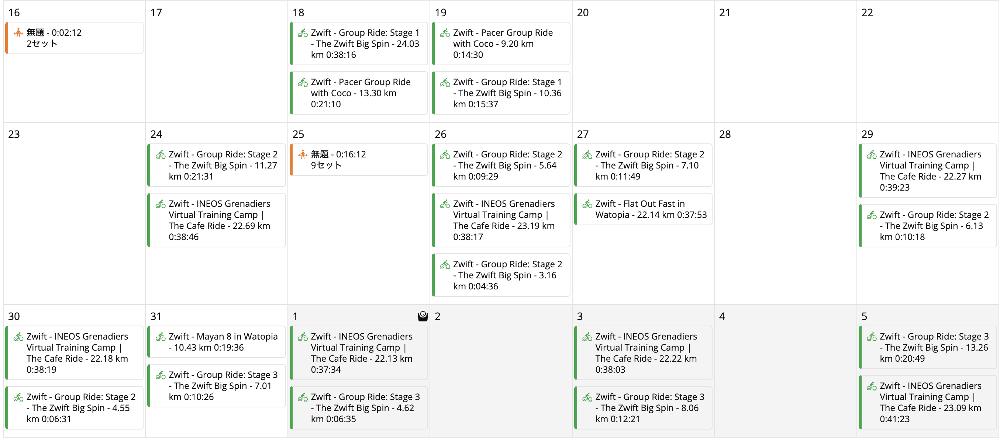

大学のキャンプツーリングから、ロードレース・シクロクロスと軸足を移しながら、グラベルにも足を踏み入れてきた17年のサイクリスト人生。

年間20レース走ってきた生活から、結婚〜子の誕生を経て徐々に減少し、レースと1日ライドはほぼ不可能になっていた。妻に1日子供を任せてイベントに行くことも不可能ではないが、知っての通り、サイクリングイベントはほとんど朝が早い。夜の早い我が子の面倒のピークは17時からスタート。

第1子なら、基本的にスコープ縮小で対応できた。1時間以内というシクロクロス特化のトレーニングとライドにフォーカスして、それ以外のパフォーマンスは見ないことにした。発揮する場がないことを想定しても、意味がないと考えた。

<LinkCard url="https://blog.gensobunya.net/post/2024/09/patanity-cyclist-time-performance/" />

とはいえ、関東のイベントでは、必然的に子供の面倒を起きてから寝る寸前まで見てもらうことになってしまう。近場のシクロクロスの午後カテゴリは朝ごはんを家族で食べてから出発でき、夕方には帰れるので非常に都合が良かったが、それでも近距離という条件は譲れない。

第2子が生まれる頃には、自転車に割く時間はほぼ無いことに気がつく。

家族と過ごす時間は代えがたいし、趣味と家族どちらを優先するかと問われたらノータイムで家族と答える。

それはそれとして、積み上げたフィットネスや肉体がジワジワと**劣化することに耐えられるかと言われると、そうでもない。**

何事でも、自分が作ってきたものが毀損されるのを実感しながら生きていくのは精神を蝕む。

## モチベーションの保ち方

すっぱりと趣味を止める、別の趣味にシフトするという選択肢もあるのだが、自分はどうやらこれらができない側の人間だった。

もちろん、前述の通り趣味への取り組み方を変える必要があったので、自分の目標や活動を再定義することにした。レーサーとしての考え方を維持していたら、とても正気でいられないだろう。

最近もパワーやタイムに囚われすぎて病む記事を読んで、シクロクロスという数字だけで決着できない競技にのめり込んでいたことを感謝したばかりだ。

### 成果指標から行動指標へ

自分の場合の手っ取り早いメンタルの切り替えは、レースの結果（カテゴリUP・順位）を目的にしていたものを、行動指標（N日乗る・N時間乗る）に置き換えて実現した。いわゆる「今日は運動した！えらい！」というやつ。

とはいえ、「自分の中の指標を変える」ということは、言葉では簡単だが、脳の報酬回路を変えるために手間を掛ける必要がある。

体に染み込ませるため、「短く高頻度で乗る」ことと楽しさを直結し、脳に学習させて習慣化しなければならない。

## 実走からバーチャルへシフト

数分から1時間程度という時間なら、それなりの頻度で使えることがわかれば、着替えてZwiftで短いセッションを行ってシャワーを浴びて家事に復帰できる。

ランニングや筋トレなんかは短時間・比較的時間のコントロールがしやすい趣味で、自転車との相性もいい。ただ、ランニングは膝の回復・筋トレは家を空けられない時期に期間が空いて習慣化に失敗…ということを繰り返しているので、どうにもうまく組み込めなかった。

### 様々な"ニンジン"

その点、**バーチャルサイクリングプラットフォームとしてのZwiftは、実に多くのモチベーションを提供**してくれている。

代表的なものは下記の通りだ。

- **ストリーク**
- ルートバッジ
- レベル上げ（EXP farming）
  - Workout of xxx
  - 各種イベント
- アイテム
  - Big Spinなどのイベント限定品
  - Bike Upgrade

トレーニングプラットフォームとしてZwiftを見ると、ワークアウト機能とERGによるターゲットパワーの固定が非常に有能で、こうしたソーシャル機能は知っているだけで活用していなかった。

特にストリーク機能の中毒性が高いことはDuolingoで体験済み（1100日オーバー中）。Zwiftにこれがあるのはありがたい。

### Big Spin 2026

<blockquote class="twitter-tweet">
ようやくコンプリートした。30回は回したか？ <a href="https://t.co/gCZMTomc6f">pic.twitter.com/gCZMTomc6f</a>
&mdash; ゲン (@gen_sobunya) <a href="https://twitter.com/gen_sobunya/status/2043968854427349299?ref_src=twsrc%5Etfw">April 14, 2026</a></blockquote>

いいタイミングでやっていたZwiftガチャことBig Spin。

プロ級がTTしない限りは各コース30分強かかる設計。そして、イベントにLate Joinして数分ライドしてゴールすればガチャを回せるので、Late Join＋フリーライドで平坦系のコースを完走すれば1時間以内に2ガチャ回せる計算だ。疲れると翌日のやる気が減少するので、低強度ワークアウトは都合が良い。

1か月程度かけて、アイテムをコンプリートした頃に、求めていた『低強度短時間高頻度のライド習慣』が出来上がっていた。

副産物として、なぜか推定VO2Maxが過去最高値を記録したが、これはGarmin Connectのロジックが偶然このライド習慣と合致しただけだと思われる。高強度運動をほぼしていないので、実際にこの強度を前提に運動したら倒れる。

<blockquote class="twitter-tweet">
テキトーに高頻度低中強度でZwiftしてるだけなんだけど、偶然にもGarmin Connectの推定ロジックをハックしてしまったらしくVO2Maxがありえないレベルでモリモリ上がってシクロクロスガチってた時より高い <a href="https://t.co/sUb5cmfOM6">pic.twitter.com/sUb5cmfOM6</a>
&mdash; ゲン (@gen_sobunya) <a href="https://twitter.com/gen_sobunya/status/2056306437777998057?ref_src=twsrc%5Etfw">May 18, 2026</a></blockquote>

幻ではあるが、フィットネスが積み上がったことになっているのは気持ちいい。この後、崩れるだろうがもともと幻なのだから惜しくはない。

**1週間に1回乗っておけば、ストリークは維持**できる。

### エンドコンテンツBike Upgradeとレベル上げ

最近は経験値を稼ぎながら、Bike UpgradeでトロンバイクのLv.5アップグレードを目指して活動している。

具体的には、ZwiftバイクをLv.5にして、経験値5％加算オプションを準備しつつ、基本はアップグレードしたいバイクで、未完走の短中距離ルートや、Route of the weekの経験値ボーナスがあるコースを走る。

完走直前で、経験値ボーナスバイクに乗り換えて完走すると、コース完走とミッション完了の経験値にボーナス5％を追加でゲットできる。

地味ではあるが、走れば走るだけ積み上がる時間や距離が目標なので、達成感が得やすい。

### イベント・アイテム集め

イベント一覧を眺めながら、完走するとジャージやホイールがもらえるイベント・ライドに参加してアンロックを狙う。

特にZwift主催のワークアウトミッションは狙い目。スキップしても達成扱いになるので…数分でPrincetonのホイールをゲットできた。本当に参加したいイベントだったらそのあと思う存分正規ルートで楽しめば良い。

## やれることをやろう

この記事を書くのを伸ばす間に出てしまった[シモジマンの動画](https://youtu.be/l7x-3Le3YS8?si=1iuWhjZ0KX2aEQ1n)に言いたいことを全て言われてしまったが、人生長いのでいろんな局面があってもよい。

正直、UCIグラベルレースには出てみたいし、北海道のグラベルイベントにはもっと参加したいし、またME1を走りたいという気持ちもある。試したい機材も色々ある。

かと言って、今の自分の環境に不満があるわけでもない。数年後にはまた自分の知らない環境になっているし、できることを楽しめばいいという気持ちになっている。

またサイクリングにリソースを注ぎ込める状態になったとき、機材も生理学も大きな変化を感じられるだろうし、それを楽しみにもできる。
