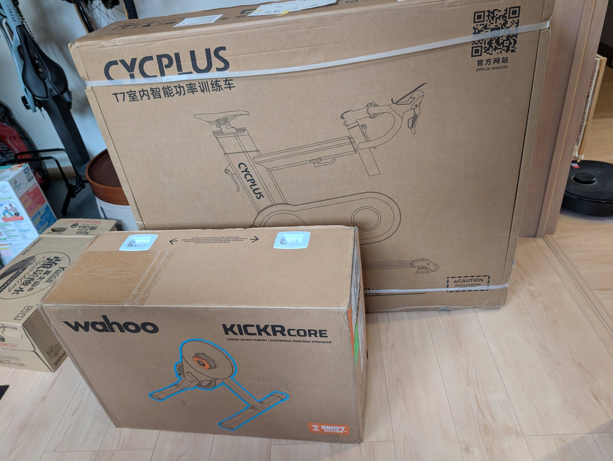
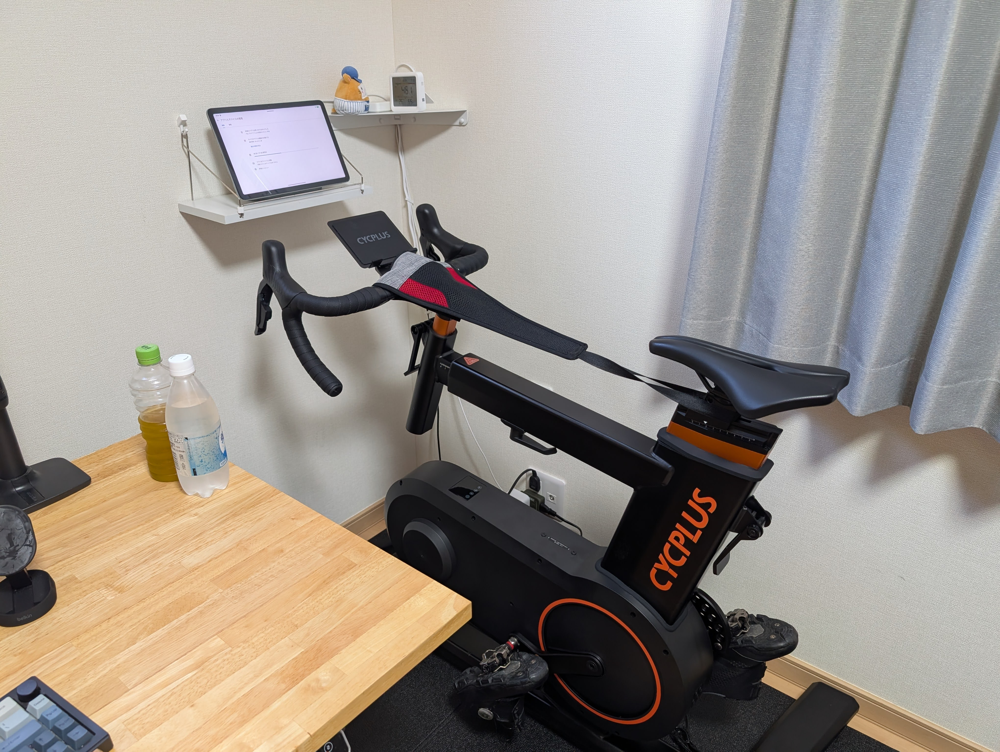
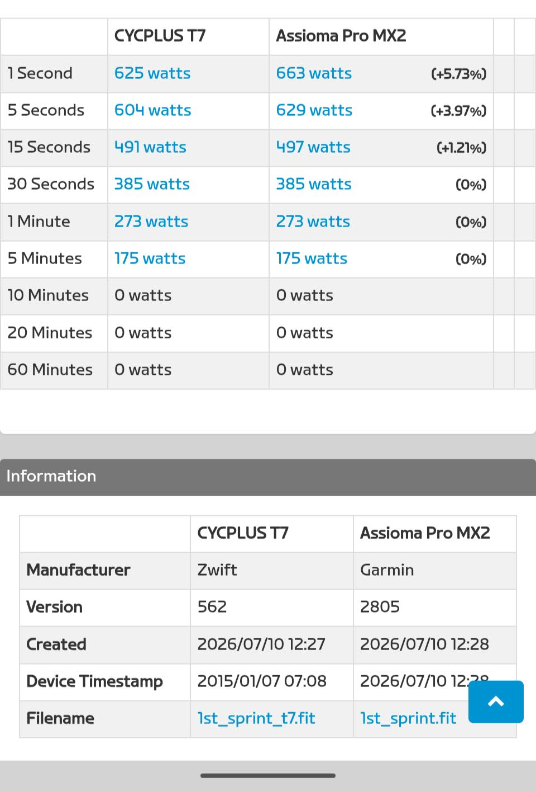
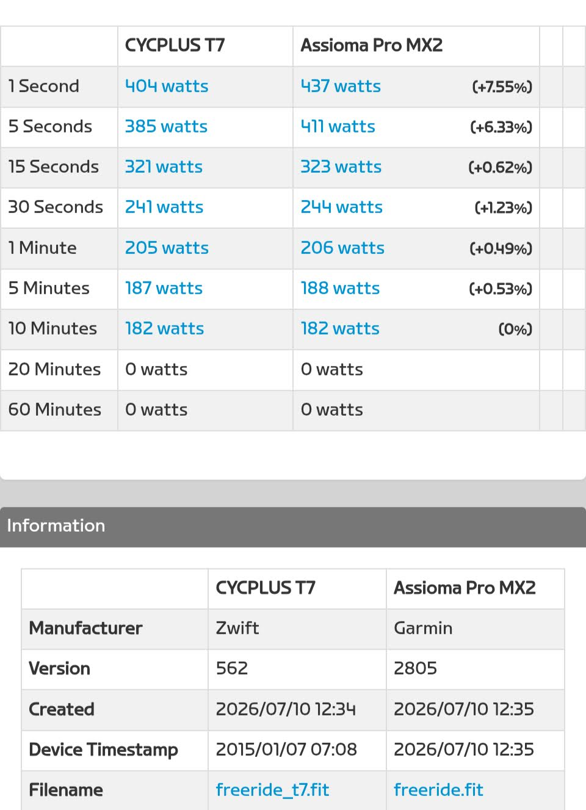

「最初に一番いいやつを買うのが一番安い」

すっかり忘れてた。

## スマートトレーナーの限界

[Wahoo KICKR CORE2(Zwift Cog)](https://amzn.to/4fcKKLR)の、Zwift向きスマートトレーナーとしては満足するものだった。物理変速を廃したことによる静音性、装着バイクを問わない万能性、そこそこのコスト…

1年近く、これ以上のお手軽トレーニング器具としての質の高さは無いだろうと考えて使っていた。

特に、Zwift Clickを使ったZwift上のゲーム体験が良く、ゲーム内の全ての操作（ホーム画面の操作・Rideonボム・メニュー表示etc...）が手元で完結することが当たり前となり、Zwift上のライド頻度は大きく上がった。

<LinkCard url="https://blog.gensobunya.net/post/2025/10/kickr-core2-review/" />

しかし、『家族の邪魔をしないトレーニング』をするためのトレーニング器具としての課題は残っていた。

静音性が高いと言っても、それは『スマートトレーナー』の範囲。パワーを掛けている間は良くても、脚を止めるとラチェット音はするし、チェーンの伸びや汚れで駆動音は鳴る。それにチェーンが伸びてギアと噛み合わなくなった際の微振動が放つ音も気になる。

安全性の面では、ドライブトレインとフライホイールが露出しており、子供が触ると汚れるしギアで手を切るかもしれない。

加えて、フライホイール横の抵抗ユニットは放熱のために熱くなる。動作後に触ると危ないのに、叩くといい音がするので子供のお気に入り楽器にされている。

早朝や夜間の、**家族が寝静まった時間に低強度有酸素トレを気兼ね無く行う**には、まだ引け目があった。

## CYCPLUS T7購入

上記全てを解決する製品…つまり稼動部が露出していないスマートバイクを勢いでポチっとした。

かねてから気になっていた[CYCPLUS T7](https://amzn.to/3SO6pma)だ。スマートバイクとしての優位を活かしたコンパクトスタイルと、スマートバイクとしては抑えめの価格になっている。

<Amzn asin="B0FKFT46BG" />

<LinkCard url="https://yahoo.jp/zpiJkg" />

対抗は[WahooのKICKR BIKE](https://yahoo.jp/NJcqXio)やZwift謹製のZwift RIDEだが、それぞれ専有面積・値段・安全性の面でメリットが小さいと考えてT7を選ぶに至った。

本体の組み立ては簡単だが、**箱が20kg以上あり、手をかける穴も空いていない**ので置き配を持ち上げるのがとにかく大変。床引きデッドを身に着けていて、これほど感謝したことはない。

サドルの前後以外を調整する以外、工具不要でサドル高・リーチ・スタックを調整できる。ハンドルそのものも一般的なサイズでできている。ただ、工具無し調整機構はあまり滑らかでなく、引っかかりがあったり、うまく固定器具の場所を調整する必要があったりと、あまり上質ではない。

その他、ブラケットの取付が外向きだったので、内向きに直したぐらいで好みのポジションが出た。

とりあえず回すと、既存のスマートトレーナーよりもパワーマックスに近いペダリングのフィードバックがある。フライホイールの仕組みなのか、スマートバイク形式の器具はこういうものになるのか。高速でフライホイールが回っても、負荷が抜けていく感覚が少ないのは良い。

バーチャルライド用の機材として見ると、ポジション設定の自由さや、安定性といった基本的な良さに加え、様々な点がスマートトレーナーと比較して向上した。特筆すべき点は2つ。

### コンパクトさ

当初の課題感には入っていないが、万人にとっての価値となるのがフットプリントの小ささ。

<blockquote class="twitter-tweet">
最も高い「土地」を節約 <a href="https://t.co/PbXGXU4FUd">pic.twitter.com/PbXGXU4FUd</a>
&mdash; ゲン (@gen_sobunya) <a href="https://x.com/gen_sobunya/status/2074718203725652213?ref_src=twsrc%5Etfw">July 8, 2026</a></blockquote>

前後ホイールの存在にとらわれない「スマートバイク」としての形状によって、（マージンを含めた）トレーニングエリアの全長は50cm以上コンパクトになった。デッドスペースだったトレーナーの上空も解放されたので、空間効率はかなり向上した。

CYCPLUS T7付属のトレーニングマットは、幅・長さともにワイズロードPBのマットより一回り以上小さい。それでいてそのマットより小さい面積しか占有していないことがわかると思う。

床面積で言えば、1平米は節約できている。

数値では小さいが、**1平米あればツールチェストや縦置きバイクラックを配置できる**。これまでバイク＋トレーナーで占有されていたエリアに、CYCPLUS T7に加えて1台保管場所が増えると大きな効率向上だ。

[CYCPLUS T7](https://amzn.to/3SO6pma)の25万円前後という価格は、トレーニング器具としては間違いなく高級な部類だが、**売却を含めた総出費は節約した土地代よりも安い**。

日々、モノの置き場所に頭を悩ませている人にとって、省スペース化は何よりも大きなメリットとなりえる。

### 静音性

インドア**サイクルトレーナーとしての静かさを超えて、家電の中でもかなり静か**と言っていい。シューズのBOAダイヤルを開放するパチッという音のほうが室内に響くと言っても過言ではない。

稼働音は低音で「フオーン」という音が鳴る程度で、漕ぎ出しはUFOっぽく、振動音も出ないので、他の部屋に響くタイプの音が出ないのは素晴らしい。

インドア用シューズを確保すれば、シューズを外す際のクリート音が鳴ることもない。こうなると、トレーニングセッション全体を通して大きな物音が立つことはない。

ドアを開放してトレーニングしても、隣の部屋で寝ている家族が気がつくことは（強度を上げて呼吸がうるさくならない限り）無いだろう。

ちなみに、電源をつけなくても稼働させることができるが、安定した無線通信を考えると電源はマストだろう。意味のない機能だ。

## パワーメーターの傾向

基準としたパワーメーターはAssioma PRO MX-2。もちろんキャリブレーションしてから、スプリントセッションとフリーライドをして傾向を確認した。

全体的にT7の計測するパワーはAssioma Pro-MXよりも1-2%程度低く、スプリントだけ…というか短時間の計測値は有意に低いという結果だった。これは発売日近辺に発表された有名PMレビューと同じ傾向。ファームウェアを最新版にしたが、変化はないようだ。

CYCPLUS T7には出力スケーリング調整機能があり、**既定値ではペダル→ドライブトレインの損失を考慮して97％で設定されている**。これを使いパワー調整を1%上にして、スプリントに関係ありそうなERGパワー平準化機能をOFFにすれば、実走行と同じパワー値を再現できると思われる。

ただ、T7でレースをするとやや不利になることは否めないだろう。

## CYCPLUS T7の課題

### 既存の変速機構に囚われた仕組み

CYCPLUS T7は実際SHIMANO方式、SRAM方式の変速レバー動作をエミュレートして、トレーナーとしての抵抗を変える。

ギア比は、フロントを52−36に設定してリアは11-30の12sで…といった具合で**現実のギアでシフトチェンジを再現するのだが、はっきり言ってこの仕組みはイケてない**と思う。

実際のフロントダブル歯数のエミュレートより、スマートバイクとしての特権を活かしてギア比（のようなもの）が飛ぶこと無く一定の間隔で負荷を変動させるような仕組みが望ましかった。

Zwift Cogの単純な24段変速のほうが直感的。スマートバイクなのに、フロント変速やリアコグ構成による歯数の飛び、ギア比の重複といったデメリットを再現する必要はなかったはずだ。

無電源稼働機能もそうだが、製品の使用シーンから逆算した機能開発が甘い印象を受けた。

### 未設定のボタン

Ltwooの無線変速レバーが搭載されており、シフトレバー部分にボタンが2つ、ブラケットトップの進行方向前後にボタンが2つと1レバーにつき4ボタン構成となっている。

モバイルアプリで設定し直せるのはSHIMANO・SRAM方式だけで、ブラケットのボタン割り当てを自由には変更できない。その他、右ブラケットのトップボタンはZwiftのシフトステアリングに割り当てられているが、ゲーム上では動作するものの非準拠警告が出る。

左のブラケットボタンは完全なブランクで、割り当て変更もできないので完全な死にボタンとなっている。

ギア比周りの設定と合わせて、スマートバイクとしての体験を提供する仕様への大型アップデートを期待したい。

## まとめ

:::positive

- 小さいフットプリント
- これ以上無い静音性
- 可動部分の殆どがカバーされた安全性

:::

:::negative

- 絶対的な価格が高い
- 既存のバイクに操作系を合わせた弊害
- 短時間パワーが低めに出る

:::
